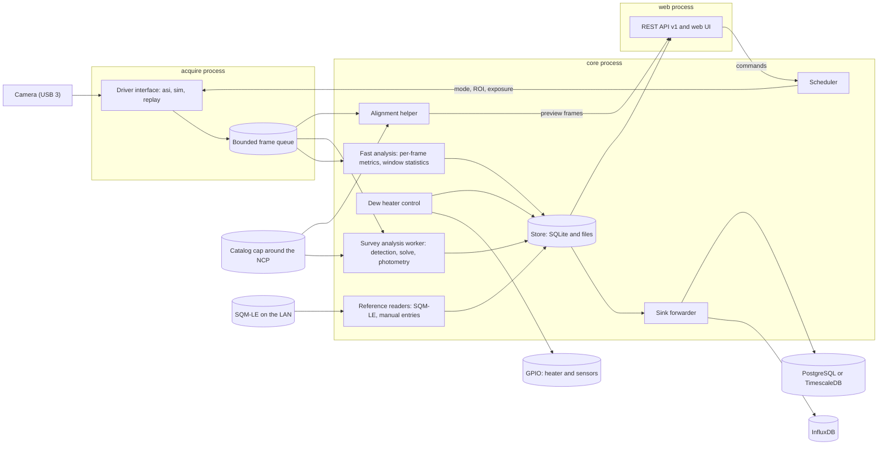

# Seeing monitor: architecture

Status: approved by the owner on October 1, 2026 (phase 1). For a short read, start with Summary, Decisions, Components, Reference hardware, Measurement modes, and Risks and open questions (about 2,500 words). The other sections are reference, and the two appendixes are optional. Sources and calculations are in [research-notes.md](research-notes.md).

## Summary

The seeing monitor is a fixed camera that points at Polaris, plus a Raspberry Pi that runs unattended for months. One camera serves four modes, and a scheduler shares its time:

- **Seeing (fast):** short exposures of a small region of interest (ROI) that follows Polaris, reduced to per-frame metrics and windowed seeing statistics.
- **Sky quality (survey):** long exposures calibrated against a star catalog.
- **Pointing (survey):** the same exposures, plate-solved locally. The solution also tells fast mode where Polaris is.
- **Alignment helper:** a low-latency live view with the solved pointing against the target.

Five rules shape the design. A profile describes the hardware, and everything else is derived. Camera access sits behind a driver interface. Three processes isolate hardware, computation, and the network. The system stores little and summarizes early. Results flow through pluggable sinks that keep their own cursors.

## Decisions and technology choices

| Topic | Decision | Reason | Set by |
|---|---|---|---|
| Language | Python 3.11 or later with NumPy, SciPy, astropy, and `pyerfa`. If the Pi 4 benchmark gate fails, Rust (PyO3) replaces only the per-frame metrics. | One maintainer, the best astronomy ecosystem, and solving is not a bottleneck. | You |
| License | MIT, copyright Lauri Kangas | | You |
| Remote database | A sink interface with InfluxDB first and PostgreSQL with TimescaleDB second. Both can run at once. | Matches your migration plan. | You |
| Hardware | Raspberry Pi 4 (with the owner's power HAT) or Raspberry Pi 5 (with the camera HAT), SD card only. The HAT choice is open. The design targets the Pi 4. | The weakest case sets the budget. | You |
| RAM | Start with 2 GB, and move to 4 GB only if the phase 2 memory gate fails. | Peak memory is about 1.4 GB, and the step to 4 GB nearly doubles the price (April 2026). A bench swap is cheap. | Lead |
| Solver catalog | A 15 degree cap around the north celestial pole (NCP). No all-sky blind solve. | The mount never points far from the pole. | You |
| Fast mode | Bin1 readout and a 2 ms exposure. The brief suggests about 10 ms, which stays selectable. | Bin1 needs no defocus. At 10 ms, Polaris saturates and seeing reads 2 to 27% low. | Lead |
| Local store | SQLite (WAL) for results. FITS, SER, and binary segment files for survey frames, bursts, and per-frame metrics. | No administration and few writes, which suits an SD card. | Lead |
| Camera access | ZWO ASI SDK through `ctypes` in `acquire`. INDI and Alpaca adapters only for other vendors. | Only the SDK offers video mode, ROI streaming, and a drop counter at low latency. | Lead |
| Dew heater | GPIO through `libgpiod` behind an `Io` interface, with one adapter per HAT. The loop holds the heater a small margin above the dew point, logs its duty, and defaults to off. | `libgpiod` works on the Pi 4 and the Pi 5 (`RPi.GPIO` does not work on the Pi 5). Heater plumes can add local turbulence, so the duty goes on every seeing window. | Lead |
| Plate solver | astrometry.net with a custom cap index and SEP star lists. ASTAP as fallback. An in-house tracker between solves. | Packaged for Raspberry Pi OS and safe at the pole. A separate process keeps GPL code out of the MIT project. | Lead |
| Web | FastAPI, uvicorn, static HTML and JavaScript with a small canvas plotter, no external assets. | The Pi may have no internet. A plotter of about 450 lines replaced a vendored library, so the repository holds no third-party script. | Lead |
| Processes | `acquire`, `core`, and `web` under systemd with a watchdog. chrony supplies time. | A closed SDK can hang, and the network-facing process stays read-only. | Lead |
| Configuration and tests | TOML with pydantic. pytest, hypothesis, and GitHub Actions on Windows, Linux x64, and Linux arm64. | The arm64 runner approximates Raspberry Pi OS. | Lead |
| Packaging and lock | `pyproject.toml` with `hatchling` and a `src/` layout. `uv` writes one universal lock (`uv.lock`) with hashes for Windows x64, Linux x64, and Linux arm64, and the install script exports hashed requirements from it. | One lock serves every CI runner and the Pi, and installs verify hashes. | Lead |
| Static checks | `ruff` (lint and format), `mypy` in strict mode, `detect-secrets`, and `tools/check_repo.py`, which fails on absolute paths, IP and MAC addresses, private host names, serial numbers, URL credentials, and co-author trailers. | The repository is public, so the checks catch leaks before review does. An untracked deny list covers private values that no general rule can describe. | Lead |
| Scheduler loop | One loop thread owns the camera, the analyzers, and the writers. `submit` changes the logical state under a lock and returns at once, and the loop moves the camera at its next step. Durations use the monotonic clock. | A command never waits for a 30 s exposure, no other thread writes records, and a step of the wall clock cannot stretch a window. | Lead |
| Cycle and cadence | The cadence runs from the start of one fast period to the start of the next, and the camera idles in the slack. Under cloud, the fast period shortens to one analysis window and the cadence shortens to 100 s. | A fast period stays a whole number of analysis windows, so no cycle ends in a partial window, and a shorter cycle under cloud finds a clearing sooner. | Lead |
| Recovery ladder | Three driver steps (restart capture, reopen, USB reset), then three supervisor steps through a callback (restart `acquire`, reboot, power cycle). Two attempts for each step, a slow retry once `degraded`, and a reboot or power cycle at most every 6 hours. | The mildest step that works costs the least data, and a dead camera must not reboot the Pi in a loop. | Lead |
| Sweeps | A sweep keeps its windows in its pinned result and its event, and writes none to the `seeing_window` series. | A window that was taken for a test must never pass for seeing data. | Lead |

"You" is the project owner. "Lead" is the design lead's choice, open to your review.

## Components and data flow

| Component | Responsibility | Process |
|---|---|---|
| Drivers | `CameraDriver` backends: `asi` (vendor SDK), `sim` (synthetic stars, turbulence, sky, clouds, injected faults), `replay` (recorded bursts) | `acquire` |
| Acquisition | Capture loop, per-frame timestamps, drop counting, mode changes | `acquire` |
| Scheduler | Grants the camera to one mode at a time, follows daylight and clouds, queues commissioning tasks | `core` |
| Analysis | Fast: per-frame metrics and window statistics. Survey: detection, solving, photometry, pointing, focus, in a low-priority worker. Alignment: live view and quick solve. | `core` |
| Store and sinks | SQLite plus files, quota-based retention, per-sink forwarding with retry | `core` |
| Heater and reference | The dew-heater control loop through GPIO. SQM-LE polling and manual SQM entries. | `core` |
| API and UI | Versioned REST API, static UI, WebSocket live view. Reads the store and sends commands to `core`. | `web` |

The processes isolate three risks. The vendor SDK is a closed binary that can hang on USB faults, so `acquire` restarts alone. `web` faces the network, so it gets read-only store access and no camera access. `core` is the only writer.

The processes talk over local connections (`multiprocessing.connection`). Each service listens at one address: a Unix socket in the runtime directory on Linux, and a named pipe on Windows. A client proves that it holds a shared key before it sends anything, and the server proves the same to the client. The key comes from configuration, a systemd credential, or an environment variable, and it never enters the repository. A client opens one connection for each channel that it needs, so the channels share nothing. The RPC channel carries JSON requests, answers, and typed errors. The frame channel carries `encode_frame` messages with a sequence number and a flow-control window, so a slow consumer makes `acquire` drop frames and count them, and nothing buffers without limit. The layer uses only `send_bytes` and `recv_bytes`. No pickle crosses a process boundary, and a test fails if one runs.

The scheduler in `core` works against interfaces, not implementations. It drives a `CameraDriver`, which is the simulator or a fake in tests and `RemoteCameraDriver` in production. `RemoteCameraDriver` forwards each call to `acquire` and takes frames from the stream, so the same scheduler code runs in both. A restart of `acquire` shows as a disconnect, and the scheduler reopens and reconfigures through the usual ladder. It feeds frames to a `FastAnalyzer`, hands survey frames to a `SurveyAnalyzer` (which returns results later, so a worker process can do the heavy work), reads the Polaris position from a `PointingProvider`, and sends finished records to a `RecordWriter`. The interfaces live in `drivers/base.py`, `analysis/base.py`, `sinks/base.py`, and `solvers/base.py`, and `seeingmon.testing` holds scripted fakes of each.

## Reference hardware

The reference camera is the uncooled, USB-powered ZWO ASI294MM (Sony IMX492, 4/3 inch, rolling shutter). ZWO's page for it shows the same modes and gain charts as the cooled Pro, so the figures below are as published, and commissioning checks them on this camera.

| | Bin1 (native) | Bin2 |
|---|---|---|
| Resolution, pixel | 8288 × 5644, 2.315 µm | 4144 × 2822, 4.63 µm (the sensor sums 2 × 2) |
| ADC | 12 bit (10 in high-speed mode) | 14 bit (12 in high-speed mode) |
| Full well, read noise at gain 0 | 14.4 ke⁻, 2.65 e⁻ | 66.4 ke⁻, 8.0 e⁻ (1.85 e⁻ at gain 120) |
| Plate scale at 250 mm | 1.91 arcsec/pixel | 3.82 arcsec/pixel |
| Row time (fitted from vendor frame rates) | 37.6 µs | 21.3 µs |

The ToupTek GS-250 scope has a 50 mm aperture, a 250 mm focal length (f/5), and a planar apochromatic triplet with a field flattener. The field of view is 4.40 × 2.99 degrees. ToupTek designs for a 1-inch image circle (16 mm, against the sensor's 23.2 mm diagonal), but your test shows good quality to the sensor edges, so the profile uses the full sensor.

- **Sampling picks the readout.** The aperture passes no spatial frequency above D/λ. In bin1 the pixel (1.91 arcsec) is smaller than λ/D (2.5 arcsec at 0.6 µm), so aliasing does not bias the centroid. In bin2 an in-focus star gives a centroid gain of 0.5 to 1.5 for ideal optics (about 0.7 to 1.3 for the vendor's design blur) as Polaris drifts across pixels, so bin2 would need a defocus of about 3 pixels (70 µm of focus offset). Fast mode uses bin1.
- **Frame rate.** Vendor figures imply about 6 ms of overhead per frame in bin1 and 1 ms in bin2 (derived), so small ROIs reach roughly 90 to 150 fps in bin1 and 300 fps or more in bin2. Your 10 ms bin2 recordings run at 97.9 fps, as the model predicts.
- **Rolling shutter.** A 128-row ROI spans 4.8 ms in bin1, so a star's row shifts its timestamp.
- **Polaris is bright.** An estimated 87,000 photoelectrons (±30%) arrive in 10 ms. A sharp-focus bin1 peak pixel then holds about 33,000 against a 14,400 full well, and it reaches 70% of full well after 3 ms. Fast mode defaults to 2 ms.
- **No cooler, no frame buffer, USB power only.** Dark current follows the ambient temperature (about 0.2 e⁻/s per pixel at 20 °C, doubling every 6 °C), so survey frames need a temperature-dependent dark model. The manual lists a DDR3 buffer only for the Pro, so a late read loses frames at once. The camera draws up to 0.37 A, so a Pi 5 on a 3 A supply or a PoE splitter needs the USB current limit lifted (`usb_max_current_enable=1`).

**Larger scopes.** The GS-300 (50 mm, f/6) and GS-350 (58 mm, f/6) share the GS-250's 16 mm design circle. The GS-300 changes no atmospheric number, and the GS-350 changes them by a few percent. Both shrink the field and add wind load. **Keep the GS-250.** The appendix has the comparison.

## Processes, data rates, and storage

| Process | Threads |
|---|---|
| `acquire` | Capture thread at raised priority (blocking SDK calls release the GIL), control thread, sender thread, and watchdog thread. No analysis. The capture thread reads, stamps, and queues frames. The sender streams them to `core` as far as the receiver's window allows. The watchdog thread puts a deadline on each driver call, and it sends a heartbeat and a health summary to systemd. A driver call that exceeds its deadline makes the process exit, and systemd restarts it. `acquire` also keeps the events that the driver reports (recovery steps, a changed geometry, a profile mismatch) in a bounded log, and `core` collects them with the `events` call, even while no stream runs. |
| `core` | Scheduler, fast-path consumer, preview encoder, sink forwarder, retention and health, and one low-priority survey worker process |
| `web` | uvicorn event loop with a read-only SQLite connection, read-only image access, and commands to `core` |

**Timing.** Every frame carries `t_utc_ns` (mid-exposure UTC), `t_err_ns` (1-sigma error), `t_quality`, and `dropped_before`. The SDK returns no frame timestamp, so the driver stamps each frame with the real-time clock when the read returns (`acquire` stamps it when the driver leaves it empty), and a star's time adds its row times the row time. `acquire` fits arrival time against frame number over a sliding window of 128 frames, which removes arrival jitter. The frame time is the fitted arrival minus the frame period, plus half the exposure, minus the latency. A frame is `ESTIMATED` until the window holds 20 frames, and `FITTED` after that. A frame that disagrees with the line (a late delivery after a stall) gets the time that the line predicts, `ESTIMATED`, and an error that includes the disagreement. Three frames in a row that disagree by the same amount mean that the clock stepped, and the fit restarts. A clock that is not synchronized makes the time `INVALID` and sets `TIME_INVALID`. The absolute error is the chrony error bound plus a latency uncertainty that commissioning measures with a light pulse from a GPIO pin, plus the error of the fit. A simulated or replayed frame keeps its own exact time.

**Drops.** Three sources lose frames: the SDK counter, gaps longer than 1.5 frame periods, and queue overflow. The system puts what they lose on the next frame (`dropped_before`), and it sums them for each window (`n_dropped`, `valid_fraction`) and for `health`. A counter and a gap that report the same loss count once, because both measure the same missing frames, so the larger of the two applies. A gap reads intervals on the monotonic clock, so a step of the wall clock never counts as lost frames. A full queue drops its oldest frame, counts it, and hands its count to the next frame in the queue, so `dropped_before` stays exact however many frames drop in a row. A window with more than 5% drops is flagged `degraded`. A frame that analysis cannot use is stored with flags and is not a drop.

| Stream | Size | Rate | Notes |
|---|---|---|---|
| Fast frames, bin1, 128 × 128 ROI (4.1 arcmin) | 32 KB | About 90 fps, 2.9 MB/s | Limited by readout, not by the exposure |
| Fast frames, bin2, 64 × 64 ROI | 8 KB | Up to about 360 fps at 2 ms | Needs about 3 pixels of defocus |
| Survey frame, bin2 | 23 MB | 1 per 3 minutes | A bin1 frame is 94 MB, too heavy for a Pi 4 |
| Per-frame metrics | About 40 bytes | 3.5 KB/s at 90 fps | 0.3 GB per 24 hours |
| Star list rows | 24 bytes a star, about 8 KB for each survey step | 1 per 3 minutes while the sky is dark | About 0.45 GB per year |
| Results | 0.15 to 0.4 KB | About 4 rows per minute | Under 0.5 GB per year |

The rates are derived estimates, and USB 3 carries every stream with wide margin. The Pi 4 budget is 10% of a core for `acquire`, 25% for the fast path, one core in bursts for the survey worker, and about 1.4 GB of memory at peak (the survey worker takes 550 MB). A 2 GB model fits if the out-of-memory killer takes the survey worker first, calibration frames stay memory-mapped, and native frames are processed off the Pi. More than 1.6 GB at peak in the gate means 4 GB. A NumPy centroid on a 128 × 128 frame takes an estimated 0.2 to 0.4 ms on a Pi 4. The performance gate measures all of this. [performance.md](performance.md) describes the harness (`seeingmon perf`) and its first results on a development machine, which agree with the kernel estimate and put the cost of moving frames between `acquire` and `core` above the budgets.

| Tier | Content | Retention |
|---|---|---|
| Results | Windows, survey results, pointing, star epochs, health, events (SQLite) | Forever |
| Per-frame metrics | Segment files of 10 minutes each, under `segments/YYYY/MM/DD/` | 7 days or 2 GB, whichever comes first |
| Star lists | Per survey step: matched stars brighter than G = 11 and all unmatched detections (about 0.45 GB per year). They are SQLite rows, and the record declares `retention_days`. | 1 year: retention deletes older rows |
| Raw bursts | SER with a JSON sidecar, on demand. One folder for each burst, under `bursts/`. | 2 GB quota for unpinned bursts. A burst with a `PINNED` marker is exempt and does not count. |
| Survey frames | FITS with Rice compression, under `survey/YYYY/MM/DD/`. The newest three stay in RAM. Every tenth frame and every event frame go to disk. | 7 days, then one per night for 60 more days (the frame nearest to the middle of the night) |
| Previews | JPEG up to 1 megapixel, under `previews/YYYY/MM/DD/` | 7 days |

A retention task (`seeingmon.store.retention`) runs hourly and deletes the oldest files first. It never deletes a file that changed in the last 15 minutes, so the segment that a writer holds open is safe. A file's age is the time of its last change, and a burst's age is the newest change inside its folder. The data directory may use 25% of the data partition, and the usage counts every byte under it, including the database and pinned bursts. Routine expiry by age writes no event. When a size cap, the quota, or low free space forces a deletion before the age limit, the task writes one `retention.early_delete` event for each tier and reason of a pass. Under pressure, per-frame metrics shrink first, then previews, survey frames, and unpinned bursts, and the task never deletes results or pinned bursts. It writes a `retention.over_quota` event when nothing more may go. Below 1 GB of free space, raw capture stops (`capture_allowed()` returns `False` and the task writes `retention.capture_stopped`). Capture resumes at 1.5 GB, with a `retention.capture_resumed` event, so that it does not flap. Every limit is a key of `[store.retention]` in `config/default.d/store.toml`.

## Data model

Every result is an immutable record keyed by `(station_id, record_type, t_utc_ns, revision)`, and a sink upserts by key.

| Record | Content |
|---|---|
| `frame` (local files; optional sink) | Sequence, UTC time and error, stream ID, centroid, width, peak, flux, background, flags (44 bytes a row) |
| `seeing_window` (each 60 s window) | Frame and drop counts, image-motion RMS, seeing, r0, scintillation, spectrum bins, vibration lines, heater duty, flags |
| `survey_frame`, `sky_quality`, `pointing` (each survey step) | Exposure, gain, mode, temperature. Sky brightness, zero point, transparency, cloud fraction. Attitude, center, roll, scale, residual, offset, focus. |
| `star_list` (each survey step), `star_epoch` (each night) | Matched stars brighter than G = 11 and all unmatched detections. Per star and night: mean position offset, mean magnitude, scatter, frame count. |
| `reference` (each reading) | Instrument, time, value (mag/arcsec²), temperature, pointing, and whether it comes from the fixed SQM-LE or a manual handheld entry |
| `health`, `event`, `run` (every 60 s, on occurrence, on start) | States, temperatures, heater duty, free space, drops, sink backlog, time sync. Events. Versions and effective configuration. |

Each record type is declared once (field, type, unit, definition) in `src/seeingmon/records/`, with the `Record` base class in `base.py` and the declarations in `seeing.py`, `survey.py`, `reference.py`, and `system.py`, one module for each lane. Generators in the same package produce the SQLite schema with additive migrations, the sink mappings (InfluxDB gets one measurement per type with `station` and `profile` tags, and TimescaleDB gets one hypertable per type with a unique index on the key), the API schema, the packed layout of the `frame` segment files, and [quantities.md](quantities.md), and `seeingmon records` prints them. Tables are append-only, so a sink cursor is the last acknowledged row ID (`AUTOINCREMENT` never reuses one), a new sink backfills from row zero, and a correction is a new record with the next `revision`, not an update.

**Storage rules.** `core` is the only writer (`seeingmon.store.Store`), and `web` reads through a read-only connection (`StoreReader`, with `snapshot()` for reads that must agree). SQLite runs in WAL mode with `synchronous=NORMAL` and a busy timeout, and the file carries an application ID, so the store refuses to create tables in an unrelated database. A write is one transaction, and `write_many` lands a whole batch or nothing. A second record with the same key raises `DuplicateRecordError`, and `write_correction` stores a reprocessed result as the next revision. Two events can share a station and a timestamp, and InfluxDB identifies a point by its measurement, tags, and timestamp, so the store moves an event that collides with another event of the same station forward by one nanosecond until its time is free, and the events keep the order in which they were written. Every other record type keeps the strict rule, and a producer never handles the collision itself. The `sink_cursor` table holds the last acknowledged row ID for each sink and record type, and it only moves forward.

The forwarder (`seeingmon.sinks.forwarder`) reads the rows after each cursor in batches, calls `Sink.send`, and moves the cursor after the call returns, so delivery is at least once and in row order. A failing sink backs off exponentially with jitter and keeps its batch, a permanent error parks the sink and writes an event, and no sink blocks another. The `health` record carries the backlog of each sink. The per-frame `frame` metrics are not rows. `SegmentWriter` appends them to segment files with a JSON header (record type, station, profile, stream, row layout, start time) and packed rows, under a `.part` name until the segment closes. A crash leaves a file that a reader opens up to its last complete row. `DataLayout` names the folders of every tier, writes each file under a hidden temporary name and renames it, and marks a pinned burst. `open_storage(config, clock)` opens all of it for `core` in one call (the layout, the store, the segment writer after it repaired the files that a crash left, the forwarder with the sinks of `[sinks]`, and retention), and `seeingmon store info DB` prints the counts, the last row IDs, and the sink cursors of a database without private values.

## REST API

The API lives under `/api/v1`. Within `v1`, changes only add fields and endpoints, and a breaking change creates `/api/v2` while `v1` stays for at least one release. FastAPI generates the OpenAPI 3.1 description. `seeingmon web openapi --output docs/openapi.json` writes it to [openapi.json](openapi.json), and a test fails when the file is stale. The UI renders the same document on its own reference page (`/api.html`), so you can read the API on a network with no access to the Internet. Times are ISO 8601 UTC strings, field names carry units (`seeing_fwhm_arcsec`), and a missing value is `null` with a `quality` object that says why. Every error has the shape `{"error": {"code", "message", "details"}}`. A response never holds a stack trace, a path, an address, or a secret.

| Endpoint | Method | Purpose |
|---|---|---|
| `/` | GET | The version of the API and of the software |
| `/status`, `/health` | GET | State of every component. Health returns 200 (healthy or degraded) or 503 (failed). |
| `/seeing`, `/sky`, `/pointing` (each with `/latest`) | GET | Latest record, or history with `from`, `to`, `step`, `limit`, `cursor`, and `fields` |
| `/events` | GET | Events, newest first, filtered by `level` and `kind` |
| `/images`, `/images/latest`, `/images/{id}` | GET | The list of previews, and one image as JPEG, FITS, or JSON |
| `/profile`, `/config` | GET | The hardware profile with derived values, and the configuration without secrets, hosts, URLs, addresses, commands, paths, or site data |
| `/commands/burst`, `/commands/sweep`, `/commands/replay`, `/mode`, `/alignment/start`, `/alignment/stop` | POST | Commissioning, mode changes, alignment (token required) |
| `/alignment/state`, `/alignment/frame`, `/alignment/stream` | GET, GET, WebSocket | The alignment offsets, the newest live-view frame (for a client that cannot use a WebSocket), and the live view |

**History.** A history route takes `from` (included) and `to` (excluded), which default to the 24 hours before now. With `step` set to `1m`, `10m`, or `1h`, an item is a bucket that starts at a multiple of the step in UTC. A numeric field is the mean of the values that the bucket holds, a list of flags is the union, a list of numbers is `null`, and a setting (`stream_id`, `gain`, `exposure_us`) keeps its last value. `n_samples` counts the records of a bucket. `fields` limits an item to the fields that you name and `quality`. A page holds at most `limit` items, and `next_cursor` points to the next page. The server reads at most `max_scan_rows` rows for one request, so a page can end early. The API serves a field in `withhold_fields` (by default the zenith angle, which narrows down the site) as `null` with the quality note `withheld`.

**Access.** Reads are open on the LAN by default, and `require_token_for_reads` asks for the token on every read. Every `POST` needs `Authorization: Bearer <token>`. The server keeps only a salted scrypt hash of the token (`$scrypt$ln=15,r=8,p=1$<salt>$<digest>`), compares in constant time, and runs one hash at a time. `seeingmon web hash-token` makes the hash, and the server reads it from `[auth]`, from the systemd credential `seeingmon-token-hash`, or from a file. Without a hash, the server refuses every command with `403 commands_disabled`. A client gets 30 commands per minute, and a client that fails the token check 5 times in 5 minutes gets `429` even with the right token. A rejection of a command by the scheduler is a normal answer with `accepted: false` and a reason, not an error. The server validates every input (a bounded body, strict models, and a strict pattern for an image ID that no path can pass).

**Hosts.** The server checks the `Host` header of every request (the API, the UI, and the static files alike) and the `Host` and `Origin` headers of every WebSocket handshake. The allowed set is `allowed_hosts` from `[web]`, plus `localhost`, `127.0.0.1`, `::1`, `bind_address`, and every entry of `extra_bind_addresses`, so the default configuration works with no list. The check ignores the port and the case, drops a trailing dot, and reads `[addr]:port` for an IPv6 literal (`seeingmon.services.web.hosts`). A wildcard entry is a configuration error. Any other host gets `400 host_not_allowed` in the error shape of the API, and a refused WebSocket origin gets `403 origin_not_allowed`. The message names `allowed_hosts` and never lists its values, and the log records each distinct refused host once, escaped and cut to 100 characters. A handshake without an `Origin` passes, because only browsers send one. This rule extends the access rule (deferred decision B7) and does not change who may read or send commands. `extra_bind_addresses` opens one more listening socket for each address, on the same port, and one event loop serves them all (an IPv6 socket accepts IPv6 only). If the process cannot bind an address, it exits and names the address. The values of one installation live in the untracked `local/config.toml`, and the tracked files hold documentation addresses only.

**Contract with `core`.** `web` talks to `core` over the connection layer of `seeingmon.services.ipc`, with the role `web` in its hello. `seeingmon.services.web.contract` holds the names and the codecs, and `core` imports the same module. Channel `rpc` serves four methods: `ping` answers `{"instance"}`, `status` answers `{"instance", "scheduler": {...}}` with the fields of `SchedulerStatus`, `submit` takes `{"command": {"type": ...}}` and answers with the `CommandResult`, and `alignment_state` answers with the alignment state (`"active": false` outside alignment). The command types are `start_alignment`, `stop_alignment`, `pause`, `resume`, `queue_burst`, `queue_sweep`, and `queue_replay`. Channel `alignment` streams one message for each frame while the scheduler aligns: the magic `SMAF`, the length of the JSON state (4 bytes, little endian), the JSON state, and the JPEG. `web` opens that stream only while a person watches, and `core` skips frames when the window is full. `web` starts and runs with `core` down: `/status` and `/health` say so, the history still reads from the store, and a command gets `503 core_unavailable`.

**Live view.** A WebSocket client of `/alignment/stream` receives a text message `{"type": "state", "state": {...}}` and then a binary message with the JPEG, at most `max_fps` times per second and always the newest frame. A text message `{"type": "idle"}` says that no frame arrived for `stall_s` seconds, and `{"type": "error", "code": ...}` says that the stream to `core` broke. One stream from `core` serves every viewer, up to `max_clients`, and it ends `idle_s` seconds after the last viewer left. A server that asks for the token on reads expects `{"type": "auth", "token": ...}` as the first message. The server closes with code 1008 for a missing or wrong token and with 1013 when it has all the viewers that it allows.

**Process.** `seeingmon web` serves the app with uvicorn on the listening sockets, opens the store read-only on demand (so it can start before `core`), and sends `READY=1`, a `WATCHDOG=1` heartbeat at half the watchdog interval from a task in the event loop, and `STOPPING=1` to systemd. A heartbeat goes out only when a real HTTP request to the first address gets an answer, so a wedged server stops sending, and the probe never touches the store or `core`. A signal ends the process cleanly. `seeingmon web --demo` serves 24 hours of synthetic data and a fake `core` with a synthetic star field, and it prints the URL as its only output. The demo reads the `[web]` settings from the layered configuration too, so you can view it through a VPN. Its commands take the token `demo`, which guards a fake `core` only.

**UI.** The UI has four pages: **Now**, **History**, **Images**, and **Align**. They are plain HTML, CSS, and JavaScript from the package, with no build step, no library, no web font, and no external asset, and a small canvas plotter draws the charts. A phone gets one column and no horizontal scroll. The dark scheme follows the device. The red night mode multiplies the page by pure red with a fixed overlay, so images and charts show only red light, and it keeps its choice in `localStorage`. The page asks for the token only when it needs one, and it keeps it for the tab in `sessionStorage`. The security headers forbid inline scripts and styles. Tests scan the files for external addresses, inline code, and unsafe calls, and Node runs the scenarios of the live link and of the helpers when it is installed. The pages were also checked in a browser at 360 pixels and in the dark, light, and night modes.

## Scheduler

One scheduler owns the camera. It runs a state machine on a loop that steps through a `Clock`, so tests run a simulated night in seconds. It works only against interfaces: a `CameraDriver`, a `FastAnalyzer`, a `SurveyAnalyzer`, a `PointingProvider`, a `RecordWriter`, and a `MetricsWriter`.

| State | Entered when | Behavior |
|---|---|---|
| `safe` | At start, in daylight, when the sky is too bright for any mode, after a persistent fault, and after `align`, `paused`, or a task that interrupted `safe` | Camera idle, with a brightness watch of one 1 ms frame per minute |
| `auto` | The sky is dark enough and the system is healthy | Repeats a fast window (default 120 s), then a survey step: a short exposure (1 ms) for bright stars and a long one (30 s) for faint stars and the sky. Default cadence: 3 minutes. |
| `align` | You start it from the UI | Preempts everything. Ends when you stop it or after 30 idle minutes. |
| `commission` | A task waits and the cycle reaches a boundary | Runs the queued bursts, sweeps, and replays. Results are pinned. |
| `paused` | You pause | Nothing runs |

`align` and `paused` always go back through `safe`, so the sky check runs before `auto` resumes. `commission` returns to the state that it interrupted. Every default is provisional until commissioning (phase 3), and every one is configurable in the `[scheduler]` tables of `config/default.d/scheduler.toml`.

**Loop and commands.** One thread runs the loop, and only that thread touches the camera, the analyzers, and the writers. `Scheduler.step()` does one unit of work (a frame, a transition, an exposure, a recovery step, a task, or a sleep through the clock), `run_until(t)` repeats it in virtual time, and `run(stop_event)` is the thread entry point. Any thread can call `submit(command)` with `StartAlignment`, `StopAlignment`, `Pause`, `Resume`, `QueueBurst`, `QueueSweep`, or `QueueReplay`. It changes the logical state under a lock and returns at once with the result or the reason for a rejection. The loop moves the camera at its next step, after the exposure in progress. Every command writes an event.

Every reconfiguration goes through one function: end the stream in use (flush the fast window and drain its metrics), `configure` the camera, and call `FastAnalyzer.begin_stream`. Each reconfiguration increments `stream_id`, so a window never spans one, and the camera never serves two modes at once.

**Cycle.** The cadence is the time from the start of one fast period to the start of the next. The survey step follows the fast period, and the camera idles until the next slot, so a fast period stays a whole number of analysis windows. The scheduler does not read the `[fastpath]` section, so set `scheduler.fast.analysis_window_s` to the `window_s` of that section. A cycle that outlasts its cadence starts the next one at once and counts an overrun. The wait for a slot is a sleep to a deadline, so errors do not add up: each fast period starts on its slot to within the clock's sleep granularity (a few milliseconds), and the survey step starts within one fast-frame period of the end of the fast period. Durations use the monotonic clock, so a step of the wall clock cannot stretch a window.

- **ROI following.** Before each fast period, the scheduler asks the `PointingProvider` for the Polaris position and centers the ROI there through the profile's ROI helpers. If the star comes within the margin of the ROI edge, the window ends early (the analyzer flushes a `partial` window), and `move_roi` recenters the ROI on the measured star. If the ROI cannot move closer, as at the sensor edge, the scheduler writes one event and keeps the window. If the star stays missing for a set number of frames, or no solution exists, a survey step runs to solve again. A missing star triggers it at most once a minute.
- **Daylight.** The Sun's elevation comes from a low-precision ephemeris and the site in local configuration. The scheduler stays in `safe` while the Sun is above -3 degrees, and it resumes below -4 degrees. A measured gate overrides the ephemeris: a background above 50% of saturation at the shortest exposure forces `safe`, and `auto` resumes below 35%. Windows and survey results carry `twilight` while the Sun is above -18 degrees, which lasts for weeks at some latitudes. While the clock is not synchronized, the UTC time can be days off (the Pi 4 has no real-time clock), so the scheduler ignores the Sun, relies on the measured gate alone, and marks windows and survey results `time_invalid`.
- **Clouds.** The survey analysis reports the share of expected catalog stars that detection missed. At 0.5 or more, the scheduler shortens the fast period to one analysis window (60 s) and the cycle to 100 s, so it notices a clearing sooner, and windows carry `cloud`. At 0.3 or less, the normal cycle returns.
- **Faults.** A camera error ends the activity and starts a backoff (2 s, doubling to 60 s). The scheduler then climbs the recovery ladder with two attempts for each step: restart the capture, reopen the camera, and reset the USB device (through `CameraDriver.recover`), then restart `acquire`, reboot, and power cycle (through an `escalate(level)` callback that the supervisor provides). A reboot or power cycle comes at most once in 6 hours. After 5 failures in a row the status turns `degraded`, the scheduler goes to `safe`, and it retries every 10 minutes with the brightness frame as its probe. Ten good frames in a row clear the status. The store and `web` stay up. Every state change, fault, and ladder step writes an event.
- **Commissioning.** A priority queue holds bursts, sweeps, and replays. Each task runs at the next cycle boundary, in `safe` as well as `auto` but not while `degraded`, and a command that preempts commissioning ends it early. The scheduler owns the sweep handler, and the services lane registers the burst and replay handlers. A sweep runs a short fast window for each cell of a grid, and it reports the saturated share of frames, the peak and the background as shares of saturation, the signal-to-noise ratio, the frame and drop rates, and the estimator's noise. Its windows go into its pinned result and its event, and never into the `seeing_window` series.
- **Events.** The scheduler writes an `event` for every state change, command, fault, ladder step, ROI recenter, cloud change, and commissioning task. `seeingmon.scheduler.events.EVENT_KINDS` lists the codes, and a test keeps the list complete.
- **Status.** `status()` returns a plain dataclass with the state, `degraded`, the current stream, the time of the last transition, counters, and the queue lengths. `health_fields()` maps it to the fields of the `health` record that the scheduler knows.

## Configuration and profiles

| Layer | Source | Tracked | Content |
|---|---|---|---|
| Profile | `profiles/<id>.toml` | Yes | Sensor, optics, readout modes, limits. One file per hardware configuration, and the `id` equals the file name. |
| Defaults | `config/default.toml`, then `config/default.d/*.toml` in file-name order | Yes | `default.toml` holds the keys that belong to no lane (`profile`, `station_id`). Each lane keeps its own defaults (scheduler, windows, retention, thresholds) in its own `default.d` file. |
| Local | `local/config.toml` | No | Station ID, site location, data directory, sink endpoints, token hash |
| Environment | `SEEINGMON_<SECTION>__<KEY>` variables | No | Secrets and overrides |
| Template | `config/local.example.toml` | Yes | Placeholders for the local file |

Later layers override earlier ones. Tables merge key by key, and an array replaces the array in the layer below. A double underscore in a variable name nests one level, so `SEEINGMON_SINKS__INFLUX__URL` sets `url` in `[sinks.influx]`. A value parses as a TOML scalar or array and stays a string otherwise.

`seeingmon.config.load_config` returns a `Config`. Each lane declares a pydantic model for its section and reads it with `config.section("scheduler", SchedulerConfig)`, which validates the merged section and applies the model's defaults. An error names the section and the keys, and it never shows a configured value. `config.profile` loads the profile that the top-level `profile` key names. `config.effective()` returns the merged configuration for the `run` record, with the value of every key whose name contains token, password, secret, credential, or key replaced by a fixed marker.

The `profiles/` and `config/` directories sit at the repository root in a source checkout, and the wheel carries them as package data in `seeingmon/_data/`. `seeingmon.paths` finds them in either layout.

A profile describes the sensor (cooling, temperature sensor), the optics (focal length, aperture, usable image circle, effective wavelength), the readout modes, and the limits (ROI rules, gain, exposure, offset). A readout mode states its resolution, pixel size, ADC bits, full well, read noise and conversion gain at gain 0, a table of rows for higher gains (with an explicit step for the high-conversion-gain switch), row time, and frame overhead. A profile can also hold two photometric priors: the photoelectron rate of a magnitude-0 star, flagged as an estimate, and a dark-current table. The software derives the plate scale and field of view per readout mode, the ROI size in pixels for an angular full width, the Airy size and star sampling, the saturation level per gain (in ADC counts and in 16-bit container counts), and the frame period and data rate. `seeingmon profile show` prints these values, and `profile_summary` returns them as JSON for the API. Fast mode and survey mode each name their readout mode.

## Commissioning support

- **Burst.** `seeingmon burst` or `POST /commands/burst` records frames to a SER file (`seeingmon.recordings.ser.SerWriter`, which stores each frame's `t_arrival_ns` in the timestamp trailer) with a JSON sidecar (`seeingmon.recordings.sidecar.BurstSidecar`). The sidecar holds a schema version, the stream settings, the profile ID, and the time quality, and it has no host name, path, or serial number. Pinned bursts are exempt from retention.
- **Sweep.** `seeingmon sweep` runs a short fast window for each cell of a grid (exposure, gain, ROI, readout mode) and prints saturation, signal-to-noise ratio, frame and drop rates, and estimator noise.
- **Dark.** There is no lens cap, so `seeingmon dark` takes bias frames, waits while you cover the camera (`--no-wait` skips the wait), checks that each frame is dark (the median sits near the bias level, the noise matches the dark current, and no star shows), records dark frames at the survey exposure, and adds the master dark to the dark library. It reads the camera driver from `[services.acquire]`, so stop `acquire` first.
- **Replay.** The `replay` driver (`seeingmon.drivers.replay`) feeds a SER recording, such as a burst or a SharpCap capture, through `acquire` at the original rate, at the maximum rate, or at a speed factor, and the production analysis runs unchanged. It reads the readout mode, exposure, gain, and sensor temperature from the sidecar next to the file (a burst's JSON sidecar, or SharpCap's `<capture>.CameraSettings.txt`), and driver options override them. Frames carry the recorded settings, the recorded timestamp as `t_arrival_ns`, `TimeQuality.ESTIMATED`, and the `REPLAYED` flag, and a gap of more than 1.5 frame periods becomes `dropped_before`. A request that does not fit the recording is refused, and a smaller ROI is cropped in software. A replay writes to a separate store. `seeingmon recordings info PATH` prints the geometry, frame count, duration, and frame timing of a recording.

## Measurement modes
### Seeing (fast)

The camera streams the ROI in bin1. For each frame, `core` subtracts a local background (the median of every second pixel in the 4-pixel ROI border) and computes the intensity-weighted centroid inside a circular aperture, recentered twice. The aperture is the larger of 15 pixels and 12 Airy FWHM of the readout mode, which is 16 pixels in bin1. This estimates the angle of arrival (the G-tilt). Centroids use sensor coordinates, so ROI moves do not alias into motion. The kernel (`seeingmon.fastpath.kernel`) needs only NumPy. It flags a frame `saturated` at 98% of the ADC full scale, `edge`, `no_star`, or `hot_pixel`, and it reports the flux in electrons from the profile's conversion gain. It takes about 100 µs for a 128 × 128 frame on the dev machine (`python -m seeingmon.fastpath.benchmark`). The estimate for a Pi 4 stays at 0.2 to 0.4 ms, and the performance gate measures it.

Frames group into windows (default 60 s of frame time) that never span a stream or a reconfiguration. A window counts a lost frame from `dropped_before` or from a gap of more than 1.5 frame periods. It carries `degraded` above 5% lost frames, `saturated` above 2% saturated frames, `partial` when it is short, and `vibration` when its spectrum has a line.

Polaris sits about 0.6 degrees from the pole and drifts 10 arcsec in 60 s (5 pixels in bin1), so each window removes a quadratic trend per axis and corrects the variance for the part that the fit removes (0.3% in 60 s). The one-axis centroid variance is σ² = 0.170 λ² D⁻¹ᐟ³ r0⁻⁵ᐟ³, and the seeing FWHM is 0.98 λ/r0. At 500 nm, an r0 of 10 cm means 1.0 arcsec seeing and 0.48 arcsec of motion per axis (0.25 pixel in bin1). The estimator subtracts the modeled noise of each centroid, divides the variance by three further factors, and stores every factor with the window:

- **Outer scale.** A von Karman integral over the aperture gives 0.74, 0.79, and 0.85 for L0 of 10, 20, and 50 m. The default of 20 m lowers the variance of a 50 mm aperture by 21%.
- **Exposure averaging.** The tilt spectrum of a single frozen layer at an assumed wind speed (default 10 m/s) gives 0.98 at 2 ms and 0.79 at 10 ms. The wind is an assumption, because at 98 fps the spectrum cannot give it, so each record stores it.
- **Centroid gain.** A recentered aperture follows the star, so truncation does not lower its gain. The windowed centroid of a 16-pixel aperture in bin1 reads 1.6% more variance than the G-tilt, and the estimator divides by that.

When the context has a zenith angle, the result converts to the zenith with the factor (cos z)^(3/5).

The same window yields the scintillation index (the normalized flux variance after a 1 s moving average, minus the Poisson floor), the motion spectrum, and a structure-function cross-check. The spectrum is a Welch estimate with Hann segments of 2 s and 50% overlap, stored in up to 24 logarithmic bins with its degrees of freedom. A gap of up to 3 frames is interpolated, and a segment with more than 10% interpolated frames is skipped. A bin above 5 times the median of its 15 neighbors on each side, above 1 Hz, is a vibration line. Power above the Nyquist frequency folds into the spectrum, and each record says so. The cross-check divides the structure function at lags of 0.04 to 0.12 s by 2 (1 − κ), where κ is the model correlation, so it ignores slow drift and white noise. It depends on the assumed wind as much as the variance does.

**Validation.** The `sim` driver renders frozen-flow phase screens through a 50 mm aperture, with exposure integration, pixel sampling, and noise, and it reports the injected truth: r0, the outer scale, the wind, and the image motion of every frame. The estimator must return r0 within 10% of that truth. The simulator first reproduces its own theory. The one-axis image-motion variance matches 0.170 λ² D⁻¹ᐟ³ r0⁻⁵ᐟ³ within 5% for r0 of 5, 10, and 15 cm. A finite outer scale lowers it by 0.740, 0.793, and 0.848 for L0 of 10, 20, and 50 m, and an exposure with vT/D of 1, 2, and 4 lowers it by 0.93, 0.83, and 0.72 (a Kolmogorov spectrum, and 0.91, 0.79, and 0.64 for L0 of 20 m). A plain centroid of rendered bin1 frames reproduces the same variance within 5% once the noise variance is subtracted. The motion spectrum follows the von Karman prediction within 15% from 7 Hz to 100 Hz at a wind of 10 m/s. The line search at five times the local median flags 4% of the 6 s windows of simulated turbulence, against 2% for an ideal Gaussian process, so the flag rate of pure turbulence is a known floor. A fixed 41 × 41 pixel window loses 0.4% of the variance to truncation, and a fixed 15 × 15 window loses 2.5%. The estimator recovers r0 of 5, 10, and 15 cm from the simulator's tilt within 0.5% (two windows of 1,000 samples have a sampling error of 1.4%, so the tolerance is seven standard errors), and the whole chain of frames, kernel, windows, and estimator recovers them within 1% (three windows of 6 to 10 s have a sampling error of 2 to 3%). The structure function agrees within 1.2%.

Your two recorded 10 ms videos (bin2 mode, 8-bit, 320 × 240, 97.9 fps) replay through the production analyzer, and [recordings-validation.md](recordings-validation.md) lists the numbers. The star is found in every frame, and the sidereal drift confirms the plate scale within 4%. The 60 s windows give an r0 of 8 to 12 cm, which is not calibrated. The checks find four limits. The two estimators differ by 17 to 34% at the default wind, and they agree on average at an assumed wind of 2 m/s, so a single frozen layer doesn't fit these data. The x variance is 1.3 to 1.6 times the y variance, which points to more than one layer. The 8-bit noise model over-subtracts, and r0 reads 3.5% high. The bin2 gain swing of 0.53 to 1.48 is absent, because the defocused star has a core of 2.3 pixels. At commissioning, tap tests and gust correlation calibrate the vibration flags. A second star 30 to 60 arcmin away (V of about 6 or brighter) would reject common-mode motion and keep the ground-layer signal. It needs an ROI about 1,000 pixels wide, with the pair's axis within 3 degrees of the sensor rows (rows start 37.6 µs apart), which holds for 20 to 30 minutes at a time, so it stays an experiment.

### Sky quality

Survey frames use bin2 at gain 120 or higher. After detection and the pointing fit, the survey worker makes the `sky_quality` record of each frame (`seeingmon.survey.quality`). A frame with an exposure under 5 s (`[survey.sky] min_exposure_s`) gets no such record: it shows too few stars and too little sky, and the alignment helper analyzes short frames about once a second, so the step would cost time and give nothing.

**Stars.** Aperture photometry measures the matched, unsaturated, isolated stars in electrons per second. The aperture is a circle of 5 pixels, stretched by the trail into a stadium, and a clipped ring of 9 to 14 pixels gives the local background. A star with a saturated or hot pixel in the aperture, or a neighbor that holds more than 2% of its flux, gets no measurement. A finite aperture misses the wings of the profile (2.7% of the light in the simulated optics, which is 0.03 mag), and the sky is measured pixel by pixel, so the 40 brightest isolated stars also get a 12-pixel aperture, and the median ratio of the two fluxes corrects the rest. The zero point then refers to the light within 12 pixels.

**Zero point.** The fit solves `G = ZP - 2.5 log10(rate) + c (BP-RP)` for the zero point and the color term against Gaia G, with 3-sigma clipping and an intrinsic scatter that the errors do not explain. The camera band is not Gaia G, so the fit determines `c`. A star without a color counts for the zero point and carries the error of its stand-in color. Tycho-2 supplies Polaris and the bright stars. A catalog magnitude that the builder estimated from Tycho-2 V has an error of 0.08 mag. Fewer than 8 measurable stars give no zero point, and the record says why.

**Sky.** The dark model gives the bias plus the dark current for the sensor temperature and the exposure, and the pipeline subtracts that level. A flat model divides (a unit flat now, `[survey] flat_file` for a measured one), the stars, saturated pixels, hot pixels, and the frame edge are hidden, and a sigma-clipped median of a million pixels gives the sky rate. The surface brightness is the zero point minus 2.5 log10 of the rate per square arcsecond (the pixel solid angle adds 2.910 mag in bin2). The V equivalent adds the color term times an assumed sky color, subtracts the Gaia G-V relation, and adds the SQM-fitted offset. A frame without a pointing solution still has a sky rate, and with a reference zero point it has a sky brightness.

**Dark library.** `seeingmon dark` adds one FITS file per set under `calibration/darks/` of the data directory: the master dark as the image and the hot pixels as a table. The dark rate follows `rate = rate_20C * 2^((T - 20 C) / doubling)`, and the fit takes the rate at 20 C and the doubling temperature (6 C by default, until the sets span 4 C or more) from the sets of one readout mode and gain. The pipeline masks the hot pixels of the nearest set. `dark_due(library, temperature_c, now_ns)` is true when no set within 3 C of the temperature is also younger than 183 days (both limits are configurable), and `health` reports it. The sky quality record carries the same condition as the `dark_due` flag.

**Transparency and clouds.** Polaris sits at a fixed altitude, so extinction cannot be fitted. The transparency is `10^(-0.4 (ZP_ref - ZP))`. The reference `ZP_ref` is the 90th percentile of the usable zero points of the last 60 days (at least 20, from frames with enough stars, a small scatter, and no clouds). The history is a small protocol, `ZeroPointHistory`, that the store implements later, and the analyzer reads it when it submits a frame. By default the analyzer keeps its own `MemoryHistory` and feeds it every result. The cloud fraction is the share of the expected catalog stars that detection missed. The limiting magnitude is where half of the catalog stars of the field are detected. A clear sky detects more than half of the stars down to G = 13, so the noise of the frame gives a predicted limit instead, and the record says so. The `cloud` flag marks a cloud fraction of 0.3 or more, or a transparency below 0.6. The `moon` and `twilight` flags need the site, so `core` sets them with the scheduler's ephemeris, and the `dew` flag needs the heater controller.

**Nightly summary.** Each night the analyzer averages the frames into one `star_epoch` record: for each star the mean position offset (measured minus predicted, in arcseconds along the sensor axes), the mean magnitude in the Gaia G scale, the scatter, and the number of frames, as six float32 columns. A night runs from one UTC hour to the same hour of the next day (`night_split_utc_hour`, 12), and a frame of the next night closes the last one. A cloudy frame adds nothing.

**SQM-LE.** The fixed SQM-LE points 45 degrees up to the north through a plastic dome. `fit_sqm_offset` fits the offset between its readings and the survey's V equivalent with a dome loss and an altitude term (the sky brightens toward the horizon about in proportion to the airmass). Handheld readings outside the dome separate the dome loss from the band offset. Readings at one altitude fix no altitude term, and without handheld readings the fit reports the dome loss and the band offset together. The real fit waits for commissioning.

**Validation:** injected-truth simulation. A synthetic frame with a zero point of 19.30 gives it back to 0.002 mag, with 170 stars that scatter by 0.017 mag (the sampling error is 0.0013 mag, and the tolerance is 0.03 mag). A frame of the `sim` driver, with a sky of 20.5 mag/arcsec^2 and a dark library that `seeingmon dark` recorded from a covered `sim` camera, gives the zero point to 0.011 mag (the 1.1% of the light beyond 12 pixels is the bias) and the sky brightness to 0.014 mag, against a tolerance of 0.1 mag. A cloud that passes half of the light gives a transparency of 0.50 within 0.03, and transparencies from 0.3 to 0.01 follow the injected value within 3%. Handheld SQM-L readings taken outside the dome calibrate the dome loss.

### Pointing

The survey worker (`seeingmon.survey`) turns each survey frame into a `survey_frame`, a `pointing`, and a `star_list` record. SEP finds the stars (`sep.Background` and `sep.extract`, with no deblending, so a trail stays one source), and a model fit measures each unsaturated star: a Gaussian that is smeared along the star's trail and integrated over each pixel. The fit gives an unbiased center for an undersampled bin2 star (0.007 pixel for bright stars in the tests), the PSF width across the trail, and the flux. Then the tracker predicts the star field from the latest solution and fits it to the detections. If that fails, the solver adapters run in order (astrometry.net, then ASTAP), and the pipeline moves the first solution from the catalog frame to the apparent frame and fits a TAN world coordinate system (WCS) to all matched stars. A fit counts as a solution only with at least 4 pairs, a residual of at most 1.5 pixels, and either 30 pairs or 30% of the reliable detections, because random pairs from a wrong prediction would pass a weaker test. A frame that cannot be solved is a normal result with the `unsolved` flag.

**Frames and conventions.** The fit uses catalog positions moved to the time of the frame with proper motion, parallax, light deflection, annual aberration (up to 20.5 arcsec), precession, and nutation (`pyerfa`, which agrees with `astropy` to 2 microarcseconds). Annual aberration would otherwise look like a seasonal pointing drift. The result is the apparent place in CIRS, the frame of the true pole of date. The camera model is a rigid TAN projection with a rotation matrix `R`, a scale, a parity, and the principal point at the sensor center. It uses unit vectors, so nothing is singular at the pole. The `attitude` in the `pointing` record is `R` for CIRS at the time of the frame (`camera = R @ cirs`), and `center_ra_deg` and `center_dec_deg` are the ICRS direction of the boresight with the aberration removed. To express the attitude in ICRS, multiply it by the bias-precession-nutation matrix of that time. The roll is the position angle of the direction to the pole in the image, from image up toward image left. It is undefined within one pixel of the pole, and the record then carries `roll_undefined`. A solution also keeps the attitude in an Earth-fixed frame, where a rigid mount stays constant, so the offset from the reference solution (boresight in arcminutes, roll in degrees) does not depend on the time of day. The Earth rotation angle uses UT1 = UTC unless you set `dut1_s`, which leaves up to 0.04 pixel of error at Polaris.

**Tracker.** `PointingTracker` implements `PointingProvider`. It projects the apparent place of Polaris through the attitude that the latest solution predicts for the requested time, in any readout mode, and returns `None` after the validity limit (12 hours by default), so the scheduler takes a survey frame. Its predict-match-fit step (`track`) serves the alignment helper.

**Trails.** A fixed mount trails a star by 15.04 arcsec per second times the sine of its distance from the pole, which is 5.6 pixels in a 30 s bin2 exposure at 2.7 degrees. The trail model takes the pole pixel from the tracker, sets the length and the direction of each star's trail, and keeps the focus value (the median FWHM across the trail of the reliable stars) free of trailing. Without a solution, the second moments of each star give the trail.

**Hot pixels and saturation.** A star at the diffraction limit still holds at most 86% of its flux in one pixel, so the detector keeps narrow sources. A hot-pixel mask from the dark frames keeps known hot pixels out, and a bright source with more than 93% of its flux in one pixel gets the detector flag `HOT_PIXEL`, which the pointing fit ignores. In a 30 s exposure at gain 120, every star brighter than about G = 11 saturates. The fit leaves saturated stars out and uses the fainter ones, and the star list keeps the saturated ones with a flag. The short exposure of each cycle gives unsaturated bright stars. A `star_list` row takes 24 bytes (six float32 values: position, flux, width, flags, and the catalog row), so the list costs about 0.45 GB per year.

**Validation.** Catalog-rendered frames with known pointing, trails, a Gaussian PSF, sky, and noise return the pointing within 0.1 pixel: on a 4144 × 2822 frame with 1,500 stars the error is 0.0005 pixel RMS and 0.001 pixel at most. The tests also cover a saturated and a missing Polaris, clouds (the cloud fraction rises with the extinction), a mount that moves, a second solver on a sample of frames, and apparent places against `astropy`. **Limits:** the fit has no distortion terms. Atmospheric refraction (about 40 arcsec at 55 degrees altitude, varying by 1 pixel across the field) and any lens distortion therefore show in `solve_rms` and wait for a distortion term at commissioning.

### Alignment helper

In `align`, the camera streams a bin2 view with 0.2 to 1 s exposures. `core` stretches each frame (asinh), encodes a JPEG, and pushes the newest frame over a WebSocket, so latency stays near one exposure plus processing (target: under 1.5 s). A worker solves inside the cap about once per second. The UI overlays the target and shows the offset, the rotation against the target roll, a focus bar, a log histogram, and a saturation warning (the live-view protocol is in [REST API](#rest-api)). **Validation:** the tracker's predict-match-fit step (`PointingTracker.track`), which the helper reuses, must recover a mount that moved 3.5 pixels to within 0.02 pixel across the field, as its tests check. Then a simulated mount-motion script, then known mount steps at commissioning.

## Reported quantities

| Quantity (unit) | Definition and estimator | Uncertainty | Known failure modes |
|---|---|---|---|
| `cx`, `cy` (px) | Centroid inside a circular aperture (15 pixels or more across in bin1), recentered twice | Noise below 0.02 px, subtracted from the variance. A recentered 16-pixel aperture reads 1.6% more variance than the G-tilt, and the estimator divides it out. | Saturation, hot pixels, a star near the ROI edge, bin2 in focus |
| `width_x`, `width_y` (px), `peak` (DN), `flux` (e⁻), `bg` (DN) | Second-moment sigma inside the aperture. Maximum pixel. Aperture sum minus background. Median of the ROI border. | Poisson plus background noise. Truncation lowers the width by a few percent. | Saturation (flag at 98%), clouds, the Polaris halo, defocus |
| `image_motion_rms` (arcsec) | RMS of the detrended centroid per axis, noise subtracted | 2 to 4% (1,000 to 6,000 effective samples per window) | Vibration and wind shake (high), exposure averaging (low), drift, jitter, drops |
| `seeing_fwhm_arcsec`, `r0_cm` | Kolmogorov seeing and r0 at 500 nm and zenith, from the tilt variance with the L0 and exposure corrections and the factor (cos z)^(3/5) | 1 to 2% statistical, 10 to 15% systematic (L0, wind) | As above, plus ground-layer turbulence and bin2 phase effects |
| `scintillation_index` | Normalized flux variance minus the Poisson floor, for exposure T | A few percent. Theory agrees within a factor of about 1.5. | Clouds, saturation, trends. Falls roughly as 1/T above 3 ms. |
| `motion_psd` (arcsec²/Hz), `vibration_lines` (Hz) | Welch spectrum of `cx` and `cy`. Lines above 5 times the local median are flagged. | Chi-squared with twice the segment count in degrees of freedom | The turbulence corner (20 to 200 Hz) can exceed the 45 Hz Nyquist limit at 90 fps. Aliasing, jitter. |
| `sky_mag_arcsec2` (mag/arcsec²) | Zero point minus 2.5 log10 of the sky rate per square arcsecond, camera band. The V-equivalent uses the Gaia G-to-V transform (0.03 mag scatter, BP-RP from -0.5 to 5.0) and an SQM-fitted offset. | 0.1 mag in the camera band, 0.2 to 0.3 mag in V | Moon, twilight, aurora, light domes, clouds, dark-model error, dew. An SQM band differs from V by up to 0.25 mag. |
| `transparency` (0 to 1) | 10^(-0.4 (ZP_ref - ZP)) | About 0.03 | Reference drift, saturated stars, color mismatch |
| `cloud_fraction`, `limiting_mag` (mag) | Share of expected stars missed. Magnitude where half are detected. | About 0.2 mag | Moonlight, bright sky, trailing |
| `center`, `roll` (deg), `plate_scale` (arcsec/px), `offset` (arcmin), `solve_rms` (arcsec), `focus_fwhm` (px) | Least-squares WCS. Roll is the position angle of the direction to the pole. Focus is the median FWHM of unsaturated stars. | Target 0.1 px | Few stars, trailing (inflates the focus value), distortion. Roll is undefined with the center on the pole. |
| `t_utc_ns`, `t_err_ns`, `dropped_before` | Mid-exposure UTC time, 1-sigma error, frames lost immediately before | Clock bound plus latency | Lost synchronization, an uncalibrated latency |

## Camera access and plate solvers
### Camera access

The comparison uses the fast-mode case: a ROI of about 128 × 128 pixels, 90 or more frames per second, per-frame UTC timestamps, and counted drops. Only the ZWO SDK fits. INDI wraps the same SDK but forces the exposure to 95% of the frame period, ignores the drop counter, and stamps frames with one-second protocol resolution (Debian ships INDI 1.9.9 with a 2022 driver). ASCOM Alpaca has no video device and needs three or more HTTP calls per exposure. The SDK files carry an MIT notice, although Debian rates the binaries non-free.

The SDK driver (`seeingmon.drivers.asi`) comes first, and INDI and Alpaca adapters wait for a non-ZWO camera. The driver follows four rules. It is the only code that calls the SDK, and the capture thread stamps `t_arrival_ns` in the statement after `ASIGetVideoData` returns. Waits are bounded: a read waits twice the longer of the exposure and the expected frame period, plus 500 ms, and never longer than the caller's timeout. The reader stops before `ASIStopVideoCapture`, because a blocked read cannot be cancelled, so `stop`, `configure`, `recover`, and `close` wait for the reader first. Every mode change runs one function (stop, set the controls, set ROI and binning, set the start position, read the geometry back, drop stale state), and `start` restarts capture. The SDK can change geometry silently, so the function compares the read-back with the request, applies the geometry once more when they differ, and raises `CameraConfigError` when the second read-back differs too. During a stream the driver checks the geometry every 8 frames, and it stops capture with `CameraConfigError` when the geometry changes. A `CallWatchdog` guards the SDK calls (one guard covers the calls of a frame). A call that outlives its deadline makes `acquire` exit with code 70, and systemd restarts it.

Two decisions go beyond the rules. By default, the driver drops the first frame after `start` and the first two after `move_roi`, because the SDK buffer can hold frames from the old state, and a frame that carries the new ROI over old pixels would corrupt a centroid. At `open` it stops a capture that a previous process left running, because `ASISetROIFormat` needs a camera that does not capture, and a process that the watchdog ended cannot stop the camera.

A recovery ladder escalates from restarting capture through reopening the camera and a USB device reset (the `USBDEVFS_RESET` ioctl, with a sysfs fallback), restarting `acquire`, and a reboot, to a hard power cycle of the whole Pi through its PoE switch port or a smart plug on its injector (the camera loses its USB power with the Pi). The driver performs the first three steps in `recover`, and each step reapplies the stream and flags the first frame `RECOVERED`. Reports describe ZWO cameras on Pi boards that stall after hours or days until someone power-cycles them. The Pi cannot switch a single USB port, so a camera-only cycle would need a powered hub on its own switchable supply, which stays optional (question 1).

### Plate solvers

The solver runs as a separate process, so GPL code stays outside the MIT code base. The cap catalog (`seeingmon.survey.catalog`) holds Gaia DR3 stars to G = 13 within the cap radius (default 15 degrees) at the Gaia epoch J2016.0, with proper motions and parallaxes. Tycho-2 adds V magnitudes to the bright Gaia rows and rows of its own for the stars that Gaia lacks. Polaris takes its Hipparcos astrometry, because Tycho-2 gives it no proper motion. The result is about 82,000 stars. A row takes 50 bytes, and a version header and a CRC-32 guard the file, so it takes roughly 4 MB. `seeingmon catalog build` runs on a larger machine. It sends one asynchronous ADQL job to the Gaia archive (a synchronous query truncates the answer, and an asynchronous job can queue for 10 minutes), asks VizieR for the Tycho-2 stars, merges them, and writes the catalog. When `build-astrometry-index` is installed, it also builds the solver index files for the scale presets 8 to 12, which cover the 4.4 × 3.0 degree field.

| | astrometry.net | ASTAP | cedar-solve |
|---|---|---|---|
| License | GPL-3.0 or later | MPL-2.0 | Apache-2.0 (detector: FSL-1.1-MIT) |
| Cap database | Custom index, 3 to 6 MB | About 28 area files, 25 MB | 4 to 15 MB |
| Pi 4 solve (estimate) | 0.4 to 2 s with a star list | 1.5 to 5 s with detection | 25 to 250 ms |
| Pole behavior | Unit vectors, safe | Pole code fixed December 2023 | RA and roll ill-conditioned |

astrometry.net is primary with SEP star lists (`apt` installs it on arm64), and ASTAP is the fallback adapter. The astrometry.net adapter (`seeingmon.solvers.astrometry_net`) writes the star list as a FITS table, names only the cap index files in a backend configuration, runs `solve-field` with the scale bounds, a center hint, and a CPU limit, and reads the `.wcs` header and the `.corr` table of matched stars. The ASTAP adapter (`seeingmon.solvers.astap`) draws the stars into a small FITS image, because ASTAP reads images and its own detector could mistake an undersampled star for a hot pixel, and it converts the solution back to frame pixels. Both return a TAN solution in the catalog frame as a starting point, which the pipeline refits against apparent places. A failure to solve is a normal result, and a missing program, a crash, or a hang raises `SolverError` so that the analyzer tries the next solver. The tests run both adapters against scripts that stand in for the programs. An integration test with the real `solve-field` runs only with `--slow` on a machine that has astrometry.net, so the first real run is a commissioning check. Between solves, a small in-house tracker (`PointingTracker.track`) predicts star positions, matches them, and fits, which suits the alignment helper, and the survey analysis tries it before it calls a solver. cedar-solve stays an option if the helper still misses 1.5 s on a Pi 4 (its version pins clash with Python 3.13). Survey and alignment frames use bin2, because a native frame (94 MB) takes an estimated 5 to 35 s to detect stars on a Pi 4. Attitude is a rotation matrix, roll is the position angle of the direction to the pole, and a hot-pixel mask keeps undersampled bin2 stars from being mistaken for hot pixels.

## Test strategy

| Level | What it checks |
|---|---|
| Unit and simulation (every push) | Estimators against simulated truth (phase-screen turbulence with injected clouds, saturation, vibration, and drops must return r0 within tolerance), scheduler transitions, retention, sink cursors |
| Component and end to end (short on push, long nightly) | `acquire`, `core`, and `web` with the simulator. Kill and restart each process. Simulate a sink outage of days, a full disk, and a clock jump. A simulated night in virtual time matches the injected truth. |
| Replay (local) | Recorded 10 ms video through production code. The repository holds only small synthetic fixtures. Recordings stay outside it, and tests skip when absent. |
| Gate and hardware | A performance gate on a Pi 4 before phase 2 exits. Timing, USB recovery, and a multi-day soak at commissioning. `seeingmon perf` measures the gate, and [performance.md](performance.md) lists the commands that run it on a Pi 4. |

GitHub Actions runs Windows, Linux x64, and Linux arm64 on Python 3.11 and 3.13: linter, type checker, tests, a secret scan, and a repository check that fails on absolute paths, IP addresses, and hostnames.

## Deployment
The target is Raspberry Pi OS Lite, 64-bit (Debian 13 with Python 3.13). The Debian 12 image with Python 3.11 also works.

- **Install.** `deploy/push.sh` builds the wheel and the hashed requirements (`uv build --wheel` and `uv export --locked --no-dev --no-emit-project --all-extras`), copies them with `deploy/` and your files to a private directory on the Pi, and runs `deploy/install.sh` there through `sudo`. Both scripts take host, user, and paths as parameters, with no defaults. The installer checks every parameter and the system before it changes anything. Then it creates a service user, installs a release, the vendor SDK, the connection key, the token hash, and the local configuration, installs the systemd units, the camera udev rule, the USB buffer setting (through `systemd-tmpfiles`), the journald setting, and the chrony sources, switches the `current` symlink, and starts the services. It is safe to rerun: a run with the same inputs changes nothing and restarts nothing, and it refuses to overwrite a system file that it did not write. [runbook.md](runbook.md) has the steps, and it says which ones stay untested without a Pi.
- **Layout.** A release lives in `<prefix>/releases/<version>-<checksum>/venv`. The checksum covers the wheel and the requirements, so a build of the same version with other contents is a new release, and a running release never changes. `<prefix>/current` and `<prefix>/previous` are symlinks that the installer switches in one rename. `<config>/local/config.toml` holds the local configuration (the units make `<config>` the working directory, because an installed release reads `local/config.toml` relative to it), and `<config>/credentials/` holds the connection key and the token hash. Releases belong to root, and the service user owns its configuration files and the data directory.
- **Units and sandbox.** Five units: `seeingmon.target`, the three services, and `seeingmon-failed@.service`. Each service is `Type=notify` with `WatchdogSec`, `Restart=always`, and a start limit of five starts in ten minutes, after which `OnFailure=` writes a critical journal message. The services share `RuntimeDirectory=seeingmon` for their sockets, and they load the connection key through `LoadCredential` (and `web` the token hash). The sandbox enforces the rules of this document: only `core` can write the data directory (`web` mounts it read-only, and `acquire` cannot see it), `web` has no devices, only `acquire` opens USB and holds `CAP_SYS_NICE` for its capture thread, and each process gets only the address families that it needs, a system call allow list (`@system-service`), and a `MemoryMax`. The out-of-memory killer takes the survey worker first (it raises its own `oom_score_adj`), then `web`, then `core`, and `acquire` last. The memory limits are provisional until the performance gate. `core` runs `seeingmon heater-off` after it stops, whatever the reason. `tools/lint_deploy.py` checks these rules, so a change to a unit cannot break one unnoticed.
- **Recovery.** Services use `Restart=always`, `WatchdogSec`, and a start limit that escalates to `degraded` health. The ladder step "restart `acquire`" is a call that makes `acquire` exit with code 75, so systemd starts a new process. The reboot step runs the `reboot_command` of the local configuration. The units run with `NoNewPrivileges`, so the service user cannot use `sudo`, and the installer's `--supervisor-actions` option adds a polkit rule that lets it restart the units and reboot. The camera ladder ends in a hard power cycle of the whole Pi through its PoE switch port or a smart plug. An external watchdog on the LAN polls `/api/v1/health` and triggers the cycle when health stays failed for several minutes, and the Pi can request it as a last resort. A command or URL in local configuration defines the cycle, so no address or credential enters the repository. The hook (`seeingmon.hardware.power`) runs an argument list without a shell, or an HTTP request. It expands `${NAME}` from the environment, so the configuration names a variable and not a token. It limits the attempts by a minimum interval and a daily maximum, and it writes each attempt to a state file before it acts, because the cycle kills the process. A dry run checks the route and sends nothing.
- **Heater.** The controller (`seeingmon.hardware.heater`) holds the optics a margin above the dew point with one slow pulse per period, and `mean_duty` returns the duty that every seeing window carries. Heater outputs default to off at boot, at construction, and when a service stops. The controller switches the heater off on an over-temperature reading, on a sensor that gives no valid reading for two minutes (the default), on an asserted fault input, and on a failing output, and it reports each as an event. `seeingmon heater-off` (`seeingmon.hardware.heater_off`) covers the stops that skip this cleanup: the `core` unit runs it after `core` stops for any reason, such as a crash, a kill, or a watchdog restart. The command reads only the `[heater]` section, switches every output line of the pin map to its inactive level (an `active_low` line goes high), and releases the lines. It exits with 0 when the outputs are off or no heater is configured, and with 1 and one line for each failed output (named by its logical name) when an output cannot be driven. It limits its GPIO work to 1 s, so it ends soon even when the GPIO library hangs. Software cannot do more, because after a process exits the kernel returns a released GPIO line to its default, which is usually an input. A heater driver that has no pull resistor to keep it off, and no failsafe of its own, can float on. The command does what software can, and the choice of HAT (blocker B3) decides the rest. Prefer a HAT with its own failsafe. If the HAT has a watchdog, name a `keepalive` output, which the controller toggles only while it runs without a fault. The pin map and the sensors live in the `[heater]` section of the local configuration, with an example template: a logical line name maps to a chip and a line offset, and a sensor reads a file that a kernel driver exposes. The lines go through `libgpiod` (1.x and 2.x) behind the `Io` interface, so one controller serves the Pi 4 and the Pi 5.
- **SD card.** Data lives on its own partition, in the folders of `DataLayout` (`db/`, `segments/`, `survey/`, `previews/`, `bursts/`). Journald logs stay in RAM, and warnings also go to the `event` table. Temporary files use tmpfs. Every file that a lane writes goes under a hidden temporary name in its own folder, reaches the disk, and gets renamed. The segment writer keeps a `.part` name until a segment closes, flushes after every call (so a crash of the process loses nothing), and forces the file to disk every 60 seconds (so a power cut loses at most a minute of frame metrics). SQLite runs WAL with `synchronous=NORMAL`. The write budget is under 1 GB per day. Use a high-endurance card. A 32 GB card holds the rolling tiers (about 7 GB) and five years of results.
- **Time and updates.** The Pi 4 has no real-time clock, so records carry `time_invalid` until the first synchronization. Two versioned environments and a symlink flip give a rollback in seconds: `rollback.sh` swaps `current` and `previous` and restarts the services. It switches the code only, and it leaves the units and the configuration as they are. The OS updates itself for security, and application and SDK updates are manual.
- **Vendor SDK.** The repository never contains the SDK. The installer takes the archive from a path you give it, checks its SHA-256 before it changes anything, refuses an archive with an absolute path or a `..` in a member name, and installs it privately under `<prefix>/sdk`, readable by the service group only. It writes the path of the library to an environment file that the `acquire` unit reads. The INDI third-party repository carries an MIT license text for the SDK, but the terms in ZWO's own archive are unconfirmed, so redistribution waits on that check.

## Security

The device sits on a LAN, and the repository is public.

- **Network.** `web` binds only the interfaces that the configuration names (`bind_address` and, for a VPN such as a tailnet, `extra_bind_addresses`), never a wildcard address. It answers a request only when its `Host` header names an allowed host (the loopback names, the bind addresses, and the entries of `allowed_hosts`), and a WebSocket handshake needs an allowed `Origin` too. Another host gets a 400 error, which stops DNS rebinding and a page from another site that drives the browser of a visitor. The host rule extends the access rule and does not change who may read or send commands: reads are open on the LAN by default (the deferred decision B7), and a setting can require the token. Commands need a bearer token (only its hash is stored), are rate-limited, and validate input. The addresses and names of one installation live in the untracked `local/config.toml`.
- **Isolation.** Each service runs unprivileged under a systemd sandbox (`NoNewPrivileges`, `ProtectSystem=strict`, `PrivateTmp`). `web` has no camera access and no write access to the data directory. Only `acquire` touches USB.
- **Supply chain and secrets.** Dependencies are pinned with hashes. Secrets and site coordinates live in `local/`, environment variables, or systemd credentials, and never in the repository, the logs, or the API. The effective configuration in the `run` record and the `/config` endpoint also leaves out hosts, URLs, addresses, commands, and paths, because they say where a station runs and not how it computes. SSH uses keys only.

## Risks and open questions

| Risk | Effect | Mitigation |
|---|---|---|
| Wind shake and vibration add image motion | Seeing reads high | Line detection and notch filtering, the structure-function cross-check, a stiff mount and wind shield, a two-star experiment, replay validation |
| Exposure averaging | At 10 ms, seeing reads 2 to 27% low | A 2 ms default (0.3 to 7%) and a wind assumption stored with each result. At 90 fps the spectrum cannot give the wind. |
| Polaris saturates, and bin2 biases the centroid | Clipped flux, and a centroid gain of 0.5 to 1.5 | Bin1, 2 ms, a defocus of about 3 pixels if bin2 is used, flags, a commissioning sweep |
| No frame timestamp from the camera | Absolute time depends on the host clock and a latency estimate | Regression over frame number, GPIO light-pulse calibration, `t_err` on every frame |
| The closed SDK hangs or stalls the camera | Lost frames, or no camera for days | Process isolation, watchdog, the recovery ladder ending in a remote power cycle, a soak test, a pinned SDK version |
| Uncooled sensor, dew, and heater plumes | Dark current and transparency drift. The heater can add local turbulence and bias seeing high. | Manual dark sets and a dark-rate model. A GPIO dew heater held a small margin above the dew point, with its duty logged and flagged on seeing windows. A dew flag from star width and transparency. |
| No standard sky scale for an unfiltered sensor | 0.2 to 0.3 mag uncertainty in V | Report the camera band first, and fit against an SQM or TESS-W |
| SD card wear and corruption | Data loss or a failed boot | Write budget, tmpfs, WAL, atomic writes, a high-endurance card, remote sinks as a second copy |

Deferred by you: the InfluxDB version, field names, and history import (the InfluxDB adapter waits for them), and the web access rule (until you decide, the design keeps the default: anyone on the local network can view, a token is needed for actions that change something, and outside access goes through a VPN).

Questions for you:

1. How will the Pi's power be cycled remotely: through its PoE switch port, through a smart plug on the injector, or not at all? A camera-only cycle needs a powered hub on a switchable supply, and ZWO advises a direct connection when troubleshooting, so the soak test must include any hub.
2. Which Pi and HAT will you use? When you decide, send the HAT's pin map, any temperature and humidity sensors, and any failsafe, so the heater adapter can match it.

## Appendix: long-term science plan

A camera that stares at one field for years produces a rare dataset. The table lists what it can show. Each sensitivity is an estimate that assumes the pipeline reaches the astrometry and photometry targets above, and [research-notes.md](research-notes.md) shows the arithmetic. Phase 2 builds only the storage hooks, and the analyses come after commissioning.

| Signal | What the data show | Method | Estimated sensitivity |
|---|---|---|---|
| Aberration, precession, nutation | A 20 arcsec aberration ellipse each year, 20 arcsec per year of precession, and 9 arcsec of nutation over 18.6 years | The pointing series in ICRS, before the apparent-place correction | About 10 pixels (bin1) per year, so weeks. Nutation needs years. The residuals show the mount's stability. |
| Sky clock | The star field rotates at 15 arcsec per second | Field rotation against UTC | Clock steps of tens of milliseconds. One arcsec of mount azimuth looks like 66 ms. |
| Stellar astrometry | Proper motions of the brightest stars (5 to 50 mas per year) | Nightly positions against Gaia | Gaia is more precise, so this checks the astrometric error budget. |
| Variable stars | VSX lists 139 variables brighter than 13 within 2.7 degrees of Polaris, 14 with periods over 30 days (semiregular stars and 2 Miras) | Differential light curves, then period searches | 0.03 mag or more for V brighter than 11 |
| Polaris pulsation | A Cepheid of about 4 days. Its period grows about 4.5 s per year, and its amplitude has changed several times. | Fast-mode flux normalized by the survey transparency | About 0.3% per night. The timing shifts about 6 hours in 10 years. |
| Eclipses, transits, flares, transients | Dimmings of 1% or more, flares, novae | Light curves at 3 minute cadence and the unmatched detections | About 1% in a few hours for V brighter than 10 |
| Moving objects | Satellites and aircraft dominate. SkyBoT lists no known asteroid or comet in the field on seven dates in 2026, because it lies at ecliptic latitude 66 degrees. | Streak and moving-source detection | A rare comet may appear. Satellite counts form a census of polar-orbit constellations. |
| Sky and atmosphere | Light-pollution trend, airglow and the solar cycle, aurora, aerosol and smoke events, clear-sky fraction, seeing against jet-stream wind | Series joined with weather and space-weather data | 0.01 mag per year if the calibration holds |
| Instrument aging | Dark-current drift, hot-pixel growth, cosmic-ray hit rate | Dark-model residuals and hit counts per frame | Percent-level rates |

Three records and a habit keep these options open. `star_epoch` stores each matched star's nightly mean position offset, magnitude, scatter, and frame count (13 MB per year for 1,500 stars). `star_list` stores each survey step's matched stars brighter than G = 11 and all unmatched detections for one year (0.45 GB), so a better algorithm can reprocess the photometry and astrometry, and moving objects can be linked offline. An optional archive sink ships one raw frame per night to remote storage, because difference imaging needs raw pixels. The `pointing` record stores the attitude as a rotation matrix, so analysis can express it in ICRS or in the frame of date. Every record carries its algorithm revision and calibration versions, and the catalog tool can switch to a later Gaia release without invalidating history.

## Appendix: larger scopes (GS-300 and GS-350)

ToupTek's GS-300 is a 50 mm f/6 (USD 229) and its GS-350 a 58 mm f/6 (USD 259), against USD 199 for the GS-250, and all three share the 16 mm design circle. Seeing depends on the aperture, so the GS-300 changes no atmospheric number. The GS-350's 16% larger aperture moves them by a few percent: the motion falls 2.4%, the exposure bias improves by 2 points, and scintillation rises 2 to 5%. The longer scopes mainly change the geometry.

| | GS-250 | GS-300 | GS-350 |
|---|---|---|---|
| Plate scale, bin1 and bin2 (arcsec/pixel) | 1.91, 3.82 | 1.59, 3.18 | 1.36, 2.73 |
| Field (degrees); stars to G = 13 inside the design circle | 4.40 × 2.99; 1,085 | 3.66 × 2.50; 754 | 3.14 × 2.14; 554 |
| In-focus bin2 centroid gain, ideal optics | 0.53 to 1.48 | 0.73 to 1.28 | 0.73 to 1.27 |
| Bin1 time to 70% of full well on Polaris | 3.0 ms | 4.0 ms | 3.0 ms |
| Mass; side profile (a wind-load proxy) | 0.82 kg; 1.0 | 0.94 kg; 1.25 | 1.21 kg; 1.74 |

Both longer scopes improve the bin2 sampling, but bin2 still needs about 2 pixels of defocus at f/6, and bin1 already needs none. They also cut the star count by a third or a half and add mass and wind area to a mount whose shake is the main systematic (a rod-model guess puts the shake variance at 2.4 and 6.8 times higher). **Keep the GS-250.** The verdict changes if a recorded in-focus bin2 histogram is already flat, if the mount is stiff enough to ignore the extra wind load, or if you need stars fainter than G = 13.
