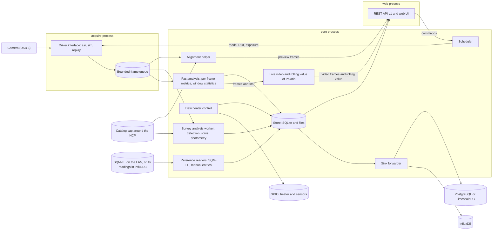

# Seeing monitor: architecture

Status: approved by the owner on October 1, 2026 (phase 1). For a short read, start with Summary, Decisions, and Risks and open questions (about 1,800 words). Components, Reference hardware, and Measurement modes give the design in detail (about 10,100 words more). The other sections are reference, and the two appendixes are optional. Sources and calculations are in [research-notes.md](research-notes.md).

## Summary

The seeing monitor is a fixed camera that points at Polaris, plus a Raspberry Pi that runs unattended for months. One camera serves four modes, and a scheduler shares its time:

- **Seeing (fast):** short exposures of a small region of interest (ROI) that follows Polaris, reduced to per-frame metrics and windowed seeing statistics.
- **Sky quality (survey):** long exposures calibrated against a star catalog.
- **Pointing (survey):** the same exposures, plate-solved locally. The solution also tells fast mode where Polaris is.
- **Alignment helper:** a low-latency live view with the solved pointing against the target.

Five rules shape the design. A profile describes the hardware, and everything else is derived. Camera access sits behind a driver interface. Three processes isolate hardware, computation, and the network. The system stores little and summarizes early. Results flow through pluggable sinks that keep their own cursors.

## Decisions and technology choices

| Topic | Decision | Reason | Set by |
|---|---|---|---|
| Language | Python 3.11 or later with NumPy, SciPy, astropy, and `pyerfa`. If the Pi 4 benchmark gate fails, Rust (PyO3) replaces only the per-frame metrics. | One maintainer, the best astronomy ecosystem, and solving is not a bottleneck. | You |
| License | MIT, copyright Lauri Kangas | | You |
| Remote database | A sink interface with InfluxDB first and PostgreSQL with TimescaleDB second. Both can run at once. | Matches your migration plan. | You |
| Hardware | Raspberry Pi 4 with 2 GB (with the owner's power HAT), SD card only. A Raspberry Pi 5 (with the camera HAT) also works. The HAT choice is open. | The weakest case sets the budget, and a Pi 4 with 2 GB passed the performance gate on October 3, 2026. | You |
| RAM | 2 GB. | The design budget is about 1.4 GB at peak. On October 3, 2026, a Pi 4 with 2 GB ran the system: the processes peak at 895 MB in sum, the installed system with the real camera used at most 1,053 MiB of the 1,844 MiB, and a 45-minute simulated run used at most 1,155 MiB, so 2 GB holds with about 690 MiB to spare (see [performance.md](performance.md#results-on-a-raspberry-pi-4)). The step to 4 GB nearly doubles the price (April 2026). | Lead |
| Solver catalog | A 15 degree cap around the north celestial pole (NCP). No all-sky blind solve. | The mount never points far from the pole. | You |
| Fast mode | Bin1 readout and a 2 ms exposure. The brief suggests about 10 ms, which stays selectable. | Bin1 needs no defocus. At 10 ms, Polaris saturates and seeing reads 2 to 27% low. | Lead |
| Local store | SQLite (WAL) for results. FITS, SER, and binary segment files for survey frames, bursts, and per-frame metrics. | No administration and few writes, which suits an SD card. | Lead |
| Survey frame images | Every long survey frame gets a JPEG preview. Every tenth long frame and every event frame also go to disk as Rice-compressed FITS. The newest frame stays in the RAM of `core` until its files are written. | You need to see the sky, a later reanalysis needs the pixels, and the SD card cannot take every frame. | Lead |
| Camera access | ZWO ASI SDK through `ctypes` in `acquire`. INDI and Alpaca adapters only for other vendors. | Only the SDK offers video mode, ROI streaming, and a drop counter at low latency. | Lead |
| Dew heater | GPIO through `libgpiod` behind an `Io` interface, with one adapter per HAT. The loop holds the heater a small margin above the dew point, logs its duty, and defaults to off. | `libgpiod` works on the Pi 4 and the Pi 5 (`RPi.GPIO` does not work on the Pi 5). Heater plumes can add local turbulence, so the duty goes on every seeing window. | Lead |
| Plate solver | astrometry.net with a custom cap index and SEP star lists. ASTAP as fallback. An in-house tracker between solves. | Packaged for Raspberry Pi OS and safe at the pole. A separate process keeps GPL code out of the MIT project. | Lead |
| Web | FastAPI, uvicorn, static HTML and JavaScript with a small canvas plotter, no external assets. | The Pi may have no internet. A plotter of about 450 lines replaced a vendored library, so the repository holds no third-party script. | Lead |
| Processes | `acquire`, `core`, and `web` under systemd with a watchdog. chrony supplies time. | A closed SDK can hang, and the network-facing process stays read-only. | Lead |
| Configuration and tests | TOML with pydantic. pytest, hypothesis, and GitHub Actions on Windows, Linux x64, and Linux arm64. | The arm64 runner approximates Raspberry Pi OS. | Lead |
| Packaging and lock | `pyproject.toml` with `hatchling` and a `src/` layout. `uv` writes one universal lock (`uv.lock`) with hashes for Windows x64, Linux x64, and Linux arm64, and the install script exports hashed requirements from it. | One lock serves every CI runner and the Pi, and installs verify hashes. | Lead |
| Static checks | `ruff` (lint and format), `mypy` in strict mode, `detect-secrets` (`tools/scan_secrets.py` runs the CI scan on a clone), and `tools/check_repo.py`, which fails on absolute paths, IP and MAC addresses, private host names (including `ts.net` names), serial numbers, URL credentials, and co-author trailers. | The repository is public, so the checks catch leaks before review does. An untracked deny list covers private values that no general rule can describe. | Lead |
| Scheduler loop | One loop thread owns the camera, the analyzers, and the writers. `submit` changes the logical state under a lock and returns at once, and the loop moves the camera at its next step. Durations use the monotonic clock. | A command never waits for a 30 s exposure, no other thread writes records, and a step of the wall clock cannot stretch a window. | Lead |
| Cycle and cadence | The cadence runs from the start of one fast period to the start of the next, and the camera idles in the slack. Under cloud, the fast period shortens to one analysis window and the cadence shortens to 100 s. | A fast period stays a whole number of analysis windows, so no cycle ends in a partial window, and a shorter cycle under cloud finds a clearing sooner. | Lead |
| Recovery ladder | Three driver steps (restart capture, reopen, USB reset), then three supervisor steps through a callback (restart `acquire`, reboot, power cycle). Two attempts for each step, a backoff of a minute at most up to the restart of `acquire`, a slow retry of 10 minutes after that, and a reboot or power cycle at most every 6 hours. | The mildest step that works costs the least data, and a dead camera must not reboot the Pi in a loop. | Lead |
| Sweeps | A sweep keeps its windows in its pinned result and its event, and writes none to the `seeing_window` series. | A window that was taken for a test must never pass for seeing data. | Lead |

"You" is the project owner. "Lead" is the design lead's choice, open to your review.

## Components and data flow

| Component | Responsibility | Process |
|---|---|---|
| Drivers | `CameraDriver` backends: `asi` (vendor SDK), `sim` (synthetic stars, turbulence, sky, clouds, injected faults), `replay` (recorded bursts) | `acquire` |
| Acquisition | Capture loop, per-frame timestamps, drop counting, mode changes | `acquire` |
| Scheduler | Grants the camera to one mode at a time, follows daylight and clouds, queues commissioning tasks | `core` |
| Analysis | Fast: per-frame metrics and window statistics, and a rolling seeing value. Survey: detection, solving, photometry, pointing, focus, in a low-priority worker. Alignment: live view and quick solve. Live video: the frames of the fast stream, stretched and encoded while someone watches. | `core` |
| Store and sinks | SQLite plus files, quota-based retention, per-sink forwarding with retry | `core` |
| Heater and reference | The dew-heater control loop through GPIO. SQM-LE reading, either by polling the unit over TCP or by asking InfluxDB for the readings that another program wrote (`[sqm] source`), and manual SQM entries. | `core` |
| API and UI | Versioned REST API, static UI, WebSocket live views (alignment and Polaris). Reads the store and sends commands to `core`. | `web` |

The processes isolate three risks. The vendor SDK is a closed binary that can hang on USB faults, so `acquire` restarts alone. `web` faces the network, so it gets read-only store access and no camera access. `core` is the only writer.

The processes talk over local connections (`multiprocessing.connection`). Each service listens at one address: a Unix socket in the runtime directory on Linux, and a named pipe on Windows. A client proves that it holds a shared key before it sends anything, and the server proves the same to the client. The key comes from configuration, a systemd credential, or an environment variable, and it never enters the repository. A client opens one connection for each channel that it needs, so the channels share nothing. The RPC channel carries JSON requests, answers, and typed errors. The frame channel carries `encode_frame` messages with a sequence number and a flow-control window, so a slow consumer makes `acquire` drop frames and count them, and nothing buffers without limit. A message may hold several frames, one after the other: the cost of a message (a wake-up of the sender, of the reader, and of the consumer) is larger than the cost of a frame at 100 frames per second, so `core` asks for batches in the hello of the channel, and `acquire` sends the frames of the last `batch_delay_s` (60 ms) together, up to `stream_batch_frames` frames (16) and `batch_bytes` bytes (256 KiB). A frame waits at most that long, a stream of fewer than 25 frames per second sends each frame at once, and an event (a camera error) or a new capture epoch ends a batch, so the order and the count of the drops stay exact. The layer moves only length-prefixed bytes. On Linux it writes and reads them on the file descriptor of the connection, in the format of `send_bytes`, with one system call for a write and a poll object that it keeps. On Windows it uses `send_bytes`, `recv_bytes`, and `poll`. No pickle crosses a connection between the three services, and a test fails if one runs.

The scheduler in `core` works against interfaces, not implementations. It drives a `CameraDriver`, which is the simulator or a fake in tests and `RemoteCameraDriver` in production. `RemoteCameraDriver` forwards each call to `acquire` and takes frames from the stream, so the same scheduler code runs in both. A restart of `acquire` shows as a disconnect, and the scheduler reopens and reconfigures through the usual ladder. It feeds frames to a `FastAnalyzer`, hands survey frames to a `SurveyAnalyzer` (which returns results later, so a worker process can do the heavy work), reads the Polaris position from a `PointingProvider`, and sends finished records to a `RecordWriter`. The interfaces live in `drivers/base.py`, `analysis/base.py`, `sinks/base.py`, and `solvers/base.py`, and `seeingmon.testing` holds scripted fakes of each.

### The core process

`seeingmon core` runs `CoreApp` (`seeingmon.services.core.app`), the composition root of the system. It loads the configuration and the profile, opens the storage, connects to `acquire` through `RemoteCameraDriver`, builds the two analyzers and the scheduler, and serves the commands of `web` and of the commissioning tools. The survey analysis runs in a worker process (`seeingmon.services.core.survey_worker`) at a lower priority, and on Linux with a raised `oom_score_adj`, so that the out-of-memory killer takes it first. Only plain data crosses to the worker: the frame as bytes, and dictionaries and strings for the rest. The threads are the scheduler loop, the housekeeping loop of the storage (forwarding and retention), a supervisor thread for the periodic work (the `health` record, the events of `acquire`, the status and the heartbeat for systemd, and the close of the night), the heater controller, the SQM-LE reader, the two threads of the alignment helper, the thread of the live video of Polaris, and the frame writer (the previews and the FITS files of the survey frames). A signal or a dead thread starts the shutdown, which runs against the order of the dependencies: the server and the RPC stop first, then the scheduler (which closes the camera), the alignment helper, the live video of Polaris, the star summary of the open night, the heater, SQM-LE, and supervisor threads, the survey worker, the frame writer (which writes the files that wait), the `core.stopped` event, the housekeeping, and the storage.

- **Records.** `core` writes a `run` record when the scheduler first opens the camera (after `run_record_wait_s`, 30 s, it writes the record without the camera): the versions of the package, the libraries, and the camera, the effective configuration without the site, and the summary of the profile. It writes a `health` record every minute, and at once when the camera first opens and when the state, the `degraded` flag, or the camera component changes (the supervisor looks every second), from the scheduler, the storage, `acquire`, the heater, the SQM-LE reader, the clock, and the machine. A component that is not `ok` says why in `quality.components`, such as `camera: the camera is not connected`. A value that no part can give is `null`, and `quality` says why. `acquire` counts as `starting` until it has answered or 30 seconds have passed, so a restart shows no failure that is not one. The hardware events of `acquire` and of the local hardware become `event` records, and a restart of `acquire` is an event of its own.
- **Sky quality.** The analyzer gets the data layout, so the dark library is `calibration/darks/` of the data directory (the flat library is `calibration/flats/` beside it), and a zero-point history that reads the `sky_quality` rows of the store (`seeingmon.services.core.history`), so that the reference of the transparency survives a restart of `core`. The scheduler flags `twilight`, `cloud`, and `time_invalid` on a survey result, and `core` adds `moon` (the Moon is above the horizon and at least 10% lit, from a low-precision ephemeris that agrees with `astropy` to 0.3 degrees) and `dew` (the optics are within 1 degree of the dew point of the heater controller). The nightly star summary closes at the split hour of the night, when no frame of the new night has closed it, and at shutdown (`seeingmon.services.core.nightly`). The alignment helper never asks for the sky quality of its short frames.
- **Survey frames.** `SurveyFrames` (`seeingmon.services.core.survey_frames`) wraps the survey analyzer, as the nightly summary does, and keeps the frames of the survey path. `submit` keeps each frame in a ring of the newest `ram_frames` frames (two by default), the frame that the driver gave and not a copy, so the memory of `core` holds at most those frames and the one that the writer works on. When the analysis returns a result, `poll` decides what the frame gets (the section Processes, data rates, and storage lists the rules), sets the `image_ref` of the `survey_frame` record, and queues the job. A writer thread does the I/O, the preview first, so the scheduler thread never waits for the disk. A preview takes tens of milliseconds and a FITS file a few hundred on a development machine. A write that fails is logged and counted, and the first failure in ten minutes becomes a `survey_images.write_failed` event. The `web` process finds the image of a record from its `image_ref` (`ImageStore.for_ref`). `[services.core.survey_frames]` holds the settings: `enabled`, `ram_frames`, `keep_every`, the JPEG quality and size, `fits_compression`, and the limits of the event frames.
- **Live video of Polaris.** `core` gives the scheduler a `LiveFastAnalyzer` (`seeingmon.services.core.live`), a decorator that forwards every call to the fast analyzer and, after each `push`, offers the frame and its result to the `PolarisStream`. The scheduler stays as it is, and only the frames of the fast stream reach the video. With no viewer, `offer` checks one flag and returns (about 0.2 µs). With a viewer, it keeps one frame in about four (`[services.core.polaris] max_fps`, 20 in frame time), copies the ROI into a slot under a lock, and wakes the thread of the stream. That thread stretches the frame, measures the width of the star, encodes a lossless PNG, and sends it to each viewer. The call averages 25 to 30 µs over all frames on a development machine that runs other jobs (the budget is 50 µs). A newer frame replaces a slot that the thread has not taken, so a slow viewer never makes `core` queue frames, and an error in `offer` never reaches the scheduler: the stream logs the first one and turns itself off for `disable_s` seconds. The stretch follows the star slowly, so that the flicker shows. Black is the median of the frame, and white is 1.5 times a 3 s average of the peak of the star above black (never less than 8 noise sigmas), under an asinh curve. A PNG takes about 2.8 KB for a frame with a star and up to 9 KB for noise alone, so 20 frames a second use about 66 KB/s. The thread takes 3 to 4% of a core on a development machine, and the factor of four to six that this document uses for other estimates puts a Pi 4 at 12 to 24%, only while someone watches. The state of every frame carries the rolling seeing value (see Seeing (fast)).
- **Systemd.** `core` sends `READY=1` after the RPC serves and the store is open, and `WATCHDOG=1` at half of `WATCHDOG_USEC`, but only while the scheduler thread makes progress. The scheduler makes progress when it reads the clock or sits inside a call of the camera driver that is within its limit (`scheduler_stall_s` and `driver_call_limit_s` in `[services.core]`), so a scheduler that hangs gets no heartbeat and systemd restarts `core`. `STATUS=` names the state when it changes, and `STOPPING=1` comes first at shutdown.
- **Commands.** The RPC serves `ping`, `status`, `submit`, `alignment_state`, `dark_library` (the dark library, whether it is due, and the progress of the latest dark session), `live_seeing` (the rolling seeing value of the fast stream), `flat_library`, `flat_activate`, `flat_delete`, and `flat_image` (the flat library and the progress of the latest flat session, and the three actions on a flat), and `results` (the latest results of the commissioning tasks), and the `alignment` and `polaris` channels stream the live views (`seeingmon.services.web.contract`). The ladder steps above the driver are calls of `core`: "restart `acquire`" asks it to exit with code 75, the reboot runs the `reboot_command` of the local configuration (no default), and the power cycle goes through `seeingmon.hardware.power`.

| Process | Exit code | Meaning |
|---|---|---|
| `acquire` | 0 | A clean stop (SIGTERM, SIGINT, or SIGBREAK) |
| | 1 | The start failed: an invalid configuration, no connection key, an unknown driver, or an address in use |
| | 70 | A driver call outlasted its deadline, so the watchdog ended the process |
| | 71 | A thread that the process cannot run without died |
| | 75 | `core` asked for a restart (the recovery ladder) |
| `core` | 0 | A clean stop |
| | 1 | The start failed: an invalid configuration, no connection key, no catalog, a store that cannot open, or the address in use |
| | 71 | A thread that the process cannot run without died |
| `web` | 0 | A clean stop |
| | 1 | The start failed: an invalid configuration, a missing package of the `web` extra, or an address that cannot bind |
| | 3 | The server did not start after the configuration loaded, for example because the application failed its startup |
| Commissioning commands | 0, 1, 2 | The task finished `ok`; it failed, was aborted, or timed out; `core` or the scheduler rejected it |
| `heater-off` | 0, 1 | The outputs are off or no heater is configured; an output cannot be switched off, the configuration cannot be read, or the 1 s limit passed |

A usage error exits with 2, and an unhandled exception exits with 1. Under `Restart=always`, systemd starts a service again after any exit that it did not ask for, and the code tells the journal why the process ended.

## Reference hardware

The reference camera is the uncooled, USB-powered ZWO ASI294MM (Sony IMX492, 4/3 inch, rolling shutter). ZWO's page for it shows the same modes and gain charts as the cooled Pro, so the figures below are as published, and commissioning checks them on this camera.

| | Bin1 (native) | Bin2 |
|---|---|---|
| Resolution, pixel | 8288 × 5644, 2.315 µm | 4144 × 2822, 4.63 µm (the sensor sums 2 × 2) |
| ADC | 12 bit (10 in high-speed mode) | 14 bit (12 in high-speed mode) |
| Full well, read noise at gain 0 | 14.4 ke⁻, 2.65 e⁻ | 66.4 ke⁻, 8.0 e⁻ (1.85 e⁻ at gain 120) |
| Plate scale at 250 mm | 1.91 arcsec/pixel | 3.82 arcsec/pixel |
| Row time (fitted to the frame rates of the real camera) | 37.6 µs | 18.5 µs |
| Single exposure, time beyond the exposure | 0.3 s + 37.6 µs a row, assumed (not measured) | 0.27 s + 75 µs a row (Raspberry Pi 4, October 3, 2026) |

The ToupTek GS-250 scope has a 50 mm aperture, a 250 mm focal length (f/5), and a planar apochromatic triplet with a field flattener. The field of view is 4.40 × 2.99 degrees. ToupTek designs for a 1-inch image circle (16 mm, against the sensor's 23.2 mm diagonal), but your test shows good quality to the sensor edges, so the profile uses the full sensor.

- **Sampling picks the readout.** The aperture passes no spatial frequency above D/λ. In bin1 the pixel (1.91 arcsec) is smaller than λ/D (2.5 arcsec at 0.6 µm), so aliasing does not bias the centroid. In bin2 an in-focus star gives a centroid gain of 0.5 to 1.5 for ideal optics (about 0.7 to 1.3 for the vendor's design blur) as Polaris drifts across pixels, so bin2 would need a defocus of about 3 pixels (70 µm of focus offset). Fast mode uses bin1.
- **Frame rate.** The real camera measures 7.4 ms of overhead per frame in bin1 (5.9 ms in high-speed mode) and 1.2 ms in bin2, so ROIs of 32 to 128 rows reach 82 to 117 fps in bin1 (103 to 146 fps in high-speed mode) and 417 to 465 fps in bin2 with 64 rows (`docs/hardware-checks.md`). Your 10 ms bin2 recordings run at 97.9 fps, as the model predicts.
- **Single exposures.** A single exposure (a snapshot) takes far longer than a video frame of the same ROI, because the camera reads the whole frame out before the SDK returns it. On a Raspberry Pi 4 on October 3, 2026, a 1 ms exposure in bin2 took 0.293 to 0.296 s for the 20 arcminute watch ROI (312 × 314 pixels) and 0.480 to 0.532 s for the full frame, where the video line model gives 7 ms and 53 ms. The profile therefore holds a second line for single exposures (`snapshot_overhead_s` and `snapshot_row_time_us`): 0.27 s plus 75 µs for each row in bin2, on top of the exposure. Bin1 is unmeasured, so it states none, and the software takes its video row time and an overhead of at least 0.3 s. A large bin1 exposure probably takes longer than that. `seeingmon camera rates --groups snapshot` refits the line ([Measure single exposures](hardware-checks.md#measure-single-exposures)).
- **Rolling shutter.** A 128-row ROI spans 4.8 ms in bin1, so a star's row shifts its timestamp.
- **Polaris is bright.** An estimated 87,000 photoelectrons (±30%) arrive in 10 ms. A sharp-focus bin1 peak pixel then holds about 33,000 against a 14,400 full well, and it reaches 70% of full well after 3 ms. Fast mode defaults to 2 ms.
- **No cooler, no frame buffer, USB power only.** Dark current follows the ambient temperature (the real camera measures 0.47 e⁻/s per bin2 pixel at 20 °C, doubling every 5 °C), so survey frames need a temperature-dependent dark model. The manual lists a DDR3 buffer only for the Pro, so a late read loses frames at once. The camera draws up to 0.37 A, so a Pi 5 on a 3 A supply or a PoE splitter needs the USB current limit lifted (`usb_max_current_enable=1`).

**Larger scopes.** The GS-300 (50 mm, f/6) and GS-350 (58 mm, f/6) share the GS-250's 16 mm design circle. The GS-300 changes no atmospheric number, and the GS-350 changes them by a few percent. Both shrink the field and add wind load. **Keep the GS-250.** The appendix has the comparison.

## Processes, data rates, and storage

| Process | Threads |
|---|---|
| `acquire` | Capture thread at raised priority (real-time round-robin on Linux, the highest thread priority on Windows, where the process also asks for a 1 ms system timer; blocking SDK calls release the GIL), control thread, sender thread, and watchdog thread. No analysis. The capture thread reads, stamps, and queues frames. The sender streams them to `core` as far as the receiver's window allows, in batches (see the channel text above): it sleeps until the flush time and wakes once for each batch, and the capture thread wakes it only for a full batch or for the first frame after a quiet time. The watchdog thread puts a deadline on each driver call, and it sends a heartbeat and a health summary to systemd. A driver call that exceeds its deadline makes the process exit, and systemd restarts it. `acquire` also keeps the events that the driver reports (recovery steps, a changed geometry, a profile mismatch) in a bounded log, and `core` collects them with the `events` call, even while no stream runs. |
| `core` | The scheduler thread (it runs the camera calls, the fast analysis, and the writers), the housekeeping thread (sink forwarder, retention), the supervisor thread (`health`, the events of `acquire`, and the heartbeat), the heater and SQM-LE threads (the SQM-LE thread polls the unit over TCP, or sends one query to InfluxDB for each poll, with a timeout of `timeout_s` in real time), the two threads of the alignment helper (JPEG encoder and quick solver), the thread of the live video of Polaris (stretch and PNG encoder, which works only while a client watches), the frame writer thread (previews and FITS files of the survey frames), and one low-priority survey worker process |
| `web` | uvicorn event loop with a read-only SQLite connection, read-only image access, and commands to `core` |

**Timing.** Every frame carries `t_utc_ns` (mid-exposure UTC), `t_err_ns` (1-sigma error), `t_quality`, and `dropped_before`. The SDK returns no frame timestamp, so the driver stamps each frame with the real-time clock when the read returns (`acquire` stamps it when the driver leaves it empty), and a star's time adds its row times the row time. `acquire` fits arrival time against frame number over a sliding window of 128 frames, which removes arrival jitter. The frame time is the fitted arrival minus the frame period, plus half the exposure, minus the latency. The frame period of a single exposure is its snapshot period from the profile ([Reference hardware](#reference-hardware)), so the time of a survey frame is only as good as that model. A frame is `ESTIMATED` until the window holds 20 frames, and `FITTED` after that. A frame that disagrees with the line (a late delivery after a stall) gets the time that the line predicts, `ESTIMATED`, and an error that includes the disagreement. Three frames in a row that disagree by the same amount mean that the clock stepped, and the fit restarts. A clock that is not synchronized makes the time `INVALID` and sets `TIME_INVALID`. The absolute error is the chrony error bound plus a latency uncertainty that commissioning measures with a light pulse from a GPIO pin, plus the error of the fit. A simulated or replayed frame keeps its own time, because the default `time_source` leaves it alone.

**Drops.** Three sources lose frames: the SDK counter, gaps longer than 1.5 frame periods, and queue overflow. The system puts what they lose on the next frame (`dropped_before`), and it sums them for each window (`n_dropped`, `valid_fraction`) and for `health`. A counter and a gap that report the same loss count once, because both measure the same missing frames, so the larger of the two applies. A gap reads intervals on the monotonic clock, so a step of the wall clock never counts as lost frames. A gap waits for the next read before it counts, because a read that comes late looks like a loss: when the host runs behind, the camera keeps the frames, and it hands them over one after the other. A read that follows within half a frame period of the late one is that catch-up, so the late read counts as a late read (`late_reads` in the health summary of `acquire`) and no frame is lost. A read that follows after a regular interval confirms the gap, and it carries the lost frames. A gap that no counter explains therefore reaches `dropped_before` one frame after the hole, and a loss that the counter reports reaches it at once. The period of the gap rule comes from the driver, or from the median of the recent intervals, and never from the time fit, whose frame numbers include the frames that the rule declares lost. A full queue drops its oldest frame, counts it, and hands its count to the next frame in the queue, so `dropped_before` stays exact however many frames drop in a row. A window with more than 5% drops is flagged `degraded`. A frame that analysis cannot use is stored with flags and is not a drop.

| Stream | Size | Rate | Notes |
|---|---|---|---|
| Fast frames, bin1, 128 × 128 ROI (4.1 arcmin) | 32 KB | About 82 fps (103 in high-speed mode), 2.7 MB/s | Limited by readout, not by the exposure |
| Fast frames, bin2, 64 × 64 ROI | 8 KB | Up to about 420 fps (417 measured at 0.5 ms, 465 at 2 ms) | Needs about 3 pixels of defocus |
| Survey frame, bin2 | 23 MB | 1 per 3 minutes | A bin1 frame is 94 MB, too heavy for a Pi 4 |
| Per-frame metrics | 44 bytes | 4 KB/s at 90 fps | 0.3 GB per 24 hours |
| Star list rows | 24 bytes a star, about 8 KB for each survey step | 1 per 3 minutes while the sky is dark | About 0.45 GB per year |
| Results | 0.15 to 0.4 KB | About 4 rows per minute | Under 0.5 GB per year |

The rates are derived estimates, and USB 3 carries every stream with wide margin. The Pi 4 budget is 10% of a core for `acquire`, 25% for the fast path, one core in bursts for the survey worker, and about 1.4 GB of memory at peak (the survey worker takes 550 MB). A 2 GB model fits if the out-of-memory killer takes the survey worker first, calibration frames stay memory-mapped, and native frames are processed off the Pi. More than 1.6 GB at peak in the gate means 4 GB. A NumPy centroid on a 128 × 128 frame takes an estimated 0.2 to 0.4 ms on a Pi 4. The performance gate measures all of this. [performance.md](performance.md) describes the harness (`seeingmon perf`) and its results on a development machine, which agree with the kernel estimate. Since the services lane batched the stream between `acquire` and `core`, the estimate puts the receive and the fast path within the budget of the fast path, and it keeps `acquire` above its own budget: 12 to 24% of a Pi 4 core against 10%.

| Tier | Content | Retention |
|---|---|---|
| Results | Windows, survey results, pointing, star epochs, health, events (SQLite) | Forever |
| Per-frame metrics | Segment files of 10 minutes each, under `segments/YYYY/MM/DD/` | 7 days or 2 GB, whichever comes first |
| Star lists | Per survey step: matched stars brighter than G = 11 and all unmatched detections (about 0.45 GB per year). They are SQLite rows, and the record declares `retention_days`. | 1 year: retention deletes older rows |
| Raw bursts | SER with a JSON sidecar, on demand. One folder for each burst, under `bursts/`. | 2 GB quota for unpinned bursts. A burst with a `PINNED` marker is exempt and does not count. |
| Survey frames | FITS with Rice compression, under `survey/YYYY/MM/DD/`. The newest frame stays in the RAM of `core` until its files are written. Every tenth long frame and every event frame go to disk. | 7 days, then one per night for 60 more days (the frame nearest to the middle of the night), and at most 4 GB |
| Previews | JPEG up to 1 megapixel, under `previews/YYYY/MM/DD/`. Every long frame has one, and so does every frame that goes to disk. | 7 days, and as long as the survey frame of the same time stays, and at most 1 GB |

**Survey frames on disk.** A *long* frame is a survey frame with an exposure of at least 5 s (`[survey.sky] min_exposure_s`), the frames that carry the sky quality. Each survey step takes a short frame (1 ms, gain 0) and a long frame (30 s), so a night of 12 hours holds about 240 long frames. `core` decides what each frame gets when the analysis returns its result:

- **RAM.** The newest frame stays in the memory of `core` (`ram_frames`, 2 by default: 47 MB at bin2) until its result comes back and its files are written. The ring keeps the frame that the driver gave and never holds more than `ram_frames` of them. A FITS write makes one transient copy of the pixels, to shift them to native counts. A frame that falls out of the ring before its result comes back, or before its files are written, gets no files, and the log says so. With one frame, that happened to every short frame on a Pi 4 (October 3, 2026): the result of the short frame comes back only after the 30 s exposure that follows it, and that frame has already pushed the short one out of the ring, so the default is two frames. A frame still gets no files when its analysis lasts longer than the wait for the frame after next. Nothing reads the frames that stay after the write, because the `web` process cannot see the memory of `core` and serves files only. A ring of three (70 MB) would hold one frame for no reader. A tmpfs file in the runtime directory, which `core` writes and `web` reads, is the way to serve the newest frames later.
- **Previews.** Every long frame gets a JPEG of at most 1 megapixel, made with the stretch of the alignment live view and with the dark level, the vignetting, and the dust shadows taken out (see [Alignment helper](#alignment-helper)). A short frame gets one only when it is also a FITS file.
- **FITS files.** Every tenth long frame goes to disk, counted from the start of `core` with the first one included, and so does every event frame. A short frame does not count for the rule of the tenth frame.
- **Event frames.** An event frame is the first frame after one of four conditions starts: the pointing has no solution (`unsolved`, which covers a solver that failed and an analysis that failed), the pointing moved (the `moved` flag), clouds (a cloud fraction of 0.5 or more, the threshold of the scheduler), or a bright sky (the background reaches half of the saturation level, the limit of the daylight gate). The long frame of a step carries all four conditions, and the short frame only the last. Each kind of frame (long and short) gets at most one event frame an hour, so a night of flickering clouds cannot fill the card.
- **Names.** A preview is `previews/YYYY/MM/DD/<kind>-<time>.jpg`, where the kind is `survey` (a long frame), `short`, or `event`. A FITS file is `survey/YYYY/MM/DD/<time>.fits`, with the same time. The `survey_frame` record gets the reference of the stored image as its `image_ref`: the FITS file when the frame was kept, else the preview, else `null`.
- **The file.** A FITS file holds native ADC counts (the shift of the 16-bit container is removed) and a header with the time, its error and quality, the exposure, the gain and the conversion gain, the readout mode, the ROI, the sensor temperature, the pixel size, the plate scale, the optics, the camera model, the profile, the station ID, the reason why the frame was kept, and the cloud fraction and the transparency of its result when the analysis has them (`CLOUDFRC` and `TRANSP`, which `seeingmon flat build` reads to pick the clear frames). It holds no serial number, no site coordinates, and no Sun or Moon position. Rice compression is lossless. If astropy cannot compress, the writer logs one warning and writes the file uncompressed.
- **Disk use.** A bin2 frame of 23 MB compresses to about 9 to 12 MB on simulated noise, and the first real sky decides the ratio. A night of 12 hours then adds about 24 FITS files and 240 previews (50 to 150 KB each), which is about 0.3 GB. The hourly retention task covers both folders. Below the free-space limit of the capture gate (see the next paragraph), `core` writes no FITS file and keeps the preview.
- **Writes.** A writer thread does the I/O, the preview first, and the scheduler thread only decides. A write goes to a hidden temporary name and takes its real name when it is complete, so a reader never sees half a file. On a development machine, a preview takes about 55 ms and the Rice compression of a FITS file 150 to 250 ms, and the compression lets other Python threads run (a thread that the compression holds up stalls for about 10 ms at most). The astropy import adds about 25 MB to `core` when the first file is written.

A retention task (`seeingmon.store.retention`) runs hourly and deletes the oldest files first. It never deletes a file that changed in the last 15 minutes, so the segment that a writer holds open is safe. A file's age is the time of its last change, and a burst's age is the newest change inside its folder. The data directory may use 25% of the data partition, and the usage counts every byte under it, including the database and pinned bursts. A preview also stays while the survey frame of the same time stays (the two names share the time), so the frame that thinning keeps for a night keeps its preview, and a preview that outlives its frame ages out by the 7-day rule. That happens in the pass that deletes the frame by its age, and in the next pass when a size cap deletes the frame. The survey frames have a size cap of 4 GB (`survey_max_gb`) and the previews a cap of 1 GB (`previews_max_gb`), next to the 2 GB caps of the metrics and the bursts. Over its cap, the survey tier deletes the frames that thinning would delete first, the oldest first, and the frame that thinning keeps for each night last, so the record of one frame a night lasts as long as the cap allows. Over its cap, the preview tier deletes the previews of frames that no longer stay first, and the previews of frames that stay last. A week of survey frames takes 1.8 to 3.5 GB (24 FITS files of about 10 MB a night, and up to 24 more at the limit of the event frames) and a week of previews 0.1 to 0.25 GB. The two caps, the 2 GB of the metrics, and the database take almost the whole quota of 25% of a 32 GB card (8 GB). The bursts, which have a cap of 2 GB and exist on demand, come on top. When all of them fill up, the quota deletes the oldest metrics first. Routine expiry by age writes no event. When a size cap, the quota, or low free space forces a deletion before the age limit, the task writes one `retention.early_delete` event for each tier and reason of a pass. Under pressure, per-frame metrics shrink first, then previews, survey frames, and unpinned bursts, and the task never deletes results or pinned bursts. It writes a `retention.over_quota` event when nothing more may go. Below 1 GB of free space, raw capture stops (`capture_allowed()`, the capture gate, returns `False`, the burst handler refuses to start, `core` writes no FITS file of a survey frame, and the task writes `retention.capture_stopped`). Capture resumes at 1.5 GB, with a `retention.capture_resumed` event, so that it does not flap. Every limit is a key of `[store.retention]` in `config/default.d/store.toml`.

## Data model

Every result is an immutable record keyed by `(station_id, record_type, t_utc_ns, revision)`, and a sink upserts by key.

| Record | Content |
|---|---|
| `frame` (segment files only: no sink takes it) | Sequence, UTC time and error, centroid, width, peak, flux, background, flags, and the frames lost before it (44 bytes a row, and the segment header holds the stream ID) |
| `seeing_window` (each 60 s window) | Frame and drop counts, image-motion RMS, seeing, r0, scintillation, spectrum bins, vibration lines, heater duty, flags |
| `survey_frame`, `sky_quality`, `pointing` (each survey step) | Exposure, gain, mode, temperature, and the reference of the stored image (`image_ref`). Sky brightness, zero point, transparency, cloud fraction. Attitude, center, roll, scale, residual, offset, focus, and the pixels of Polaris and of the pole. |
| `star_list` (each survey step), `star_epoch` (each night) | Matched stars brighter than G = 11 and all unmatched detections. Per star and night: mean position offset, mean magnitude, scatter, frame count. |
| `reference` (each reading) | Instrument, time (for a reading from InfluxDB, the time stamp of its point), value (mag/arcsec²), temperature, pointing, and whether it comes from the fixed SQM-LE or a manual handheld entry |
| `health`, `event`, `run` (every 60 s, on occurrence, on start) | States, temperatures, heater duty, free space, drops, sink backlog, time sync. Events. Versions and effective configuration. |

Each record type is declared once (field, type, unit, definition) in `src/seeingmon/records/`, with the `Record` base class in `base.py` and the declarations in `seeing.py`, `survey.py`, `reference.py`, and `system.py`, one module for each group of records. Generators in the same package produce the SQLite schema with additive migrations, the sink mappings (InfluxDB gets one measurement per type with `station` and `profile` tags, and TimescaleDB gets one hypertable per type with a unique index on the key), the API schema, the packed layout of the `frame` segment files, and [quantities.md](quantities.md). `seeingmon records` prints the SQLite schema, the API schema, and the quantity reference. Tables are append-only, so a sink cursor is the last acknowledged row ID (`AUTOINCREMENT` never reuses one), a new sink backfills from row zero, and a correction is a new record with the next `revision`, not an update.

**Storage rules.** `core` is the only writer (`seeingmon.store.Store`), and `web` reads through a read-only connection (`StoreReader`, with `snapshot()` for reads that must agree). SQLite runs in WAL mode with `synchronous=NORMAL` and a busy timeout, and the file carries an application ID, so the store refuses to create tables in an unrelated database. A new field adds a column when `core` opens the store. A reader that opens the database first (`web` starts before `core`, or a tool reads a copy of an old database) cannot migrate it, so it reads a missing column as `null`. A write is one transaction, and `write_many` lands a whole batch or nothing. A second record with the same key raises `DuplicateRecordError`, and `write_correction` stores a reprocessed result as the next revision. Two events can share a station and a timestamp, and InfluxDB identifies a point by its measurement, tags, and timestamp, so the store moves an event that collides with another event of the same station forward by one nanosecond until its time is free, and the events keep the order in which they were written. Every other record type keeps the strict rule, and a producer never handles the collision itself. The `sink_cursor` table holds the last acknowledged row ID for each sink and record type, and it only moves forward.

The forwarder (`seeingmon.sinks.forwarder`) reads the rows after each cursor in batches, calls `Sink.send`, and moves the cursor after the call returns, so delivery is at least once and in row order. A failing sink backs off exponentially with jitter and keeps its batch, a permanent error parks the sink and writes an event, and no sink blocks another. The `health` record carries the backlog of each sink. The per-frame `frame` metrics are not rows. `SegmentWriter` appends them to segment files with a JSON header (record type, station, profile, stream, row layout, start time) and packed rows, under a `.part` name until the segment closes. A crash leaves a file that a reader opens up to its last complete row. `DataLayout` names the folders of every tier, writes each file under a hidden temporary name and renames it, and marks a pinned burst. `open_storage(config, clock)` opens all of it for `core` in one call (the layout, the store, the segment writer after it repaired the files that a crash left, the forwarder with the sinks of `[sinks]`, and retention), and `seeingmon store info DB` prints the counts, the last row IDs, and the sink cursors of a database without private values.

## REST API

The API lives under `/api/v1`. Within `v1`, changes only add fields and endpoints, and a breaking change creates `/api/v2` while `v1` stays for at least one release. FastAPI generates the OpenAPI 3.1 description. `seeingmon web openapi --output docs/openapi.json` writes it to [openapi.json](openapi.json), and a test fails when the file is stale. The UI renders the same document on its own reference page (`/api.html`), so you can read the API on a network with no access to the Internet. Times are ISO 8601 UTC strings, field names carry units (`seeing_fwhm_arcsec`), and a missing value is `null` with a `quality` object that says why. Every error has the shape `{"error": {"code", "message", "details"}}`. A response never holds a stack trace, a path, an address, or a secret.

| Endpoint | Method | Purpose |
|---|---|---|
| `/` | GET | The version of the API and of the software |
| `/status`, `/health` | GET | State of every component, and in `/status` what the scheduler does now and what comes next (`scheduler.activity`). Health returns 200 (healthy or degraded) or 503 (failed), and its `quality.components` says why a component is not `ok`. |
| `/seeing`, `/sky`, `/pointing` (each with `/latest`) | GET | Latest record, or history with `from`, `to`, `step`, `limit`, `cursor`, and `fields` |
| `/events` | GET | Events, newest first, filtered by `level` and `kind` |
| `/images`, `/images/latest`, `/images/{id}` | GET | The list of previews (newest first), the newest one, and one image as JPEG, FITS (when `core` kept the frame), or JSON |
| `/profile`, `/config` | GET | The hardware profile with derived values, and the configuration without secrets, hosts, URLs, addresses, commands, paths, or site data |
| `/commands/burst`, `/commands/sweep`, `/commands/replay`, `/commands/dark`, `/mode`, `/alignment/start`, `/alignment/stop`, `/alignment/focus/reset` | POST | Commissioning tasks, a dark session, pause and resume (`/mode`), alignment, and the restart of the best focus value (token required) |
| `/dark` | GET | The dark sets of the library, whether it is due for a new set, the dark model, the sensor temperature, and the progress of the latest dark session |
| `/flat` | GET | The flats of the library with the numbers of their reports, the flat in use, the flat that waits for a decision, the first set that waits for a second set, and the progress of the latest flat session |
| `/flat/session`, `/flat/session/stop`, `/flat/{version}/activate` | POST | Queue a flat session, stop it, and make a flat the one that the survey uses (token required) |
| `/flat/{version}` | DELETE | Delete a flat that is not in use (token required) |
| `/flat/{version}/image` | GET | The preview of a flat as JPEG |
| `/alignment/state`, `/alignment/frame`, `/alignment/stream` | GET, GET, WebSocket | The state of the alignment helper (the offset, the focus with its history, the overlay, and the timing), the newest live-view frame (for a client that cannot use a WebSocket), and the live view |
| `/polaris/frame`, `/polaris/stream` | GET, WebSocket | The newest frame of the live video of Polaris as a PNG with its state in a header (for a client that cannot use a WebSocket), and the live video |
| `/seeing/live` | GET | The rolling seeing value of the fast stream, with its time and its age (`404 no_data` while `core` has none) |

**History.** A history route takes `from` (included) and `to` (excluded), which default to the 24 hours before now. With `step` set to `1m`, `10m`, or `1h`, an item is a bucket that starts at a multiple of the step in UTC. A numeric field is the mean of the values that the bucket holds, a list of flags is the union, a list of numbers is `null`, and a setting (`revision`, `stream_id`, `gain`, `exposure_us`) keeps its last value. `n_samples` counts the records of a bucket. `fields` limits an item to the fields that you name, the time fields (`t_utc` and `t_utc_ns`), `n_samples`, and the `quality` entries of the fields that you name. A page holds at most `limit` items, and `next_cursor` points to the next page. The server reads at most `max_scan_rows` rows for one request, so a page can end early. The API serves a field in `withhold_fields` (by default the zenith angle, which narrows down the site) as `null` with the quality note `withheld`.

**Images.** `GET /images` lists the previews that `core` wrote, newest first, 24 at a time by default. An item holds the ID (`<kind>-<time>`, such as `survey-20261001T201500.123Z`), the kind, the time, the size of the preview, and `has_fits` with the size of the FITS file. The kind says what the frame is: `survey` for a long frame, `short`, or `event` for a frame that `core` kept because of an event. `GET /images/latest` and `GET /images/{id}` return the JPEG, `?format=fits` returns the FITS file (`404 no_fits` for a frame that `core` did not keep), and `?format=json` returns the item. The `web` process only reads the files. The ID passes a strict pattern and every path comes from its parts, so no path from a client reaches a file. `ImageStore.for_ref` turns the `image_ref` of a `survey_frame` record into the same image, whether the reference names the FITS file or the preview. A preview lasts 7 days, and it lasts as long as its FITS file when retention keeps the file, so the list also shows the one frame of each night that stays for 60 more days.

**Access.** Reads are open on the LAN by default, and `require_token_for_reads` asks for the token on every read. Every `POST` and `DELETE` needs `Authorization: Bearer <token>`. The server keeps only a salted scrypt hash of the token (`$scrypt$ln=15,r=8,p=1$<salt>$<digest>`), compares in constant time, and runs one hash at a time. `seeingmon web hash-token` makes the hash, and the server reads it from `[auth]`, from the systemd credential `seeingmon-token-hash`, or from a file. Without a hash, the server refuses every command with `403 commands_disabled`. A client gets 30 commands per minute, and a client that fails the token check 5 times in 5 minutes gets `429` even with the right token. A command that the scheduler rejects gets `409` with a body that holds `accepted: false`, a `reason`, and the scheduler state, and not the error shape. A command with values that the scheduler refuses gets `422 invalid_command`. The server validates every input (a bounded body, strict models, and a strict pattern for an image ID that no path can pass). The `[web.requests]` table limits what a command may ask for: the exposure of a dark frame (`max_dark_exposure_s`, 120 s by default) and the length of a label (`max_label_chars`, 40).

**Hosts.** The server checks the `Host` header of every request (the API, the UI, and the static files alike) and the `Host` and `Origin` headers of every WebSocket handshake. The allowed set is `allowed_hosts` from `[web]`, plus `localhost`, `127.0.0.1`, `::1`, `bind_address`, and every entry of `extra_bind_addresses`, so the default configuration works with no list. The check ignores the port and the case, drops a trailing dot, and reads `[addr]:port` for an IPv6 literal (`seeingmon.services.web.hosts`). A wildcard entry is a configuration error. Any other host gets `400 host_not_allowed` in the error shape of the API, and a refused WebSocket origin gets `403 origin_not_allowed`. The message names `allowed_hosts` and never lists its values, and the log records each distinct refused host once, escaped and cut to 100 characters. A handshake without an `Origin` passes, because only browsers send one. This rule extends the access rule (deferred decision B7) and does not change who may read or send commands. `extra_bind_addresses` opens one more listening socket for each address, on the same port, and one event loop serves them all (an IPv6 socket accepts IPv6 only). If the process cannot bind an address, it exits and names the address. The values of one installation live in the untracked `local/config.toml`, and the tracked files hold documentation addresses only.

**Contract with `core`.** `web` talks to `core` over the connection layer of `seeingmon.services.ipc`, with the role `web` in its hello. `seeingmon.services.web.contract` holds the names and the codecs, and `core` imports the same module. Channel `rpc` serves 11 methods: `ping` answers `{"instance"}`, `status` answers `{"instance", "scheduler": {...}}` with the fields of `SchedulerStatus`, including its `activity` (the times in nanoseconds; `web` turns them into ISO strings), `submit` takes `{"command": {"type": ...}}` and answers with the `CommandResult`, `alignment_state` answers with the alignment state (`"active": false` outside alignment), `alignment_reset_focus` restarts the best focus value and answers `{"reset": true}`, `dark_library` answers with the dark sets, the status of the library, the dark model, the sensor temperature, and the progress of the latest dark session, `live_seeing` answers with the rolling seeing value of the fast stream, or `null` while `core` has none, `flat_library` answers with the flats of the library, the flat in use, the pending flat, the session that waits for a second set, and the progress of the latest flat session, `flat_activate` and `flat_delete` take `{"version"}` and answer with `ok` or a reason and a sentence, and `flat_image` answers with the preview of a flat as base64 JPEG. `core` serves one more method, `results`, that the commissioning commands use (see the core process above). The command types are `start_alignment`, `stop_alignment`, `pause`, `resume`, `queue_burst`, `queue_sweep`, `queue_replay`, `queue_dark`, `queue_flat`, and `cancel_task`. Channel `alignment` streams one message for each frame while the scheduler aligns: the magic `SMAF`, the length of the JSON state (4 bytes, little endian), the JSON state, and the JPEG. Channel `polaris` streams the video of Polaris in the same layout under the magic `SMPF`, with a PNG in place of the JPEG, while the fast stream runs. `web` opens each stream only while a person watches it, and `core` skips frames when the window is full. While no stream of the video is open, `core` copies and encodes nothing. `web` starts and runs with `core` down: `/status` and `/health` say so, the history still reads from the store, and a command gets `503 core_unavailable`. The first connection waits up to `connect_timeout_s` (2 s) for `core`, which may be starting. After a failure, `web` answers `503 core_unavailable` at once for `retry_interval_s` (3 s), and the next call then waits only `probe_timeout_s` (0.25 s), so a page that refreshes while `core` is down does not stall for the whole connect timeout each time.

**Live view.** A WebSocket client of `/alignment/stream` receives a text message `{"type": "state", "state": {...}}` and then a binary message with the JPEG, at most `max_fps` times per second and always the newest frame. A text message `{"type": "idle"}` says that no frame arrived for `stall_s` seconds, and `{"type": "error", "code": ...}` says that the stream to `core` broke. One stream from `core` serves every viewer, up to `max_clients`, and it ends `idle_s` seconds after the last viewer left. A server that asks for the token on reads expects `{"type": "auth", "token": ...}` as the first message. The server closes with code 1008 for a missing or wrong token and with 1013 when it has all the viewers that it allows. It sends the code after it accepts the connection, because a browser reports a refusal before the handshake as a failed connection (code 1006). A client that sends a wrong `Authorization` header, which a browser cannot do for a WebSocket, gets the refusal before the handshake. A page treats 1013 as "busy" and tries again later, and it polls only while the WebSocket is not usable. The focus history (`focus.history`, below) travels in parallel lists. `core` puts the whole history in the state of every frame, and the server cuts it down for each viewer: the first message of a viewer holds the whole history and says `"reset": true`, and the next messages hold only the points that this viewer lacks, with `"reset": false`. One rule serves every message of every route: if `reset` is true, discard the points that you hold, then append the points of the message, then keep the newest 120. A viewer that skips a frame still gets every point, and a page that reloads gets the whole history in its first message. `GET /alignment/state` always returns the whole history.

**Live video of Polaris.** `/polaris/stream` speaks the protocol of the live view with a hub of its own, so the two views share nothing: each has its stream from `core`, its viewers (up to `max_clients` for each), and its cadence (`polaris_max_fps`, 20 by default, against 2 for the alignment preview). The binary message holds an 8-bit grayscale PNG with the size of the ROI (128 by 128 pixels in bin1), and not a JPEG, because the page magnifies it with nearest-neighbor scaling, and a lossless image shows the pixels of the star without blocks. The state holds the number of the frame (`seq`, which the hub of `web` gives), the time, the stream, the ROI, the plate scale, the frame rate of the camera, the type and the size of the image (`image_type`, `image_width`, and `image_height`), the star of this frame (its position in pixels of the image, `peak_fraction`, and the width from its second moments), the levels of the stretch, and the rolling seeing value. `GET /polaris/frame?after=<seq>` serves the newest frame as `image/png` with the number in `X-Frame-Seq` and the state in `X-Frame-State`, answers 204 when nothing is newer, and returns the newest frame when `after` lies above the newest number, which means that the server restarted. `GET /seeing/live` returns the rolling seeing value with its time (`t_utc`) and its age (`age_s`).

**Process.** `seeingmon web` serves the app with uvicorn on the listening sockets, opens the store read-only on demand (so it can start before `core`), and sends `READY=1`, a `WATCHDOG=1` heartbeat at half the watchdog interval from a task in the event loop, and `STOPPING=1` to systemd. A heartbeat goes out only when a real HTTP request to the first address gets an answer, so a wedged server stops sending, and the probe never touches the store or `core`. A signal ends the process cleanly. `seeingmon web --demo` serves 24 hours of synthetic data and a fake `core` with a synthetic star field, a dark library of six sets, and a flat library of two flats, and it prints the URL as its only output. The demo plays a dark session on a timeline of about 35 seconds: it adds a set, and then it pauses the fake scheduler, so that Resume works. It plays a flat session of about 40 seconds too, which adds a pending flat with a preview to review. The fake scheduler also plays an `activity` on a short cycle (see the Scheduler section), and the gate of `safe` opens after 25 seconds. The demo reads the `[web]` settings from the layered configuration too, so you can view it through a VPN. Its commands take the token `demo`, which guards a fake `core` only.

**UI.** The UI has six pages: **Now**, **History**, **Images**, **Align**, **Dark**, and **Flat**. They are plain HTML, CSS, and JavaScript from the package, with no build step, no library, no web font, and no external asset, and a small canvas plotter draws the charts. A phone gets one column and no horizontal scroll. The **Images** page shows the previews as a grid, newest first, with the kind and the time of each frame, and its viewer offers the JPEG and the FITS file when `core` kept one. A page shows the message of a command that the scheduler rejected (status 409), such as "the scheduler is paused; resume it first". The header has a title row (the name, the state of the station, and the Token and Night mode buttons) and the tab row. A screen narrower than 560 pixels shows the buttons as icons, and a screen shorter than 640 pixels lets the title row scroll away and keeps the tab row at the top. The **Dark** page shows the dark library (a status line that says `Due`, `Up to date`, or `Empty`, the sets, and a chart of the dark rate against the sensor temperature on a logarithmic scale, with the model and the sensor temperature), starts a dark session (the token is required), lists its phases with the active one marked, and offers Cancel (the pause command) and Resume. It reads `GET /dark` every 2 seconds while a session is queued or running and every 10 seconds otherwise, and a hidden tab waits. The **Flat** page shows the flat in use and starts a flat session in four plain steps (the token is required). It lists the phases of the session with the active one marked, draws the level of the frames against the target on a bar, and writes what the session noticed. It then shows the new flat, with a picture and a verdict (a word and a sentence that says why) on the corners, the tilt, the dust, the noise, and the frames used, and it offers Use this flat, Discard, and Take a second set. It lists the flats of the library with Use again and Delete, and a deletion asks twice. It reads `GET /flat` at the same intervals as the Dark page. The dark scheme follows the device. The red night mode multiplies the page by pure red with a fixed overlay, so images and charts show only red light, and it keeps its choice in `localStorage`. The page asks for the token only when it needs one, and it keeps it for the tab in `sessionStorage`. The security headers forbid inline scripts and styles. The server sends the `Cross-Origin-Opener-Policy` header only on a secure origin (https, or a loopback address), because a browser ignores it on a LAN or VPN address over plain HTTP and logs an error for each page load. It never trusts `X-Forwarded-Proto`. Tests scan the files for external addresses, inline code, and unsafe calls, and Node runs the scenarios of the live link, of the helpers, of the Dark page, and of the Flat page when it is installed. The pages were also checked in a browser at 360 pixels and in the dark, light, and night modes.

## Scheduler

One scheduler owns the camera. It runs a state machine on a loop that steps through a `Clock`, so tests run a simulated night in seconds. It works only against interfaces: a `CameraDriver`, a `FastAnalyzer`, a `SurveyAnalyzer`, a `PointingProvider`, a `RecordWriter`, and a `MetricsWriter`.

| State | Entered when | Behavior |
|---|---|---|
| `safe` | At start, in daylight, when the sky is too bright for any mode, after a persistent fault, and after `align`, `paused`, or a task that interrupted `safe` | Camera idle, with a brightness watch of one 1 ms frame per minute |
| `auto` | The sky is dark enough and the system is healthy | Repeats a fast window (default 120 s), then a survey step: a short exposure (1 ms) for bright stars and a long one (30 s) for faint stars and the sky. Default cadence: 3 minutes. |
| `align` | You start it from the UI | Preempts everything. Ends when you stop it or after 30 idle minutes. |
| `commission` | A task waits and the cycle reaches a boundary (a dark or flat session starts at the next step) | Runs the queued bursts, sweeps, replays, dark sessions, and flat sessions. Results are pinned. |
| `paused` | You pause | Nothing runs |

`align` and `paused` always go back through `safe`, so the sky check runs before `auto` resumes. `commission` returns to the state that it interrupted. Every default is provisional until commissioning (phase 3), and every one is configurable in the `[scheduler]` tables of `config/default.d/scheduler.toml`.

**Loop and commands.** One thread runs the loop, and only that thread touches the camera, the analyzers, and the writers. `Scheduler.step()` does one unit of work (a frame, a transition, an exposure, a recovery step, a task, or a sleep through the clock), `run_until(t)` repeats it in virtual time, and `run(stop_event)` is the thread entry point. Any thread can call `submit(command)` with `StartAlignment`, `StopAlignment`, `Pause`, `Resume`, `QueueBurst`, `QueueSweep`, `QueueReplay`, `QueueDark`, `QueueFlat`, or `CancelTask`. It changes the logical state under a lock and returns at once with the result or the reason for a rejection. The loop moves the camera at its next step, after the exposure in progress. Every command writes an event.

Every reconfiguration goes through one function: end the stream in use (flush the fast window and drain its metrics), `configure` the camera, and call `FastAnalyzer.begin_stream`. Each reconfiguration increments `stream_id`, so a window never spans one, and the camera never serves two modes at once.

**Cycle.** The cadence is the time from the start of one fast period to the start of the next. The survey step follows the fast period, and the camera idles until the next slot, so a fast period stays a whole number of analysis windows. The scheduler does not read the `[fastpath]` section, so set `scheduler.fast.analysis_window_s` to the `window_s` of that section. `core` checks that the two match when it starts, and it exits with an error when they differ. A cycle that outlasts its cadence starts the next one at once, and it counts an overrun when that start is more than 1 s late. The wait for a slot is a sleep to a deadline, so errors do not add up: each fast period starts on its slot to within the clock's sleep granularity (a few milliseconds), and the survey step starts within one fast-frame period of the end of the fast period. Durations use the monotonic clock, so a step of the wall clock cannot stretch a window.

- **ROI following.** Before each fast period, the scheduler asks the `PointingProvider` for the Polaris position and centers the ROI there through the profile's ROI helpers. If the star comes within the margin of the ROI edge, the window ends early (the analyzer flushes a `partial` window), and `move_roi` recenters the ROI on the measured star. If the ROI cannot move closer, as at the sensor edge, the scheduler writes one event and keeps the window. If the star stays missing for a set number of frames, or no solution exists, a survey step runs to solve again. A missing star triggers it at most once a minute.
- **Daylight.** The Sun's elevation comes from a low-precision ephemeris and the site in local configuration. The scheduler stays in `safe` while the Sun is above -3 degrees, and it resumes below -4 degrees. A measured gate overrides the ephemeris: a background above 50% of saturation at the shortest exposure forces `safe`, and `auto` resumes below 35%. Windows and survey results carry `twilight` while the Sun is above -18 degrees, which lasts for weeks at some latitudes. While the clock is not synchronized, the UTC time can be days off (the Pi 4 has no real-time clock), so the scheduler ignores the Sun, relies on the measured gate alone, and marks windows and survey results `time_invalid`.
- **Clouds.** The survey analysis reports the share of expected catalog stars that detection missed. At 0.5 or more, the scheduler shortens the fast period to one analysis window (60 s) and the cycle to 100 s, so it notices a clearing sooner, and windows carry `cloud`. At 0.3 or less, the normal cycle returns.
- **Faults.** A camera error ends the activity and starts a backoff (2 s, doubling to 60 s). The scheduler sorts the error into a cause: `timeout` (no frame arrived), `disconnected` (the driver finds no camera), `link` (`core` cannot reach `acquire`), or `error` (anything else). It keeps the best explanation of the episode in words, such as `no frame arrived; the camera may be disconnected`, and it shows it in the activity, in the events (`cause` and `reason`), and in the `health` record (`quality.components`). A failing step does not replace a better explanation, and a step that works ends the explanation of the failures before it. The scheduler then climbs the recovery ladder with two attempts for each step: restart the capture, reopen the camera, and reset the USB device (through `CameraDriver.recover`), then restart `acquire`, reboot, and power cycle (through an `escalate(level)` callback that the supervisor provides). The steps up to the restart of `acquire` keep the backoff, a minute at most, whether or not the status is `degraded`, so a camera that needs the third step gets it within minutes. When those steps have had their attempts, the scheduler retries every 10 minutes (`slow_retry_s`) with the brightness frame as its probe, and the reboot and the power cycle wait for that pace too. A reboot or power cycle comes at most once in 6 hours. The status turns `degraded` after 5 failures in a row, and at once when the driver says that the camera is not connected (a reopen that finds none), because more failures would add nothing. The scheduler then goes to `safe`, and the activity shows the phase `camera_fault` with the reason and the time of the next try. Ten good frames in a row clear the status. The store and `web` stay up. Every state change, fault, and ladder step writes an event. A driver step on a camera that is not open (it never opened, or a restart of `acquire` closed it) opens the camera, because the driver has nothing to restart. A sleep that returns much later than it should (`[scheduler.loop] stall_s`, 10 s) writes `scheduler.stalled`: the machine was suspended, or the process did not run, and the events before and after the gap say what the scheduler did not see.
- **Commissioning.** A priority queue holds bursts, sweeps, replays, dark sessions, and flat sessions. Each task runs at the next cycle boundary, in `safe` as well as `auto` but not while `degraded`, and a command that preempts commissioning ends it early. A dark session and a flat session are the exception: with `immediate`, which is the default, they do not wait for the boundary, because someone stands at the camera with the cover on or the light source in place. The next step in `auto` ends the fast stream, whose window closes as a partial one, or skips what is left of the survey step, and the task starts. An exposure in progress finishes first, so a start can take as long as the long survey exposure (30 s), and a fast period costs one frame period. The scheduler owns the sweep handler, and `core` registers the burst, replay, dark, and flat handlers. The scheduler keeps at most one dark session: while one waits or runs, it rejects a second `QueueDark` as `busy`, and the flat session and `QueueFlat` follow the same rule. A `QueueDark` also checks its numbers (3 to `[scheduler.dark] max_frames` frames of each kind, an exposure inside the limits of the profile, and a wait for the cover of at most `[scheduler.dark] max_cover_wait_s`), and a `QueueFlat` checks 8 to 64 frames, a target of 0.3 to 0.7 of the full scale, and a set number of 1 or 2. With `pause_after`, which is the default, the episode ends in `paused` whatever the outcome, because the camera may still be covered (or lit by the flat light) and nothing may record until you uncover it and press Resume. A command that interrupts the episode, such as `Pause`, clears the flag. `CancelTask` with a `kind` removes the queued task of that kind, or asks the running one to stop at its next `should_stop` check, and it rejects with `no_task` when none waits or runs. A sweep runs a short fast window for each cell of a grid, and it reports the saturated share of frames, the peak and the background as shares of saturation, the signal-to-noise ratio, the frame and drop rates, and the estimator's noise. Its windows go into its pinned result and its event, and never into the `seeing_window` series.
- **Events.** The scheduler writes an `event` for every state change, command, fault, ladder step, ROI recenter, cloud change, and commissioning task. A dark session also writes `scheduler.dark_phase` when each phase starts (bias frames, the wait for the cover, dark frames, and the master dark) and `scheduler.dark_result` at the end. A flat session writes `scheduler.flat_phase` when each phase starts (the setup, the search for the exposure, the frames, and the combination) and `scheduler.flat_result` at the end. The detail of a phase event may hold `expected_s`, the seconds that the phase takes, and the activity then announces its end (the frames of a flat session do). `seeingmon.scheduler.events.EVENT_KINDS` lists the codes, and a test keeps the list complete.
- **Status.** `status()` returns a plain dataclass with the state, `degraded`, the current stream, the time of the last transition, counters, the queue lengths, and the `activity`. `health_fields()` maps it to the fields of the `health` record that the scheduler knows.
- **Activity.** `status().activity` says what the scheduler does now, for how long, and what comes next, so a page shows the mode, its age, and the next step without guessing. Its fields are `state`, `phase`, `label`, `since_utc_ns`, `ends_utc_ns`, `next_label`, `next_utc_ns`, `cadence_s`, `detail`, and `reason`. A value that the scheduler does not know is `null`. The scheduler measures time on the monotonic clock and reports every moment as UTC nanoseconds, like the other times of the status (`t_utc_ns`, `state_since_utc_ns`). The REST API serves the three times as ISO 8601 strings under the names `since_utc`, `ends_utc`, and `next_utc`. The `label` is a phrase in plain words, and `detail` and `reason` add what the label cannot say. `reason` is why the state holds, such as `the sky is dark enough`. `cadence_s` is the length of the cycle in force (`[scheduler.survey] cadence_s`, or the shorter `[scheduler.cloud] survey_cadence_s` under clouds) and `null` outside `auto`.

| Phase | State | What the scheduler does | `ends_utc` | The activity that follows (`next_label`, `next_utc`) |
|---|---|---|---|---|
| `fast` | `auto` | The fast stream measures seeing, one analysis window after another. `detail` counts the windows: `Windows of 20 s: 4 of 7 closed`. | The end of the fast period: `window_s`, or `[scheduler.cloud] fast_window_s` under clouds. A star that nears the ROI edge or goes missing ends it early. | The survey step, at the end of the period |
| `survey_short` | `auto` | The short exposure of the survey step (1 ms). | The start plus the exposure and the overhead of an exposure, which the scheduler measures on the last one (1.5 s before the first). | The long exposure, at the same moment |
| `survey_long` | `auto` | The long exposure (30 s). | Like `survey_short` | The fast stream, at the next slot of the cycle (`cadence_s` after the start of the last period). A step that has to find the pointing is followed by `solve_wait`. |
| `solve_wait` | `auto` | The survey step ran, and the pointing solution has not arrived. | The deadline of the wait (`[scheduler.survey] solve_wait_s`). The wait ends sooner when the solution arrives. | The fast stream, with no time: the solution can arrive at any moment |
| `idle` | `auto` | The camera rests until the next slot of the cycle, or until the next try to find the pointing. | The slot | The fast stream (or a survey step, when no pointing exists), at the slot |
| `watch` | `safe` | The brightness watch: a 1 ms frame every minute. The label names the gate that holds the cycle: `Daylight gate: the Sun is above -4 degrees`, `Brightness gate: the sky is too bright`, or `Brightness watch: waiting for the first frame`. | `null`: the gate opens when the sky says so | The next brightness frame |
| `align` | `align` | The alignment helper streams the live view. | The idle timeout: the last use plus `[scheduler.align] idle_timeout_s`. It moves while someone uses the helper. | The brightness check that follows the alignment, at the timeout |
| `commission` | `commission` | A burst, a sweep, a replay, a dark session, or a flat session. A dark session and a flat session name their phase: `Dark session: waiting for the cover`, `Flat session: finding the exposure`. `detail` counts the tasks that wait. | The end of a burst, and the end of the frames of a flat session (the number of frames times the time that a frame took in the search for the exposure, which the session announces when it starts the frames). `null` for the others, which do not know their length in advance. | Where the episode ends: the cycle, the brightness watch, or `paused` |
| `paused` | `paused` | Nothing runs. | `null` | `null` |
| `camera_fault` | any | A camera error ended the activity, and the scheduler waits to try a recovery step. `since_utc_ns` is the start of the fault episode. | `null` | The recovery step (`Recovery step: reopen the camera`), at the time of the next try |

The demo (`seeingmon web --demo`) plays these phases on a cycle of 45 seconds instead of 3 minutes, so that a page moves within seconds.

## Configuration and profiles

| Layer | Source | Tracked | Content |
|---|---|---|---|
| Profile | `profiles/<id>.toml` | Yes | Sensor, optics, readout modes, limits. One file per hardware configuration, and the `id` equals the file name. |
| Defaults | `config/default.toml`, then `config/default.d/*.toml` in file-name order | Yes | `default.toml` holds the keys that belong to no component (`profile`, `station_id`). Each component keeps its own defaults (scheduler, windows, retention, thresholds) in its own `default.d` file. |
| Local | `local/config.toml` | No | Station ID, site location, data directory, sink endpoints, token hash, and the bind addresses and allowed host names of the web process |
| Environment | `SEEINGMON_<SECTION>__<KEY>` variables | No | Secrets and overrides |
| Template | `config/local.example.toml` | Yes | Placeholders for the local file |

Later layers override earlier ones. Tables merge key by key, and an array replaces the array in the layer below. A double underscore in a variable name nests one level, so `SEEINGMON_SINKS__INFLUX__URL` sets `url` in `[sinks.influx]`. A value parses as a TOML scalar or array and stays a string otherwise.

`seeingmon.config.load_config` returns a `Config`. Each lane declares a pydantic model for its section and reads it with `config.section("scheduler", SchedulerConfig)`, which validates the merged section and applies the model's defaults. An error names the section and the keys, and it never shows a configured value. `config.profile` loads the profile that the top-level `profile` key names. `config.effective()` returns the merged configuration for the `run` record. By default (`redact=True`), it replaces with a fixed marker the value of every key whose name contains token, password, secret, credential, or key, and the value of every key that has a host, URL, endpoint, address, command, path, directory, socket, pipe, or file word in its name (a plural such as `allowed_hosts` counts), because those values say where a station runs. `omit_site=True` also leaves out the `site` section.

The `profiles/` and `config/` directories sit at the repository root in a source checkout, and the wheel carries them as package data in `seeingmon/_data/`. `seeingmon.paths` finds them in either layout.

A profile describes the sensor (cooling, temperature sensor), the optics (focal length, aperture, usable image circle, effective wavelength), the readout modes, and the limits (ROI rules, gain, exposure, offset). A readout mode states its resolution, pixel size, ADC bits, full well, read noise and conversion gain at gain 0, a table of rows for higher gains (with an explicit step for the high-conversion-gain switch), row time, and frame overhead, and optionally a second overhead and row time for single exposures (`snapshot_overhead_s` and `snapshot_row_time_us`, which a mode states together or not at all). A profile can also hold two photometric priors: the photoelectron rate of a magnitude-0 star, flagged as an estimate, and a dark-current table. The software derives the plate scale and field of view per readout mode, the ROI size in pixels for an angular full width, the Airy size and star sampling, the saturation level per gain (in ADC counts and in 16-bit container counts), the frame period, the time of a single exposure, and the data rate. `seeingmon profile show` prints these values, and `profile_summary` returns them as JSON for the API. Fast mode and survey mode each name their readout mode.

## Commissioning support

- **Burst.** `seeingmon burst` or `POST /commands/burst` records frames to a SER file (`seeingmon.recordings.ser.SerWriter`, which stores each frame's `t_arrival_ns` in the timestamp trailer) with a JSON sidecar (`seeingmon.recordings.sidecar.BurstSidecar`). The sidecar holds a schema version, the stream settings, the profile ID, and the time quality, and it has no host name, path, or serial number. The burst handler pins each burst (a `PINNED` marker in its folder), and pinned bursts are exempt from retention, so a burst stays until you remove its marker.
- **Sweep.** `seeingmon sweep` runs a short fast window for each cell of a grid (exposure, gain, ROI, readout mode) and prints saturation, signal-to-noise ratio, frame and drop rates, and estimator noise.
- **Dark.** There is no lens cap, so you cover the camera by hand. A dark session takes bias frames, waits while you cover the camera (`--no-wait` skips the wait), checks that each frame is dark (the median sits near the bias level, the noise matches the dark current, and no star shows), records dark frames at the survey exposure, builds the master dark, and adds it to the dark library. You start the session from the Dark page of the web UI or with `seeingmon dark`, and both queue a `QueueDark` task in the running `core`. The scheduler starts the task at its next step, because the owner stands at the camera (`immediate`), and runs it in `commission`. The session waits for the cover at most `wait_for_cover_timeout_s` seconds, or `[survey.dark] wait_timeout_s` when the command gives none. A session that you queue while the scheduler is paused or the alignment helper runs waits until you resume the scheduler or the helper ends, and the answer to the command and the view say so. The `dark_library` method of the RPC reports the progress (the phase, the step, and whether the latest test frame was dark), the result, and the library. When the task ends, the scheduler pauses (`pause_after`), because the camera may still be covered: you uncover it and press Resume. A command that takes the camera during the session, such as `Pause`, ends the task as `aborted`, and the library stays as it was. A new set serves the next survey frame, because the analysis reads the library folder for every frame, and `dark_due` clears. `seeingmon dark --standalone` runs the same session code (`seeingmon.survey.dark_session`) on the camera driver of `[services.acquire]` without `core`, so stop `acquire` first. A standalone run says why the latest test frame is not dark every 30 seconds while it waits for the cover.
- **Flat.** The flat field is a hook for commissioning. `seeingmon flat make` builds the master flat that `[survey] flat_file` loads from frames of a lit panel, offline and one frame at a time (`seeingmon.survey.flat_make`). Each `--frames` is a set of frames (a SER file or a folder of FITS files) with the light source in one position. A frame passes when its mean level lies between 20% and 80% of full scale, within 5% of the median of its set, and its pixels are not uneven. The command subtracts a bias level that it takes from the dark library (the bias of the sets of the readout mode and the gain, interpolated to the sensor temperature), from `--bias-level`, or from bias frames that pass a check (a noise of at most 3.5 counts, and a middle at most 0.5 counts brighter than the corners, so that a lens that was not covered is caught). It scales the frames of a set to a common level, averages them with a sigma clip, divides by the median, and averages the sets. The light source has a gradient of its own, up to about 1% for a phone screen, which one set cannot tell from the tilt of the optics. A second set with the source turned by 180 degrees (`--source-turned`) separates them: half the sum of the two tilts stays, and half the difference turns with the source. The report gives the vignetting at five radii and in the corners, the tilt after the radial part, the shadows deeper than 1% (a dip within 20 pixels of an edge is an edge artifact), and how well the sets agree (`seeingmon.survey.flat_report`). The command knows whether you turned the source only from your word, so without `--source-turned` it warns when the sets differ in tilt by more than 0.3%.
- **Flat session.** The Flat page of the web UI takes a flat without a shell. You hold an even light source over the aperture, and the page queues a `QueueFlat` task in the running `core`: 8 to 64 frames (32 by default), a target of 0.3 to 0.7 of the full scale (0.5), a set number, `pause_after`, and `immediate`, as for a dark session. `FlatHandler` (`seeingmon.services.core.commissioning.flat`) runs the session of `seeingmon.survey.flat_session` in `commission`. The session needs a dark set for the bias (`core` refuses the command with "Record a dark set first (Dark page)." without one), it refuses a set whose frames would leave less free space than the retention reserve, and it refuses to start when less memory is available (`MemAvailable` on Linux) than the combination needs (48 bytes for each pixel, which is 0.6 GB for a full frame, where a run peaked at 421 MB of arrays whatever the number of frames). It configures the survey mode (bin2), the survey gain, and the full frame, and it finds the exposure by scaling it from `[survey.flat] start_exposure_s` toward the target level of the middle of the frame above the bias, within `level_tolerance` of the target, in at most `max_iterations` tries, and between the shortest exposure of the profile and `max_exposure_s` (1 s). A light that is too weak or too bright at the end of that range ends the session with a sentence that says what to change. The frames go into a SER file in `calibration/flats/session/` (at most 1.5 GB for 64 frames), and the session watches each frame for a drifting level (`drift_percent`), saturated pixels, corners with less than half of the light of the middle, and a level outside the 20 to 80% that `make_flat` accepts. It then combines the frames with `make_flat`, which takes the bias of the dark library at the sensor temperature of the frames, and adds the result to the flat library as a pending flat. The session reads the clock for each frame, so the watchdog sees a scheduler that works, and it asks `should_stop` before each frame, so a `Pause` or a `CancelTask` with the kind `flat` ends it as `aborted`, deletes the frames of the unfinished set, and leaves the library as it was. When the queue is empty again, the scheduler pauses (`pause_after`), because the light may still cover the camera. A second set (`set_number` 2) takes the source turned by 180 degrees and combines with the first set of the same session, which `core` keeps for 24 hours and then deletes (a periodic task and the start of `core` sweep it), so `make_flat` splits the tilt into the part of the optics and the part of the source. The flat of the first set gives way to the combined flat, and a decision about the pending flat ends the session.
- **Flat library.** `FlatLibrary` (`seeingmon.survey.flat_library`) keeps three files for each flat in `calibration/flats/`: `flat-<8 hex digits>.npy` holds the flat (the name is the version that `sky_quality` carries in `provenance.flat`), `.json` holds the report (the vignetting at five radii and in the corners, the tilt and its split, the shadows, the agreement of two sets, the exposure, the gain, the sensor temperature, the frames used and dropped, the bias, and the warnings), and `.jpg` holds a preview stretched to plus and minus 10% around 1. A new flat is pending until you use it, and then it is approved. The library keeps the newest 10 flats and never deletes the active one, and each write goes through an atomic rename, so the survey worker, which is another process, reads a whole file. `current.json` names the active flat. The survey uses the active flat of the library, or else `[survey] flat_file`, or else a unit flat, and `active_flat(config)` applies that rule as one cheap call, which the pipeline builder and `core` use. The previews of `core` follow the pointer too, through `library_flat(config)`, which gives the active flat of the library alone: they read `flat_file` again when it changes, which the survey analysis does not, so they keep that part of the rule to themselves. The pipeline looks at `current.json` with one `stat` (time, size, and inode) before each frame, and it builds the flat model again only when the pointer changed, so an activation reaches the next frame with no restart. A pointer that names a flat that cannot be read leaves the flat in use. The page reads `GET /flat`, which holds the progress of the session (`FlatTaskView`: the state, the phase with its step, the exposure, the level above the bias as a fraction of the full scale, the share of saturated pixels, the notes, the summary, and the version that the session added), and it decides with `POST /flat/{version}/activate` and `DELETE /flat/{version}`. Both refuse while a session is queued or running. The verdicts of the review (corners, tilt, dust, noise, and frames used) are rules of thumb in `flattext.js`, and the runbook lists them.
- **Flat from the night sky.** `seeingmon flat build` builds the flat from the survey frames that `core` keeps as FITS files (`seeingmon.survey.flat_sky`), offline and one frame at a time. The camera is fixed to the ground with the pole at the middle of the frame, so the sky turns about the middle at 15 arcsec per second, and the mean of many star-masked frames in the sensor frame holds the flat times the mean sky, the gradient that is fixed to the ground, and the azimuthal mean about the pole of the structure that is fixed on the sky. A frame counts when it is not an event frame, the Sun is below -18 degrees, the Moon is down or under 25% lit, the cloud fraction is under 0.1, the transparency is at least 0.95, and its sky level lies within 10% of the median of the chosen frames. The cloud fraction and the transparency come from the header (`CLOUDFRC` and `TRANSP`), and the Sun and the Moon from the frame time and `[site]`, because the header holds no position. The command subtracts the dark as the survey pipeline does (the model level, and the per-pixel master dark of a set within 3 degrees C), detects the stars, masks them with a radius that grows with their flux, masks the saturated and hot pixels, the frame edge, and a disk of 400 pixels around Polaris, whose halo makes a ring at the radius of its orbit, divides the frame by its own sky level, and adds it into a sum, a sum of squares, and a count at 4 x 4 binning. An accumulator file keeps those sums with the time and the roll of every frame, so that a later run adds only the new frames, and a frame that expires from the folder stays in the sum. The flat is the radial part of the mean (its azimuthal mean about the optical center) times its fine part (the mean over the radial part and over a Gaussian of 40 binned pixels), with a median of 1. It holds no tilt, because the sky cannot tell a tilt of the flat from a gradient of the sky, so a tilt of the optics of about 1% stays at the frame edges unless a panel flat gives it. The report gives the number of frames and the rejected ones by reason, the noise, the roll coverage of the accumulator, the vignetting at five radii, the shadows, and a check for a ring at the radius of the orbit of Polaris (a bump of more than 0.3% means that the mask is too small). It warns when fewer than 20 frames or less than 60 degrees of roll went in. A frame of 4144 x 2822 pixels takes about 1 s on a development machine.
- **A base flat.** `seeingmon flat build --base-flat` divides the mean sky by a panel flat (`seeingmon.survey.flat_base`), and splits the quotient the way the reports split a flat. The radial change is the azimuthal mean at five radii against the disk within 15% of the way to the corners. The fine changes are the new shadows, and the bright patches over a shadow that the base flat has and the sky has not (a bump over no shadow of the base is the residue of a star that the masks missed, and stays out). The plane holds the gradient of the sky and any change of the tilt, which the sky cannot tell apart. Without `--update` the command only reports. With `--update` it writes the base flat times a correction that holds the radial change as a whole when it exceeds 1% at any of the five radii, and each region of a new shadow or a bright patch with a soft edge. The correction never holds the plane, a smaller radial change, or a dip within 20 pixels of an edge, so the tilt, the pattern of the pixels, and every shadow that did not change stay as the base flat has them. It applies nothing when the ring check around Polaris fails. The decomposition of `seeingmon.survey.flat_report` takes the plane out of the image before it takes the rings, so that a steep gradient of the sky does not leave its slope in the rings at the corners.
- **Pointing reference.** `seeingmon pointing set-reference` saves a stored pointing solution as the reference solution that `[survey.pointing] reference_file` names, so that the Pointing card and the `moved` flag have something to measure against (`seeingmon.survey.reference`). It reads the newest `pointing` record that has a solution (`solver` is not `none`), at least 100 matched stars, a finite residual, and no `time_invalid` flag, and that is at most 60 minutes old. It opens the store through `StoreReader`, which is read-only, so it is safe while `core` writes. The record holds the attitude in CIRS, the plate scale, and the readout mode, but not the parity of the image or the principal point. The command takes the frame size and the principal point from the profile, as the pipeline does, and it takes the parity that puts Polaris and the roll where the record says (+1 when the record cannot tell). It refuses a record that the profile does not reproduce to 0.01 pixel, which catches a record from another profile. It writes the Earth-fixed solution atomically (`save_reference`) to `pointing-reference.json` in the calibration folder, or to the file that `reference_file` or `--out` names, and it does not replace a file without `--force`. `SurveyPipelineAnalyzer` loads the file once, when `core` starts, so restart `core` afterwards. `seeingmon pointing show` prints a file, and with `--data-dir` the offset of the newest stored solution from it.
- **Replay.** The `replay` driver (`seeingmon.drivers.replay`) feeds a SER recording, such as a burst or a SharpCap capture, to the production analysis at the original rate, at the maximum rate, or at a speed factor. The replay task of `core` (`seeingmon replay`) runs the driver inside `core`, and `acquire` can run it as its camera. It reads the readout mode, exposure, gain, and sensor temperature from the sidecar next to the file (a burst's JSON sidecar, or SharpCap's `<capture>.CameraSettings.txt`), and driver options override the mode, the exposure, the gain, and the ADC depth. Frames carry the recorded settings, the recorded timestamp as `t_arrival_ns`, `TimeQuality.ESTIMATED`, and the `REPLAYED` flag, and a gap of more than 1.5 frame periods becomes `dropped_before`. A request that does not fit the recording is refused, and a smaller ROI is cropped in software. A replay writes to a separate store. `seeingmon recordings info PATH` prints the geometry, frame count, duration, and frame timing of a recording.
- **Commands.** `seeingmon burst`, `sweep`, and `replay` queue a task in the running `core` through the RPC, wait for the result (`--wait-timeout`, or `--no-wait`), and print it. The exit code is 0 when the task finished `ok`, 1 when it failed, was aborted, or did not finish in time, and 2 when `core` rejected it. `seeingmon dark` works the same way and also shows the progress that `core` reports, including why the latest test frame is not dark while the session waits for the cover. Its `--no-wait` keeps its old meaning (do not wait for the cover), `--detach` queues the session and returns, `--wait-timeout` goes to `core` as `wait_for_cover_timeout_s`, and the options that `core` decides (`--mode`, `--gain`, `--driver`, and `--library`) need `--standalone`. With `--standalone` a command runs the task in a private scheduler against the configured camera driver, for bench work: the handlers, the stream rules, and the fast analysis are the production ones, but there is no store, no survey analysis (the pointing is the center of the sensor), and nothing guards a hung driver call, so stop `acquire` first. A replay writes its store to `replays/` of the data directory, which retention does not manage.
- **Camera rates.** `seeingmon camera rates` measures the frame rate of the connected camera, one factor at a time around the fast stream of the profile: the exposure, the ROI size, the pixel format, the USB bandwidth, the high-speed mode, and then the second readout mode, and the group `snapshot` takes single exposures of the survey mode at a few ROI heights and times each from the start call to the returned frame. It prints the measured rate beside the rate of the profile's timing model, with the median, the jitter, and the maximum of the frame periods, the drops, and the ADC depth, and it fits the frame overhead and the row time of the profile to the rows at full USB bandwidth, and the snapshot overhead and row time to the single exposures. The command opens the camera itself, so stop `acquire` and every other program that uses the camera first. It saves the settings of the camera before it starts and puts them back at the end, even when a row fails, and `--json` also writes the table to `local/camera-rates.json`.

## Measurement modes
### Seeing (fast)

The camera streams the ROI in bin1. For each frame, `core` subtracts a local background (the median of the pixels of the 4-pixel ROI border whose row and column are both even, a quarter of the border) and computes the intensity-weighted centroid inside a circular aperture, recentered twice. The aperture is the larger of 15 pixels and 12 Airy FWHM of the readout mode, which is 16 pixels in bin1. This estimates the angle of arrival (the G-tilt). Centroids use sensor coordinates, so ROI moves do not alias into motion. The kernel (`seeingmon.fastpath.kernel`) needs only NumPy. It flags a frame `saturated` at 98% of the ADC full scale, `edge`, `no_star`, or `hot_pixel`, and it reports the flux in electrons from the profile's conversion gain. It takes about 20 µs for a 128 × 128 frame on a quiet dev machine, and up to 100 µs on a busy one (`python -m seeingmon.fastpath.benchmark`). The estimate for a Pi 4 is 0.1 to 0.25 ms, which agrees with the earlier estimate of 0.2 to 0.4 ms, and the performance gate measures it.

Frames group into windows (default 60 s of frame time) that never span a stream or a reconfiguration. A window counts a lost frame from `dropped_before` or from a gap of more than 1.5 frame periods in the frame times. It carries `degraded` above 5% lost frames (see the next paragraph), `saturated` above 2% saturated frames, `partial` when it is short, and `vibration` when its spectrum has a line.

**The `degraded` rule.** `n_frames` counts the frames that arrived and `n_dropped` the frames that the window lost, so a window should hold `n_frames + n_dropped` frames. The window carries `degraded` when `n_dropped` exceeds 5% of that sum, and for no other reason. `valid_fraction` (the frames with a usable star, over the same sum) is a different measure with its own limit: below 0.5, a window gets no seeing statistics. A rate of 10% reads as `degraded`, and the threshold stays at 5%, because the Welch estimate skips every 2 s segment with more than 10% interpolated slots, so at 10% lost frames most of the segments go. The windows of 20 s in the first light kept 3 to 11 of their 19 segments (6 to 21 degrees of freedom, where a clean window has 36), 8 of the 31 had no spectrum at all (`too few contiguous frames for a spectrum`), and almost every one carried `degraded`, at a drop rate of 10 to 11%. Those windows held 82.1 frames per second, which is the rate of the camera in that mode, so the frames most likely arrived. The likely cause is that, on Windows, the capture thread reads late, and the gap rule counted the late reads as lost frames (a fake camera that loses nothing shows the same on the dev machine, see "Drops" under "Processes, data rates, and storage"). The next run on the real camera confirms it or not, because the health line of `acquire` splits the losses by source and counts the late reads. A window that carries `degraded` since that fix lost frames, and `n_dropped` says how many. `docs/hardware-checks.md` says how to measure the rate on a real camera.

Polaris sits about 0.6 degrees from the pole and drifts 10 arcsec in 60 s (5 pixels in bin1), so each window removes a quadratic trend per axis and corrects the variance for the part that the fit removes (0.3% in 60 s). The one-axis centroid variance is σ² = 0.170 λ² D⁻¹ᐟ³ r0⁻⁵ᐟ³, and the seeing FWHM is 0.98 λ/r0. At 500 nm, an r0 of 10 cm means 1.0 arcsec seeing and 0.48 arcsec of motion per axis (0.25 pixel in bin1). The estimator subtracts the modeled noise of each centroid, divides the variance by three further factors, and stores every factor with the window:

- **Outer scale.** A von Karman integral over the aperture gives 0.74, 0.79, and 0.85 for L0 of 10, 20, and 50 m. The default of 20 m lowers the variance of a 50 mm aperture by 21%.
- **Exposure averaging.** The tilt spectrum of a single frozen layer at an assumed wind speed (default 10 m/s) gives 0.98 at 2 ms and 0.79 at 10 ms. The wind is an assumption, because at 98 fps the spectrum cannot give it, so each record stores it.
- **Centroid gain.** A recentered aperture follows the star, so truncation does not lower its gain. The windowed centroid of a 16-pixel aperture in bin1 reads 1.6% more variance than the G-tilt, and the estimator divides by that.

When the context has a zenith angle, the result converts to the zenith with the factor (cos z)^(3/5).

The same window yields the scintillation index (the normalized flux variance after a 1 s moving average, minus the Poisson floor), the motion spectrum, and a structure-function cross-check. The spectrum is a Welch estimate with Hann segments of 2 s and 50% overlap, stored in up to 24 logarithmic bins with its degrees of freedom. A gap of up to 3 frames is interpolated, and a segment with more than 10% interpolated frames is skipped. The line search runs on the full-resolution spectrum: a bin that is a local maximum and stands above 5 times the median of its 15 neighbors on each side, above 4 Hz, is a vibration line. The search starts at 4 Hz, eight bins above zero, because the motion is red below it: a bin there stands 10 to 50 times above its median, and any bump of the noise is a local maximum. At the first light, a minimum of 1 Hz flagged 18 of 42 windows, 21 of the 22 lines lay between 0.8 and 2.9 Hz, and none repeated. Above 4 Hz, the search found one line (at 41 Hz, in a window of 6 degrees of freedom). Power above the Nyquist frequency folds into the spectrum, and each record says so. The cross-check divides the structure function at lags of 0.04 to 0.12 s by 2 (1 − κ), where κ is the model correlation, so it ignores slow drift and white noise. It depends on the assumed wind as much as the variance does.

**Live value.** A stored window closes once a minute, which is too slow for a page that follows the seeing. `push` therefore also keeps the newest frames in a ring (`seeingmon.fastpath.live`). Every `live_every_s` seconds of frame time (2), it runs the estimator of the windows on the newest `live_span_s` seconds (10), with the same settings, context, and corrections. The first value comes after `live_min_span_s` seconds (4) of a stream. The ring uses the slot grid of a window, so a lost frame leaves an empty slot, and on the same frames the live value equals the estimate of a stored window (a test checks it). The result is an immutable `LiveSeeing` that the analyzer assigns in one step, so other threads read it with no lock. It differs from a stored window in four ways:

- **Provisional.** It covers 10 seconds, so it scatters more than a window of 60 seconds. Twelve simulator runs of 300 s (r0 of 5, 10, and 15 cm, four runs each, one layer at 10 m/s, an outer scale of 20 m, 2 ms exposures at 82 frames per second) give about 360 independent spans. The seeing of a 10 s span has a standard deviation of 3.3% around the injected truth and reads 0.4% low on average. A stored window scatters by 1.4% at 60 s (24 windows) and by 2.6% at 20 s (84 windows). Against the stored window that holds the span, the ratio averages 0.993 for windows of 60 s and 1.001 for windows of 20 s, with standard deviations of 2.9% and 2.2%. In the first six runs, a span of 5 seconds scatters by 4.3%, one of 20 seconds by 2.4%, and one of 30 seconds by 2.0%, so 10 seconds is steady enough for a number on a page, and a longer span only delays it. On the sky, a gust or a vibration raises the value with no flag, so expect more scatter.
- **Not stored.** `core` writes no record for it, and no sink gets it.
- **Fewer outputs.** It has no spectrum, no scintillation, no `vibration` flag, and no `partial` flag.
- **Only while the fast stream runs,** which is about three quarters of each cycle. A new stream, or a change of the exposure, gain, mode, or ROI, clears it, and `core` has no value until the stream has run for `live_min_span_s` again. Between fast periods the last value keeps its time, and `GET /api/v1/seeing/live` reports its age.

`[fastpath] live_enabled = false` keeps no ring and computes no value. An estimate takes about 2 ms on a development machine (up to 6 ms while other jobs load it), and the ring takes 3 µs for each frame. A Pi 4 needs four to six times as much: about 10 ms every 2 seconds and 15 µs for each frame, under 1% of a core. An estimate runs inside the `push` that is due, so the frames of the stream wait in the queue of the connection for that time.

**Validation.** The `sim` driver renders frozen-flow phase screens through a 50 mm aperture, with exposure integration, pixel sampling, and noise, and it reports the injected truth: r0, the outer scale, the wind, and the image motion of every frame. The estimator must return r0 within 10% of that truth. The simulator first reproduces its own theory. The one-axis image-motion variance matches 0.170 λ² D⁻¹ᐟ³ r0⁻⁵ᐟ³ within 5% for r0 of 5, 10, and 15 cm. A finite outer scale lowers it by 0.740, 0.793, and 0.848 for L0 of 10, 20, and 50 m, and an exposure with vT/D of 1, 2, and 4 lowers it by 0.93, 0.83, and 0.72 (a Kolmogorov spectrum, and 0.91, 0.79, and 0.64 for L0 of 20 m). A plain centroid of rendered bin1 frames reproduces the same variance within 5% once the noise variance is subtracted. The motion spectrum follows the von Karman prediction within 15% from 7 Hz to 100 Hz at a wind of 10 m/s. The line search at five times the local median flags 4% of the 6 s windows of simulated turbulence, against 2% for an ideal Gaussian process, so the flag rate of pure turbulence is a known floor. That check starts at 1.5 Hz, and the search of the fast path starts at 4 Hz, above the bins that cause the scatter. A fixed 41 × 41 pixel window loses 0.4% of the variance to truncation, and a fixed 15 × 15 window loses 2.5%. The estimator recovers r0 of 5, 10, and 15 cm from the simulator's tilt within 1% (two windows of 1,000 samples have a sampling error of 1.4%, so the 10% tolerance of the test is seven standard errors), and the whole chain of frames, kernel, windows, and estimator recovers them within 3% (three windows of 6 to 10 s have a sampling error of 2 to 3%). The structure function agrees within 3% on the same runs.

Your two recorded 10 ms videos (bin2 mode, 8-bit, 320 × 240, 97.9 fps) replay through the production analyzer, and [recordings-validation.md](recordings-validation.md) lists the numbers. The star is found in every frame, and the sidereal drift confirms the plate scale within 4%. The 60 s windows give an r0 of 8 to 12 cm, which is not calibrated. The checks find four limits. The two estimators differ by 17 to 34% at the default wind, and they agree on average at an assumed wind of 2 m/s, so a single frozen layer doesn't fit these data. The x variance is 1.3 to 1.6 times the y variance, which points to more than one layer. The 8-bit noise model over-subtracts, and r0 reads 3.5% high. The bin2 gain swing of 0.53 to 1.48 is absent, because the defocused star has a core of 2.3 pixels. At commissioning, tap tests and gust correlation calibrate the vibration flags. A second star 30 to 60 arcmin away (V of about 6 or brighter) would reject common-mode motion and keep the ground-layer signal. It needs an ROI about 1,000 pixels wide, with the pair's axis within 3 degrees of the sensor rows (rows start 37.6 µs apart), which holds for 20 to 30 minutes at a time, so it stays an experiment.

### Sky quality

The long survey frames use bin2 at gain 120 or higher, and the short frame of each step uses gain 0. After detection and the pointing fit, the survey worker makes the `sky_quality` record of each frame (`seeingmon.survey.quality`). A frame with an exposure under 5 s (`[survey.sky] min_exposure_s`) gets no such record: it shows too few stars and too little sky, and the alignment helper analyzes short frames about once a second, so the step would cost time and give nothing.

**Stars.** Aperture photometry measures the matched, unsaturated, isolated stars in electrons per second. The aperture is a circle of 5 pixels radius, stretched by the trail into a stadium, and a clipped ring from 9 to 14 pixels of radius gives the local background. A star with a saturated or hot pixel in the aperture, or a neighbor that holds more than 2% of its flux, gets no measurement. A finite aperture misses the wings of the profile (2.7% of the light in the simulated optics, which is 0.03 mag), and the sky is measured pixel by pixel, so the 40 brightest isolated stars also get an aperture of 12 pixels radius, and the median ratio of the two fluxes corrects the rest. The zero point then refers to the light within 12 pixels of the star.

**Zero point.** The fit solves `G = ZP - 2.5 log10(rate) + c (BP-RP)` for the zero point and the color term against Gaia G, with 3-sigma clipping and an intrinsic scatter that the errors do not explain. The camera band is not Gaia G, so the fit determines `c`. A star without a color counts for the zero point and carries the error of its stand-in color. Tycho-2 supplies Polaris and the bright stars. A catalog magnitude that the builder estimated from Tycho-2 V has an error of 0.08 mag. Fewer than 8 measurable stars give no zero point, and the record says why.

**Sky.** The dark model gives the bias plus the dark current for the sensor temperature and the exposure, and the pipeline subtracts that level. A flat model divides (the active flat of the flat library that you used on the Flat page, or else `[survey] flat_file` for a measured one that `seeingmon flat make` builds from panel frames or `seeingmon flat build` builds from the night sky, or else a unit flat), the stars, saturated pixels, hot pixels, and the frame edge are hidden, and a sigma-clipped median of a million pixels gives the sky rate. The surface brightness is the zero point minus 2.5 log10 of the rate per square arcsecond (the pixel solid angle adds 2.910 mag in bin2). The V equivalent adds the color term times an assumed sky color, subtracts the Gaia G-V relation, and adds the SQM-fitted offset. A frame without a pointing solution still has a sky rate, and with a reference zero point it has a sky brightness. Until the history holds enough zero points for a reference, a provisional zero point stands in for it: the median of the usable zero points of the last 6 hours (`[survey.transparency] fallback_hours`, where 0 turns it off). It calibrates the sky of a frame that has no zero point of its own, so that a lost pointing solution or a restart does not stop the sky brightness, and the record says so in its `quality` map and in the `zp_ref_provisional` provenance key.

**Dark library.** `seeingmon dark` adds one FITS file per set under `calibration/darks/` of the data directory: the master dark as the image and the hot pixels as a table. The dark rate follows `rate = rate_20C * 2^((T - 20 C) / doubling)`, and the fit takes the rate at 20 C and the doubling temperature (6 C by default, until the sets span 4 C or more) from the sets of one readout mode and gain. The pipeline masks the hot pixels of the nearest set. `dark_due(library, temperature_c, now_ns)` is true when no set within 3 C of the temperature is also younger than 183 days (both limits are configurable), and `health` reports it. The sky quality record carries the same condition as the `dark_due` flag.

**Transparency and clouds.** Polaris sits at a fixed altitude, so extinction cannot be fitted. The transparency is `10^(-0.4 (ZP_ref - ZP))`. The reference `ZP_ref` is the 90th percentile of the usable zero points of the last 60 days (at least 20, from frames with enough stars, a small scatter, and no clouds). The provisional zero point (see **Sky**) sets no transparency, because a median of recent frames does not describe the clearest conditions, and the cloud fraction ignores it too: until the reference exists, the expected signal comes from the profile's photometric prior. The history is a small protocol, `ZeroPointHistory`, and the analyzer reads it when it submits a frame. `core` implements it on the `sky_quality` rows of the store, so the reference survives a restart. An analyzer without a history keeps its own `MemoryHistory` and feeds it every result. The cloud fraction is the share of the expected catalog stars that detection missed. The limiting magnitude is where half of the catalog stars of the field are detected. A clear sky detects more than half of the stars down to G = 13, so the noise of the frame gives a predicted limit instead, and the record says so. The `cloud` flag marks a cloud fraction of 0.3 or more, or a transparency below 0.6. The `twilight`, `moon`, and `dew` flags need what the survey path does not know. The scheduler sets `twilight` from the Sun at the site, `core` sets `moon` from its own lunar series (the scheduler's ephemeris has the Sun and Polaris only), and `core` sets `dew` from the heater controller.

**Nightly summary.** Each night the analyzer averages the frames into one `star_epoch` record: for each star the mean position offset (measured minus predicted, in arcseconds along the sensor axes), the mean magnitude in the Gaia G scale, the scatter, and the number of frames, as six float32 columns. A night runs from one UTC hour to the same hour of the next day (`night_split_utc_hour`, 12), and a frame of the next night closes the last one. A cloudy frame adds nothing.

**SQM-LE.** The fixed SQM-LE points 45 degrees up to the north through a plastic dome. `fit_sqm_offset` fits the offset between its readings and the survey's V equivalent with a dome loss and an altitude term (the sky brightens toward the horizon about in proportion to the airmass). Handheld readings outside the dome separate the dome loss from the band offset. Readings at one altitude fix no altitude term, and without handheld readings the fit reports the dome loss and the band offset together. The real fit waits for commissioning.

**Where the readings come from.** `[sqm] source` chooses between two readers that have one interface. The source `tcp` polls the unit over the LAN with the protocol that Unihedron documents, which no real unit has confirmed yet. The source `influx` reads the readings that another program wrote to InfluxDB, for a unit that this system cannot reach. Each poll asks the database for the newest point of the configured field (InfluxQL on version 1 of the API, Flux on version 2), and every detail, from the endpoint to the tags that select the unit, is a key of `[sqm.influx]`. The reader supports InfluxDB 1.x and 2.x, and it makes no claim about 3.x. A `reference` record takes the time stamp of its point. A point that repeats the last time stamp adds no record and is no failure, and a point older than `max_age_s` (600 s by default) fails the poll with the cause `Stale`. Both readers write the events `sqm.read_failed` and `sqm.recovered`, and the `sqm` component of `health` reads `degraded` from the first failed poll in a row and never `failed`, because a power cycle of the Pi cannot repair a reference instrument or the program that feeds InfluxDB, and a `failed` component makes `/api/v1/health` answer 503. No record, event, or log line holds a name from `[sqm.influx]`. `read_range` returns a time range as records, so that the offset fit can pair the readings of a night that the live reader missed.

**Validation:** injected-truth simulation. A synthetic frame with a zero point of 19.30 gives it back to 0.002 mag, with 170 stars that scatter by 0.017 mag (the sampling error is 0.0013 mag, and the tolerance is 0.03 mag). A frame of the `sim` driver, with a sky of 20.5 mag/arcsec^2 and a dark library that `seeingmon dark` recorded from a covered `sim` camera, gives the zero point to 0.011 mag (the 1.1% of the light beyond 12 pixels is the bias) and the sky brightness to 0.014 mag, against a tolerance of 0.1 mag. A cloud that passes half of the light gives a transparency of 0.50 within 0.03, and transparencies from 0.3 to 0.01 follow the injected value within 3%. Handheld SQM-L readings taken outside the dome calibrate the dome loss.

### Pointing

The survey worker (`seeingmon.survey`) turns each survey frame into a `survey_frame`, a `pointing`, and a `star_list` record. SEP finds the stars (`sep.Background` and `sep.extract`, with no deblending, so a trail stays one source), and a model fit measures each star that is not heavily saturated (at most 6 saturated pixels, which get no weight): a Gaussian that is smeared along the star's trail and integrated over each pixel. The fit gives an unbiased center for an undersampled bin2 star (0.007 pixel for bright stars in the tests), the PSF width across the trail, and the flux. Then the tracker predicts the star field from the latest solution and fits it to the detections. If that fails, the solver adapters run in order (astrometry.net, then ASTAP), and the pipeline moves the first solution from the catalog frame to the apparent frame and fits a TAN world coordinate system (WCS) to all matched stars. A fit counts as a solution only with at least 4 pairs, a residual of at most 1.5 pixels, and either 30 pairs or 30% of the reliable detections, because random pairs from a wrong prediction would pass a weaker test. A frame that cannot be solved is a normal result with the `unsolved` flag. A short frame with fewer than 4 stars, the 1 ms frame of each step that shows Polaris alone, gets no `pointing` record, because no solver can use it and an `unsolved` record would report a failure that did not happen. Its `survey_frame` record stays, and the latest `pointing` record is always the latest frame that the tracker or a solver could try.

**Coarse search.** SEP takes most of the analysis time on a frame of 11.7 megapixels, and the pointing and the zero point use only the brightest 1,000 stars. With `[survey.detect] coarse_bin = 2`, SEP searches a copy that sums each 2 × 2 block (a quarter of the pixels, no matched filter, and a binned pixel is masked when any of its four pixels is). The model fit then measures the brightest `refine_stars` stars (1,200 by default) at full resolution, starting from the coarse position. The other stars keep the coarse position, which is good to about 0.1 pixel, and carry the flag `COARSE`. The pointing fit, the photometry, and the focus ignore them, and the cloud fraction, the star list, and the sky mask still use them. The fit needs the trail of each star, which the second moments of a binned star cannot give, so the binned search runs only with the trail model of a solution, and the first frame after a start takes the full search. On two real frames the fitted positions agree with the full search to 0.0014 pixel RMS, and the detection takes a quarter of the time. The default is `coarse_bin = 2`: on two real frames, with the real catalog, the pointing differs from the full search by at most 0.022 pixel (the target was 0.1), the zero point by at most 0.0034 mag (the target was 0.03), and the detection takes 0.5 to 0.8 s of CPU time instead of 2.1 to 3.8 s.

**Frames and conventions.** The fit uses catalog positions moved to the time of the frame with proper motion, parallax, light deflection, annual aberration (up to 20.5 arcsec), precession, and nutation (`pyerfa`, which agrees with `astropy` to 2 microarcseconds). Annual aberration would otherwise look like a seasonal pointing drift. The result is the apparent place in CIRS, the frame of the true pole of date. The camera model is a rigid TAN projection with a rotation matrix `R`, a scale, a parity, and the principal point at the sensor center. It uses unit vectors, so nothing is singular at the pole. The `attitude` in the `pointing` record is `R` for CIRS at the time of the frame (`camera = R @ cirs`), and `center_ra_deg` and `center_dec_deg` are the ICRS direction of the boresight with the aberration removed. To express the attitude in ICRS, multiply it by the bias-precession-nutation matrix of that time. The roll is the position angle of the direction to the pole in the image, from image up toward image left. It is undefined within one pixel of the pole, and the record then carries `roll_undefined`. A solution also keeps the attitude in an Earth-fixed frame, where a rigid mount stays constant, so the offset from the reference solution (boresight in arcminutes, roll in degrees) does not depend on the time of day. The Earth rotation angle uses UT1 = UTC unless you set `dut1_s`, which leaves up to 0.04 pixel of error at Polaris.

**The pole and Polaris in the record.** The record gives the pixel of Polaris (`polaris_x_px` and `polaris_y_px`) and the pixel of the celestial pole of date (`pole_x_px` and `pole_y_px`, the CIRS vector `[0, 0, 1]` projected through `R`). Both are in the pixels of the readout mode of the frame, with the center of the first pixel at 0. A rigid mount keeps the pole at one pixel, and Polaris circles it at 15.04 degrees an hour on a circle of about 0.63 degree (590 pixels in bin2), so one record is enough to draw the orbit. The pole lies within about 0.3 degree of the frame center in this installation, and it can lie outside the frame in another one: the record gives its pixel anyway. A pole behind the camera has no pixel, so both fields are `null` with the note "the pole is not in front of the camera", and an unsolved record has `null` with the note "no pointing solution". A row that an older release stored has `null` and no note.

**Tracker.** `PointingTracker` implements `PointingProvider`. It projects the apparent place of Polaris through the attitude that the latest solution predicts for the requested time, in any readout mode, and returns `None` after the validity limit (12 hours by default), so the scheduler takes a survey frame. Its predict-match-fit step (`track`) serves the alignment helper. At start, `core` seeds the tracker with the newest solved `pointing` record of the store that the tracker could still use: within the validity limit, with at least `tracker_min_stars` stars, a residual of at most `tracker_max_rms_px`, and a time that is not ahead of the clock (`[services.core] seed_from_store`, `seeingmon.survey.reference.seed_solution`). A restart then goes on with the solution of the last run, and the first solve is no blind search. A seed file (`seed_solution_file`) goes first, and a clock that is not synchronized starts the tracker empty.

**Trails.** A fixed mount trails a star by 15.04 arcsec per second times the sine of its distance from the pole, which is 5.6 pixels in a 30 s bin2 exposure at 2.7 degrees. The trail model takes the pole pixel from the tracker, sets the length and the direction of each star's trail, and keeps the focus value (the median FWHM across the trail of the reliable stars) free of trailing. Without a solution, the second moments of each star give the trail.

**Hot pixels and saturation.** A star at the diffraction limit still holds at most 86% of its flux in one pixel, so the detector keeps narrow sources. A hot-pixel mask from the dark frames keeps known hot pixels out, and a bright source with more than 93% of its flux in one pixel gets the detector flag `HOT_PIXEL`, which the pointing fit ignores. In a 30 s exposure at gain 120, every star brighter than about G = 11 saturates. The fit leaves saturated stars out and uses the fainter ones, and the star list keeps the saturated ones with a flag. The short exposure of each cycle gives unsaturated bright stars. A `star_list` row takes 24 bytes (six float32 values: position, flux, width, flags, and the catalog row), so the list costs about 0.45 GB per year.

**Validation.** Catalog-rendered frames with known pointing, trails, a Gaussian PSF, sky, and noise return the pointing within 0.1 pixel: on a 4144 × 2822 frame with 1,500 stars the error is 0.0005 pixel RMS and 0.001 pixel at most. The tests also cover a saturated and a missing Polaris, clouds (the cloud fraction rises with the extinction), a mount that moves, a second solver on a sample of frames, and apparent places against `astropy`. **Limits:** the fit has no distortion terms. Atmospheric refraction (about 40 arcsec at 55 degrees altitude, varying by 1 pixel across the field) and any lens distortion therefore show in `solve_rms` and wait for a distortion term at commissioning.

### Alignment helper

In `align`, the camera streams a bin2 view with 0.2 to 1 s exposures. `core` stretches each frame (asinh), encodes a JPEG, and pushes the newest frame over a WebSocket, so latency stays near one exposure plus processing (target: under 1.5 s). The state holds the offset from the target in arcseconds and pixels, which comes from `[alignment] target_x_px`, `target_y_px`, and `target_roll_deg` in the local configuration (without them the helper shows the solved position and no offset), the rotation against the target roll, the focus (the median FWHM of the unsaturated stars), the histogram, and the saturation warning. The UI overlays the target and shows the offset, the rotation against the target roll, the focus value with a curve of the last frames, a log histogram, and a saturation warning (the live-view protocol is in [REST API](#rest-api)).

**Two threads, one frame each.** The helper (`seeingmon.services.core.alignment`) keeps only the newest frame, so a slow viewer never queues frames. One thread encodes the JPEG, and another solves. Each has a slot for one frame: a new frame replaces the one that waits, and a solve in progress is never interrupted. The preview of the newest frame goes out when its encoding ends, and it never waits for a solve. The solver takes the newest frame as soon as it is free, so the overlay follows every frame when the solve is fast (the tracker needs a few tens of milliseconds after the detection) and lags by the length of a solve when it is slow. `[alignment] solve_interval_s` (0 by default) spaces the starts of the solves for a machine that has no CPU to spare. The state says which frame the picture shows and which frame the solution comes from (`timing`, below).

**The solve runs in a worker process.** The detector (SEP) holds the Python GIL for the whole of its background estimate and its extraction, so a solver thread freezes every thread of `core` while it detects: the encoder, the connection layer, and the scheduler thread that reads the camera frames. On a real 30 s bin2 frame (11.7 megapixels) the background took 0.4 s and the extraction 2.5 s, and a thread that counted its wakeups saw almost none in between. At the first light this showed as a live view that froze for 3 to 4 seconds at a time and frames that reached `core` late. A freeze longer than the read timeout (2.5 s for a 0.5 s exposure) also makes the read of the next frame time out, and the scheduler treats a timeout as a camera fault. So by default (`[alignment] solver_mode = "process"`) the quick solve runs in a worker process of its own (`seeingmon.services.core.alignment.worker`). The worker starts with the `spawn` method at the lower priority and with the raised `oom_score_adj` of the survey worker, builds its own pipeline from the plain-data `PipelineSpec` when it starts, takes each frame as bytes with the latest pointing solution (a dictionary), and answers with a dictionary. No other object crosses. The tracker stays in `core`, which applies the trust rule (8 matched stars and 1.5 pixels) and updates it. The helper starts the worker when the alignment starts, so that it loads (about 3 s of imports on the development machine) while the first frames arrive, and it ends the worker when the alignment ends, so that a Pi 4 gets its memory back. The worker takes about 100 MB while it waits and peaks at about 390 MB on a full frame. A worker that dies, or a solve that takes longer than `solve_timeout_s` (60 s), ends the worker and gives an unsolved frame with a note, and the solver waits 10 s before it starts another worker. `solver_mode = "thread"` runs the solve in a thread of `core`, which needs no second process and freezes the live view while the detector runs. A survey worker mode other than `process` selects the thread as well.

**Cheap detection.** The quick solve needs a few dozen stars and a fast answer, so it detects with a threshold of 8 sigma, keeps the 300 brightest stars, and uses the coarse search of the detector (see Coarse search under Pointing): the detector searches a copy that sums each 2 × 2 block and fits the 300 stars at full resolution. The options are `[alignment] detect_threshold_sigma`, `detect_max_stars`, `detect_coarse_bin`, and `detect_refine_stars`, and they apply to the pipeline of the worker, while `[survey.detect]` keeps its values for the survey path. On the real 30 s frame, the CPU time of the detection falls from 5.0 s (5 sigma, 3,000 stars) to 3.0 s (8 sigma, 300 stars) and to 0.7 s with the coarse search, and the reliable stars that the focus value and the pointing fit use number 152 with the full search and 151 with the coarse one (best of 4 runs). The coarse search needs the trail model of a solution, so the first frame after the start takes the full search. On a synthetic full frame with 950 stars, the whole solve takes 0.73 s with the old options and 0.53 s with these (CPU time, best of 10 runs), and the tracker step takes 10 to 40 ms of it.

**Timing.** Each state carries `timing`, so that the page shows the lag and does not hide it. All times are in seconds. `frame_seq` and `frame_t_utc` name the frame of the picture and its capture time (the middle of the exposure). `frame_age_s` is the age of that frame when `core` sent the state, and in the state of `GET /alignment/state` the age at the request, so a stalled stream shows as a growing number. Two parts of it are separate: `receive_lag_s` is the time from the capture to the arrival in `core`, and `preview_s` is the time from the arrival to the finished preview. `solution_frame_seq` is the frame that the latest finished solve ran on (solved or not), and `solve_elapsed_s` is the duration of that solve, including the transfer of the frame to the worker. `frame_seq` minus `solution_frame_seq` is the lag of the overlay in frames, and `solved.age_s` is the same lag in seconds. `solving_frame_seq` and `solving_s` say which frame the solver works on now and for how long, and they are `null` while it idles. A frame without a valid time (the clock was not synchronized) has no ages.

**The aim ring survives a lost solution.** The dashed circle of the reticle and the aim ring on it need no current pointing. The ring is the pixel where Polaris belongs for the orientation of the picture and the time of the frame, and a move of the mount changes that orientation little: a move in altitude translates the picture and leaves its orientation alone, and a turn in azimuth twists it by the turn times the sine of the altitude of the camera. So the helper keeps the last good solution, and a state that has no current solution takes the ring from it: `aim_ring` holds the pixel, its `source` (`current frame` or `last solution`), and the age of the solution, and `last_solution` holds that solution (its frame, its roll, the colatitude of Polaris, the matched stars, the residual, and its age). A solve that fails, or a solution older than `[alignment] solution_max_age_s` (10 s), makes the source `last solution`. The helper turns the solution to the time of the frame, because the Earth rotates a rigid camera about the pole by 15.04 degrees an hour (`rotation @ rot_z(era_then - era_now)`, as `PointingSolution.attitude_at` does), projects Polaris and the pole through it, and adds the vector from the pole to Polaris to the aim. The ring stays on the circle of the reticle to under 1 pixel at any time of day. A move of the mount by 0.5 degrees shifts it by 4 pixels at most, and a move of 1 degree in altitude and in azimuth by 8 pixels (a test reprojects the sky for each move). The pole marker, the polar grid, and the move in altitude and azimuth need the pointing of the current frame, so a state without a current solution has no `sky`, and a page cannot draw them. The helper forgets the last solution when the alignment ends. The demo (`seeingmon web --demo`) loses its solution for 20 s of every 150 s, so that you can draw the overlay without one.

**Focus numbers.** The focus value of a frame is the median FWHM of its usable stars (not saturated, not at the edge, not blended, with a signal-to-noise ratio of at least 10, and at least 3 of them), measured across the trail. It has no smoothing, and it comes in pixels of the readout mode and in arcseconds through the plate scale of the frame (3.82 arcseconds per pixel in bin2): `focus.fwhm_px`, `fwhm_arcsec`, `best_fwhm_px`, and `best_fwhm_arcsec`. The helper keeps the last 120 values with the sequence numbers and the capture times of their frames (`seeingmon.services.core.alignment.focus`), one for each solve that found enough stars, so the page draws a rolling curve and a reload sees it at once. `focus.history` holds them in parallel lists (`index`, `seq`, `t_utc_ms`, `fwhm_px`, `fwhm_arcsec`, `n_stars`, `spike`) with a `session` number and the flag `reset`, and the live view sends only the new points after the first message of a viewer (see [REST API](#rest-api)). A value that exceeds twice the median of the preceding ten values is a spike (`spike: true` in the history, and `focus.spike` for the latest value). Touching the telescope inflates the stars for a moment, so a page leaves a spike out of its scale. The preceding values include earlier spikes, so a lasting change is a spike only for its first five values, and the first three values of a session are never spikes. The best value is the smallest value of the session that is not a spike. A spike never sets it, and a new alignment starts without one. `POST /alignment/focus/reset` (token required) restarts it, for example after a refocus: the next value that is not a spike becomes the best, and the history stays, so the curve before and after the refocus shows together.

**Validation:** the tracker's predict-match-fit step (`PointingTracker.track`), which the helper reuses, must recover a mount that moved 3.5 pixels to within 0.02 pixel across the field, as its tests check. Then a simulated mount-motion script, then known mount steps at commissioning.

**Calibrated images.** The live view and the previews of the survey frames show the sky and not the optics. For a frame of the survey readout mode, a `PreviewCalibrator` (`seeingmon.services.core.alignment.calibration`) works on the shrunk image, before the stretch. It replaces the hot pixels that the dark library lists, subtracts the dark level of the dark model for the sensor temperature and the exposure, and divides by the flat: the active flat of the flat library, or else `[survey] flat_file`, which it reads again when the file changes, or else a unit flat (`LibraryFlatProvider`). A flat that you activate on the Flat page reaches the next preview with no restart. The bias is no light of the sky, so the division needs the dark level: a frame without a dark model stays as it is. A calibration that fails logs one warning and leaves the image as it was. The step adds 1 to 2 ms to a live-view frame and 5 to 10 ms to a survey preview on a development machine. The histogram and the saturation warning come from the raw frame.

## Reported quantities

| Quantity (unit) | Definition and estimator | Uncertainty | Known failure modes |
|---|---|---|---|
| `cx`, `cy` (px) | Centroid inside a circular aperture (15 pixels or more across in bin1), recentered twice | Noise below 0.02 px, subtracted from the variance. A recentered 16-pixel aperture reads 1.6% more variance than the G-tilt, and the estimator divides it out. | Saturation, hot pixels, a star near the ROI edge, bin2 in focus |
| `width_x`, `width_y` (px), `peak` (DN), `flux` (e⁻), `bg` (DN) | Second-moment sigma inside the aperture. Maximum pixel. Aperture sum minus background. Median of the ROI border. | Poisson plus background noise. Truncation lowers the width by a few percent. | Saturation (flag at 98%), clouds, the Polaris halo, defocus |
| `image_motion_rms` (arcsec) | RMS of the detrended centroid per axis, noise subtracted | 2 to 4% (1,000 to 6,000 effective samples per window) | Vibration and wind shake (high), exposure averaging (low), drift, jitter, drops |
| `seeing_fwhm_arcsec`, `r0_cm` | Kolmogorov seeing and r0 at 500 nm and zenith, from the tilt variance with the L0 and exposure corrections and the factor (cos z)^(3/5) | 1 to 2% statistical, 10 to 15% systematic (L0, wind) | As above, plus ground-layer turbulence and bin2 phase effects |
| `live_seeing` (`seeing_fwhm_arcsec`, `r0_cm`, `width_fwhm_arcsec`, and the other fields of `LiveSeeing`) | The estimator of the window over the newest 10 s of frames, every 2 s. The width is the mean second-moment FWHM of the star over the span. Not stored. | 3% (1 sigma) on simulated turbulence, and no bias beyond 1% | Only while the fast stream runs. A gust or a vibration raises it, and it has no flag for them. |
| `scintillation_index` | Normalized flux variance minus the Poisson floor, for exposure T | A few percent. Theory agrees within a factor of about 1.5. | Clouds, saturation, trends. Falls roughly as 1/T above 3 ms. |
| `motion_psd` (arcsec²/Hz), `vibration_lines` (Hz) | Welch spectrum of the detrended `cx` and `cy`. Lines above 5 times the local median and above 4 Hz are flagged. | Chi-squared with about 1.9 times the segment count in degrees of freedom (the 50% overlap lowers it from twice the count) | The turbulence corner (20 to 200 Hz) can exceed the 45 Hz Nyquist limit at 90 fps. Aliasing, jitter. |
| `sky_mag_arcsec2` (mag/arcsec²) | Zero point minus 2.5 log10 of the sky rate per square arcsecond, camera band. The V-equivalent uses the Gaia G-to-V transform (0.03 mag scatter, BP-RP from -0.5 to 5.0) and an SQM-fitted offset. | 0.1 mag in the camera band, 0.2 to 0.3 mag in V | Moon, twilight, aurora, light domes, clouds, dark-model error, dew. An SQM band differs from V by up to 0.25 mag. |
| `transparency` (1 at the reference, and above 1 for a clearer frame) | 10^(-0.4 (ZP_ref - ZP)) | About 0.03 | Reference drift, saturated stars, color mismatch |
| `cloud_fraction`, `limiting_mag` (mag) | Share of expected stars missed. Magnitude where half are detected. | About 0.2 mag | Moonlight, bright sky, trailing |
| `center`, `roll` (deg), `plate_scale` (arcsec/px), `offset` (arcmin), `solve_rms` (arcsec), `focus_fwhm` (px) | Least-squares WCS. Roll is the position angle of the direction to the pole. Focus is the median FWHM of unsaturated stars. | Target 0.1 px | Few stars, trailing (inflates the focus value), distortion. Roll is undefined with the center on the pole. |
| `polaris_x_px`, `polaris_y_px`, `pole_x_px`, `pole_y_px` (px) | The pixel of the apparent place of Polaris and the pixel of the celestial pole of date, from the attitude of the frame, in the readout mode of the frame. The pole is the CIRS vector `[0, 0, 1]` projected through the attitude, and it can lie outside the frame. | The fit error (target 0.1 px), plus the scale error (0.01%) times the distance of the pole from the field center: 0.1 px at 1,000 px | A pole behind the camera (`null` with a note), a wrong parity or principal point in the profile, distortion |
| `t_utc_ns`, `t_err_ns`, `dropped_before` | Mid-exposure UTC time, 1-sigma error, frames lost immediately before | Clock bound plus latency | Lost synchronization, an uncalibrated latency |

## Camera access and plate solvers
### Camera access

The comparison uses the fast-mode case: a ROI of about 128 × 128 pixels, 90 or more frames per second, per-frame UTC timestamps, and counted drops. Only the ZWO SDK fits. INDI wraps the same SDK but forces the exposure to 95% of the frame period, ignores the drop counter, and stamps frames with one-second protocol resolution (Debian ships INDI 1.9.9 with a 2022 driver). ASCOM Alpaca has no video device and needs three or more HTTP calls per exposure. The SDK files carry an MIT notice, although Debian rates the binaries non-free.

The SDK driver (`seeingmon.drivers.asi`) comes first, and INDI and Alpaca adapters wait for a non-ZWO camera. The driver follows four rules. It is the only code that calls the SDK, and the capture thread stamps `t_arrival_ns` in the statement after `ASIGetVideoData` returns. Waits are bounded: a read waits twice the longer of the exposure and the expected frame period, plus 500 ms, and never longer than the caller's timeout. The expected period of a video stream comes from the line model of the profile (the frame overhead plus the rows times the row time). The expected period of a single exposure is the exposure plus the snapshot model of the profile (see [Reference hardware](#reference-hardware)): a full bin2 frame at 1 ms takes about 0.5 s on the camera, where the video model gives 53 ms. The driver reports that period as `frame_period_s` of the stream, and the scheduler and `acquire` wait twice that period plus `read_timeout_margin_s` (0.5 s), so their timeouts for a survey or brightness exposure follow the snapshot model, and the hang detection of a fast stream keeps the short video period. The reader stops before `ASIStopVideoCapture`, because a blocked read cannot be cancelled, so `stop`, `configure`, `recover`, and `close` wait for the reader first. Every mode change runs one function (stop, set the controls, set ROI and binning, set the start position, read the geometry back, drop stale state), and `start` restarts capture. The SDK can change geometry silently, so the function compares the read-back with the request, applies the geometry once more when they differ, and raises `CameraConfigError` when the second read-back differs too. During a stream the driver checks the geometry every 8 frames, and it stops capture with `CameraConfigError` when the geometry changes. A `CallWatchdog` guards the SDK calls (one guard covers the calls of a frame). A call that outlives its deadline makes `acquire` exit with code 70, and systemd restarts it.

Two decisions go beyond the rules. By default, the driver drops the first frame after `start` and the first two after `move_roi`, because the SDK buffer can hold frames from the old state, and a frame that carries the new ROI over old pixels would corrupt a centroid. At `open` it stops a capture that a previous process left running, because `ASISetROIFormat` needs a camera that does not capture, and a process that the watchdog ended cannot stop the camera.

The camera keeps its controls when a process closes it, and between processes, until it loses power. The vendor default of the USB bandwidth control after power-up is 50 percent, and on the reference camera the fast mode (bin1, 128 × 128, 2 ms) runs at about 41 frames a second at 50 and at 82 at 100 (measured on Windows with SDK V1.41 on a USB 3 port: the rate is proportional to the control). A driver that left the control alone would run at half the design rate after every power cycle, and at the rate of whichever process or program ran before it otherwise. A stale flip would mirror the frames, and a stale offset would move the bias level. So every `configure` sets high-speed mode, flip (always 0), bandwidth, offset, gain, and exposure in manual mode, reads each back, and raises `CameraConfigError` when a value differs or a control stays automatic. `ActiveStream.config` reports the bandwidth and the offset that applied. The `bandwidth_pct` driver option (default 100) gives the bandwidth of a stream that asks for none, and `None` leaves the control as it is. The `offset` option does the same for the offset, with the camera's default value when it is `None`. A stream still overrides both for itself. The reference camera lists ten controls, and the driver sets the six that change the image or the rate. The three auto-exposure limits matter only in automatic mode, which the driver turns off.

The camera takes up the high-speed flag only when the image format (RAW8 or RAW16) changes, and the first time after it opens. It silently ignores a change of the flag alone: the stream keeps the old readout regime, with its frame rate and its ADC depth, while the driver reports the new one. So when the flag differs from the one that the camera last took up, or none is known (after an open, a recovery step that reopens the camera, a restore, or a configure that failed), `configure` sets the other image format first and then the requested one, which makes the camera read the flag (the [hardware guide](hardware-checks.md#the-camera-takes-up-the-high-speed-flag-late) has the measurements). A tool that changes the camera for a while, such as `seeingmon camera rates`, calls `save_settings` first and `restore_settings` last, because another program shares the camera.

A recovery ladder escalates from restarting capture through reopening the camera and a USB device reset (the `USBDEVFS_RESET` ioctl, with a sysfs fallback), restarting `acquire`, and a reboot, to a hard power cycle of the whole Pi through its PoE switch port or a smart plug on its injector (the camera loses its USB power with the Pi). The driver performs the first three steps in `recover`, and each step reapplies the stream and flags the first frame `RECOVERED`. Reports describe ZWO cameras on Pi boards that stall after hours or days until someone power-cycles them. The Pi cannot switch a single USB port, so a camera-only cycle would need a powered hub on its own switchable supply, which stays optional (question 1).

### Plate solvers

The solver runs as a separate process, so GPL code stays outside the MIT code base. The cap catalog (`seeingmon.survey.catalog`) holds Gaia DR3 stars to G = 13 within the cap radius (default 15 degrees) at the Gaia epoch J2016.0, with proper motions and parallaxes. Tycho-2 adds V magnitudes to the bright Gaia rows and rows of its own for the stars that Gaia lacks. Polaris takes its Hipparcos astrometry, because Tycho-2 gives it no proper motion. The result is about 82,000 stars. A row takes 50 bytes, and a version header and a CRC-32 guard the file, so it takes roughly 4 MB. `seeingmon catalog build` runs on a larger machine. It sends one asynchronous ADQL job to the Gaia archive (a synchronous query truncates the answer, and an asynchronous job can queue for 10 minutes), asks VizieR for the Tycho-2 stars, merges them, and writes the catalog. When `build-astrometry-index` is installed, it also builds the solver index files for the scale presets 8 to 12, which cover the 4.4 × 3.0 degree field.

| | astrometry.net | ASTAP | cedar-solve |
|---|---|---|---|
| License | GPL-3.0 or later | MPL-2.0 | Apache-2.0 (detector: FSL-1.1-MIT) |
| Cap database | Custom index, 3 to 6 MB | About 28 area files, 25 MB | 4 to 15 MB |
| Pi 4 solve (estimate) | 0.4 to 2 s with a star list | 1.5 to 5 s with detection | 25 to 250 ms |
| Pole behavior | Unit vectors, safe | Pole code fixed December 2023 | RA and roll ill-conditioned |

astrometry.net is primary with SEP star lists (`apt` installs it on arm64), and ASTAP is the fallback adapter. The astrometry.net adapter (`seeingmon.solvers.astrometry_net`) writes the star list as a FITS table, names only the cap index files in a backend configuration, runs `solve-field` with the scale bounds, a center hint, and a CPU limit, and reads the `.wcs` header and the `.corr` table of matched stars. The ASTAP adapter (`seeingmon.solvers.astap`) draws the stars into a FITS image of half the size of the frame, because ASTAP reads images and its own detector could mistake an undersampled star for a hot pixel, and it converts the solution back to frame pixels. A quarter-size image solved synthetic star lists but found no solution in any real star field of the first light (October 4, 2026), and half size solves the same frames in 0.2 to 0.5 s (`render_scale`). With no pointing known, the survey path hints the pole to the solvers (`[survey.solve] pole_hint_radius_deg`, 15 degrees), because the camera looks at Polaris: ASTAP then solves in 0.2 s, where a blind search takes seconds and sometimes fails. Both return a TAN solution in the catalog frame as a starting point, which the pipeline refits against apparent places. A failure to solve is a normal result, and a missing program, a crash, or a hang raises `SolverError` so that the analyzer tries the next solver. The tests run both adapters against scripts that stand in for the programs. An integration test with the real `solve-field` runs only with `--slow` on a machine that has astrometry.net, so the first real run is a commissioning check. Between solves, a small in-house tracker (`PointingTracker.track`) predicts star positions, matches them, and fits, which suits the alignment helper, and the survey analysis tries it before it calls a solver. cedar-solve stays an option if the helper still misses 1.5 s on a Pi 4 (its version pins clash with Python 3.13). Survey and alignment frames use bin2, because a native frame (94 MB) takes an estimated 5 to 35 s to detect stars on a Pi 4. Attitude is a rotation matrix, roll is the position angle of the direction to the pole, and a hot-pixel mask keeps undersampled bin2 stars from being mistaken for hot pixels.

## Test strategy

| Level | What it checks |
|---|---|
| Unit and simulation (every push) | Estimators against simulated truth (phase-screen turbulence with injected clouds, saturation, vibration, and drops must return r0 within tolerance), scheduler transitions, retention, sink cursors |
| Component and end to end (short on push, long nightly) | `acquire`, `core`, and `web` with the simulator. Kill and restart each process. Simulate a sink outage of days, a full disk, and a clock jump. A simulated night in virtual time matches the injected truth. `tests/services/e2e/` holds them: the failures of the world, a short night, and the images of a short night (the files that `core` writes, and the web API that serves them) run on every push, and the longer nights and the kill-and-restart tests of the three processes carry the `slow` marker (`--slow`). |
| Replay (local) | Recorded 10 ms video through production code. The repository holds only small synthetic fixtures. Recordings stay outside it, and tests skip when absent. |
| Gate and hardware | A performance gate on a Pi 4, which stays blocked until a bench Pi 4 exists, so phase 2 closes on the estimate of the dev-machine harness. Timing, USB recovery, and a multi-day soak at commissioning. `seeingmon perf` measures the gate, and [performance.md](performance.md) lists the commands that run it on a Pi 4. The `hardware` checks in `tests/hardware/` run the camera driver and the other hardware code against a real device, and they skip unless you pass `--hardware` (see [hardware-checks.md](hardware-checks.md)). |

**Development run.** `seeingmon dev` runs `acquire` (with the `sim` driver), `core`, and `web` as child processes on a simulated sky, with one command and no hardware. The run lives in a temporary folder (`--keep-data` keeps it when you stop) with fresh addresses and a scaled clock (`--speed`, default 1: the simulator renders about 40 frames a second on one core, so twice real time is the most that a quiet machine sustains). The sensor is small by default (640 × 480 pixels in bin2), and Polaris leaves that field after about two hours of simulated time, so a longer run needs `--sensor full`, the reference sensor. The sky of the simulator, the cap catalog, and the first pointing solution come from one seed (`seeingmon.services.simsky`, set with `--seed`), so `core` follows the simulated Polaris from the first second without a plate solver. The children get a clean environment: the `web` child alone receives your `[web]` and `[auth]` settings (from `local/config.toml` and the `SEEINGMON_WEB__` and `SEEINGMON_AUTH__` variables), the launcher prints one URL for each bind address (loopback and port 8080 when you set none, and `--port` sets the port), and it makes a random API token for the run when `[auth]` holds no hash. A simulated run never reaches a real sink, device, or data directory. The simulated camera has no lens cap, so the launcher gives the `sim` driver a cover file in the run folder and prints one line that says how to use it: the camera shows the sensor alone while the file exists, so you create the file, start a dark session from the Dark page, and delete the file when the session says that the cover can come off. The driver looks at the file twice a second (`cover_file` and `cover_check_s` in the options of the `sim` driver), and a dev run shortens the dark session to 5 frames of each kind. With `--driver asi`, the run uses your ZWO camera instead of the simulator: `acquire` runs the `asi` driver on the full sensor (`asi294mm-gs250`, so `--sensor` does not apply), all three processes run in real time on the system clock (`--speed` must be 1, and `--start` does not apply), and the fast stream takes the exposure of the profile (2 ms). The vendor library comes from `--asi-library`, or from `SEEINGMON_ASI__LIBRARY_PATH` in your environment and never from a file, and the launcher gives it to `acquire` alone, in the environment of that child. `acquire` raises the priority of its capture thread in this run, and on Windows it asks for a 1 ms system timer; `--no-raise-priority` turns both off, so that two runs can be compared, and the simulator never raises them (it renders inside the read, so a raised priority would starve the other threads). `--data-dir` keeps the store, the dark library, and the images in a folder that survives the run. Unless you pass `--real-sky` (next paragraph), the sky catalog, the first pointing solution, and the site stay synthetic, so a camera that sees a room or a dark reports no stars, and the seeing windows and the sky quality stay empty. The tests run the same setup on the fake SDK (the `fake_sdk` option of the `asi` driver in `acquire`), and never on a camera.

**Real sky.** `seeingmon dev --driver asi --real-sky --data-dir <folder>` replaces the synthetic sky with yours, for the first night on real stars (the runbook has the steps: "First light on the dev machine"). The launcher refuses `--real-sky` without `--driver asi` and without `--data-dir`. It writes no simulated catalog and no seed solution, so `core` starts with no pointing on a new data folder (`[services.core] seed_solution_file` stays empty, and a later start takes the newest stored solution), asks for a survey step, and solves the first frame, and the alignment frames, with the solvers of `[survey] solvers`, as a production start does. The launcher layers the `[site]`, `[survey]`, and `[alignment]` tables of `local/config.toml` and the variables `SEEINGMON_SITE__*`, `SEEINGMON_SURVEY__*`, and `SEEINGMON_ALIGNMENT__*` the way that it layers `[web]` and `[auth]`, and it gives them to `core` alone, in the environment of that child and never on a command line (`acquire` and `web` need none of them). No other key of the file and no other variable reaches a child, so no sink, heater, SQM-LE, or power setting takes part. Before it writes a file or starts a child, the launcher checks the tables with the models that `core` uses. The site needs `latitude_deg`, `longitude_deg`, and `elevation_m`, and it is not the placeholder of the template. The survey needs a `catalog_path` that names a cap catalog (the check reads the header), and the solver names must be known. A message names the table and the setting and never shows a value. The launcher warns, and goes on, when `solvers` is empty, when it finds no program for a listed solver (by `shutil.which` or as a file, after it splits the command as the adapters do), when astrometry.net has no index files, or when the folder of the ASTAP database does not exist. The survey keeps the production limits of the cloud fraction and the short dark session of a dev run, unless your `[survey]` table sets them, and the dark library is the `calibration` folder of the data folder unless you name another. The scheduler follows the real Sun at the real site. The banner says what is real and what is not, names the solvers, and prints no coordinate and no path. The children log at the level `info` into `logs/<start time>` of the data folder, which retention leaves alone, and the banner names that folder relative to the data folder. The analyzer in `core` logs one line for each run of a plate solver (`SolveAttempt`: the solver, the result, the number of stars sent, the time, and the matched stars or the reason) and one line for the outcome of each survey frame, and `core` logs at its start whether it has a pointing and which solvers it will try, so a person can follow the first solve in `core.log`. The tests cover the plan with made-up values, and an end-to-end test starts `acquire` (on the fake SDK) and `core` from this plan. Unverified: no real star image has run through the detector and the solvers yet, so the first night is the check of the whole chain.

GitHub Actions runs Windows, Linux x64, and Linux arm64 on Python 3.11 and 3.13: format check, linter, type checker, tests, a secret scan, and a repository check that fails on absolute paths, IP addresses, and hostnames. A separate job checks that `uv.lock` is current. On `main`, one run goes at a time and at most one waits behind it, so a burst of pushes tests the newest commit. A nightly workflow runs the slow tests on Windows, Linux x64 (Python 3.13 and 3.11), and Linux arm64.

## Deployment
The target is Raspberry Pi OS Lite, 64-bit (Debian 13 with Python 3.13). The Debian 12 image with Python 3.11 also works.

- **Install.** `deploy/push.sh` builds the wheel and the hashed requirements (`uv build --wheel` and `uv export --locked --no-dev --no-emit-project --all-extras`), copies them with `deploy/` and your files to a private directory on the Pi, and runs `deploy/install.sh` there through `sudo`. Both scripts take host, user, and paths as parameters, with no defaults. The installer checks every parameter and the system before it changes anything. Then it creates a service user, installs a release, the vendor SDK, the connection key, the token hash, and the local configuration, installs the systemd units, the camera udev rule, the USB buffer setting (through `systemd-tmpfiles`), the journald setting, and the chrony sources, switches the `current` symlink, and starts the services. It is safe to rerun: a run with the same inputs changes nothing and restarts nothing, and it refuses to overwrite a system file that it did not write. [runbook.md](runbook.md) has the steps, and it says which ones stay untested without a Pi.
- **Layout.** A release lives in `<prefix>/releases/<version>-<checksum>/venv`. The checksum covers the wheel and the requirements, so a build of the same version with other contents is a new release, and a running release never changes. `<prefix>/current` and `<prefix>/previous` are symlinks that the installer switches in one rename. `<config>/local/config.toml` holds the local configuration (the units make `<config>` the working directory, because an installed release reads `local/config.toml` relative to it), and `<config>/credentials/` holds the connection key and the token hash. Releases belong to root, and the service user owns its configuration files and the data directory.
- **Units and sandbox.** Five units: `seeingmon.target`, the three services, and `seeingmon-failed@.service`. Each service is `Type=notify` with `WatchdogSec`, `Restart=always`, and a start limit of five starts in ten minutes, after which `OnFailure=` writes a critical journal message. The services share `RuntimeDirectory=seeingmon` for their sockets, and they load the connection key through `LoadCredential` (and `web` the token hash). The sandbox enforces the rules of this document: only `core` can write the data directory (`web` mounts it read-only, and `acquire` cannot see it), `web` has no devices, only `acquire` holds `CAP_SYS_NICE` for its capture thread, and each process gets only the address families that it needs, a system call allow list (`@system-service`), and a `MemoryMax`. Only `acquire` opens USB by design, but the units do not stop `core` from doing so: `core` needs the GPIO devices for the heater, and the service group can open the camera's device node. The out-of-memory killer takes the survey worker first (it raises its own `oom_score_adj`), then `web`, then `core`, and `acquire` last. The memory limits need the memory cgroup, which the kernel of Raspberry Pi OS leaves off until the kernel command line has `cgroup_enable=memory cgroup_memory=1`, and the installer warns when it is off. Each unit also sets `MemorySwapMax=0`, so that a unit that passes its limit is killed and restarted and does not swap to zram, which keeps the compressed pages in RAM. The memory limits are provisional until the performance gate. `core` runs `seeingmon heater-off` after it stops, whatever the reason. `tools/lint_deploy.py` checks these rules, so a change to a unit cannot break one unnoticed.
- **Recovery.** Services use `Restart=always`, `WatchdogSec`, and a start limit after which the unit stays down and `seeingmon-failed@.service` writes a critical message. `core` reports a lost `acquire` as `failed`, and `/api/v1/health` then answers 503. The ladder step "restart `acquire`" is a call that makes `acquire` exit with code 75, so systemd starts a new process. The reboot step runs the `reboot_command` of the local configuration. The units run with `NoNewPrivileges`, so the service user cannot use `sudo`, and the installer's `--supervisor-actions` option adds a polkit rule that lets it restart the units and reboot. The camera ladder ends in a hard power cycle of the whole Pi through its PoE switch port or a smart plug. An external watchdog on the LAN polls `/api/v1/health` and triggers the cycle when health stays failed for several minutes, and the Pi can request it as a last resort. A command or URL in local configuration defines the cycle, so no address or credential enters the repository. The hook (`seeingmon.hardware.power`) runs an argument list without a shell, or an HTTP request. It expands `${NAME}` from the environment, so the configuration names a variable and not a token. It limits the attempts by a minimum interval and a daily maximum, and it writes each attempt to a state file before it acts, because the cycle kills the process. A dry run checks the route and sends nothing.
- **Heater.** The controller (`seeingmon.hardware.heater`) holds the optics a margin above the dew point with one slow pulse per period, and `mean_duty` returns the duty that every seeing window carries. Heater outputs default to off at boot, at construction, and when a service stops. The controller switches the heater off on an over-temperature reading, on a sensor that gives no valid reading for two minutes (the default), on an asserted fault input, and on a failing output, and it reports each as an event. `seeingmon heater-off` (`seeingmon.hardware.heater_off`) covers the stops that skip this cleanup: the `core` unit runs it after `core` stops for any reason, such as a crash, a kill, or a watchdog restart. The command reads only the `[heater]` section, switches every output line of the pin map to its inactive level (an `active_low` line goes high), and releases the lines. It exits with 0 when the outputs are off or no heater is configured, and with 1 and one line for each failed output (named by its logical name) when an output cannot be driven. It limits its GPIO work to 1 s, so it ends soon even when the GPIO library hangs. Software cannot do more, because after a process exits the kernel returns a released GPIO line to its default, which is usually an input. A heater driver that has no pull resistor to keep it off, and no failsafe of its own, can float on. The command does what software can, and the choice of HAT (blocker B3) decides the rest. Prefer a HAT with its own failsafe. If the HAT has a watchdog, name a `keepalive` output, which the controller toggles only while it runs without a fault. The pin map and the sensors live in the `[heater]` section of the local configuration, with an example template: a logical line name maps to a chip and a line offset, and a sensor reads a file that a kernel driver exposes. The lines go through `libgpiod` (1.x and 2.x) behind the `Io` interface, so one controller serves the Pi 4 and the Pi 5.
- **SD card.** Data lives on its own partition, in the folders of `DataLayout` (`db/`, `segments/`, `survey/`, `previews/`, `bursts/`). Journald logs stay in RAM, and warnings also go to the `event` table. Temporary files use tmpfs. Every file that a component writes goes under a hidden temporary name in its own folder, reaches the disk, and gets renamed. The segment writer keeps a `.part` name until a segment closes, flushes after every call (so a crash of the process loses nothing), and forces the file to disk every 60 seconds (so a power cut loses at most a minute of frame metrics). SQLite runs WAL with `synchronous=NORMAL`. The write budget is under 1 GB per day, and the previews and FITS files of the survey frames take about 0.3 GB of it for a night of 12 hours. Use a high-endurance card. A 32 GB card holds the rolling tiers (about 7 GB) and five years of results.
- **Time and updates.** The Pi 4 has no real-time clock, so records carry `time_invalid` until the first synchronization. Two versioned environments and a symlink flip give a rollback in seconds: `rollback.sh` swaps `current` and `previous` and restarts the services. It switches the code only, and it leaves the units and the configuration as they are. The OS updates itself for security, and application and SDK updates are manual.
- **Vendor SDK.** The repository never contains the SDK. The installer takes the archive from a path you give it, checks its SHA-256 before it changes anything, refuses an archive with an absolute path or a `..` in a member name, and installs it privately under `<prefix>/sdk`, readable by the service group only. It writes the path of the library to an environment file that the `acquire` unit reads. The terms are confirmed: ZWO's own V1.41 archives, for Windows and for Linux and macOS, carry the same `license.txt`, the MIT license text with the notice "Copyright (c) 2015, ZWO Company". The INDI third-party repository also carries an MIT license text for the SDK. The text allows copying and redistribution with its notice. The installer still takes the archive from a path that you give it, and the repository still never holds the SDK.

## Security

The device sits on a LAN, and the repository is public.

- **Network.** `web` binds only the interfaces that the configuration names (`bind_address` and, for a VPN such as a tailnet, `extra_bind_addresses`), never a wildcard address. It answers a request only when its `Host` header names an allowed host (the loopback names, the bind addresses, and the entries of `allowed_hosts`), and a WebSocket handshake that carries an `Origin` needs an allowed one too. A request with another host gets a 400 error, and a handshake with another origin gets a 403 error, which stops DNS rebinding and a page from another site that drives the browser of a visitor. The host rule extends the access rule and does not change who may read or send commands: reads are open on the LAN by default (the deferred decision B7), and a setting can require the token. Commands need a bearer token (only its hash is stored), are rate-limited, and validate input. The addresses and names of one installation live in the untracked `local/config.toml`.
- **Isolation.** Each service runs unprivileged under a systemd sandbox (`NoNewPrivileges`, `ProtectSystem=strict`, `PrivateTmp`). `web` has no camera access and no write access to the data directory. Only `acquire` touches USB by design, and the sandbox enforces that for `web` only.
- **Supply chain and secrets.** Dependencies are pinned with hashes. Secrets and site coordinates live in `local/`, environment variables, or systemd credentials, and never in the repository, the logs, or the API. The effective configuration in the `run` record and the `/config` endpoint also leaves out hosts, URLs, addresses, commands, and paths, because they say where a station runs and not how it computes. SSH uses keys only.

## Risks and open questions

| Risk | Effect | Mitigation |
|---|---|---|
| Wind shake and vibration add image motion | Seeing reads high | Line detection and notch filtering, the structure-function cross-check, a stiff mount and wind shield, a two-star experiment, replay validation |
| Exposure averaging | At 10 ms, seeing reads 2 to 27% low | A 2 ms default (0.3 to 7%) and a wind assumption stored with each result. At 90 fps the spectrum cannot give the wind. |
| Polaris saturates, and bin2 biases the centroid | Clipped flux, and a centroid gain of 0.5 to 1.5 | Bin1, 2 ms, a defocus of about 3 pixels if bin2 is used, flags, a commissioning sweep |
| No frame timestamp from the camera | Absolute time depends on the host clock and a latency estimate | Regression over frame number, GPIO light-pulse calibration, `t_err` on every frame |
| The closed SDK hangs or stalls the camera | Lost frames, or no camera for days | Process isolation, watchdog, the recovery ladder ending in a remote power cycle, a soak test, a pinned SDK version |
| Uncooled sensor, dew, and heater plumes | Dark current and transparency drift. The heater can add local turbulence and bias seeing high. | Manual dark sets and a dark-rate model. A GPIO dew heater held a small margin above the dew point, with its duty logged and flagged on seeing windows. A dew flag from star width and transparency. |
| No standard sky scale for an unfiltered sensor | 0.2 to 0.3 mag uncertainty in V | Report the camera band first, and fit against an SQM or TESS-W |
| Capture work of `acquire` on a Pi 4 | The estimate puts `acquire` at 12 to 24% of a core, against its 10% budget. The receive and the fast path fit. | Batched frames (60 ms) and a trimmed capture thread cut the cost to half. A measurement on a Pi 4 decides. If `acquire` stays over, trim the stamping fit and the watchdog calls, or accept the cost, because the Pi 4 has four cores and the whole system uses a fraction of one. |
| SD card wear and corruption | Data loss or a failed boot | Write budget, tmpfs, WAL, atomic writes, a high-endurance card, remote sinks as a second copy |

Deferred by you: the InfluxDB version, field names, and history import (the adapter takes the version as a setting, 1 or 2, and writes the field names of the record declarations until you decide), and the web access rule (until you decide, the design keeps the default: anyone on the local network can view, a token is needed for actions that change something, and outside access goes through a VPN).

Questions for you:

1. How will the Pi's power be cycled remotely: through its PoE switch port, through a smart plug on the injector, or not at all? A camera-only cycle needs a powered hub on a switchable supply, and ZWO advises a direct connection when troubleshooting, so the soak test must include any hub.
2. Which Pi and HAT will you use? When you decide, send the HAT's pin map, any temperature and humidity sensors, and any failsafe, so the heater adapter can match it.

## Appendix: long-term science plan

A camera that stares at one field for years produces a rare dataset. The table lists what it can show. Each sensitivity is an estimate that assumes the pipeline reaches the astrometry and photometry targets above, and [research-notes.md](research-notes.md) shows the arithmetic. The last column says whether the reference setup can observe the signal, and the reasons are in [Which goals this setup can observe](research-notes.md#which-goals-this-setup-can-observe). Phase 2 builds only the storage hooks, and the analyses come after commissioning.

| Signal | What the data show | Method | Estimated sensitivity | Observable here? |
|---|---|---|---|---|
| Aberration, precession, nutation | A 20 arcsec aberration ellipse each year, 20 arcsec per year of precession, and 9 arcsec of nutation over 18.6 years | The pointing series in ICRS, before the apparent-place correction | About 10 pixels (bin1) per year, so weeks. Nutation needs years. The residuals show the mount's stability. | Aberration: limited. Precession and nutation: check only, because they look like slow mount motion. |
| Sky clock | The star field rotates at 15 arcsec per second | Field rotation against UTC | Clock steps of tens of milliseconds. One arcsec of mount azimuth looks like 66 ms. | Clock steps and mount roll: yes. Earth rotation: no. |
| Stellar astrometry | Proper motions of the brightest stars (5 to 50 mas per year) | Nightly positions against Gaia | Gaia is more precise, so this checks the astrometric error budget. | Limited, and it adds nothing to Gaia. |
| Variable stars | VSX lists 139 variables brighter than 13 within 2.7 degrees of Polaris, 14 with periods over 30 days (semiregular stars and 2 Miras) | Differential light curves, then period searches | 0.03 mag or more for V brighter than 11 | Yes at G < 12 with 0.03 mag or more (35 stars). Limited at G = 12 to 13. |
| Polaris pulsation | A Cepheid of about 4 days. Its period grows about 4.5 s per year, and its amplitude has changed several times. | Fast-mode flux normalized by the survey transparency | About 0.3% per night. The timing shifts about 6 hours in 10 years. | The cycle and the amplitude: yes. The period change: limited, and it needs 3 to 4 years. |
| Eclipses, transits, flares, transients | Dimmings of 1% or more, flares, novae | Light curves at 3 minute cadence and the unmatched detections | About 1% in a few hours for V brighter than 10 | Eclipses, flares, and novae: yes. Transits: limited, for giant planets around bright stars. |
| Moving objects | Satellites and aircraft dominate. SkyBoT lists no known asteroid or comet in the field on seven dates in 2026, because it lies at ecliptic latitude 66 degrees. | Streak and moving-source detection | A rare comet may appear. Satellite counts form a census of polar-orbit constellations. | Satellites: yes, with streak code that does not exist yet. Asteroids: no. |
| Sky and atmosphere | Light-pollution trend, airglow and the solar cycle, aurora, aerosol and smoke events, clear-sky fraction, seeing against jet-stream wind | Series joined with weather and space-weather data | 0.01 mag per year if the calibration holds | Yes, except the trend of 0.01 mag per year, which is limited by the stability of the calibration. |
| Instrument aging | Dark-current drift, hot-pixel growth, cosmic-ray hit rate | Dark-model residuals and hit counts per frame | Percent-level rates | Yes. |
| Deep stack of faint diffuse light | The integrated flux nebulae of the Polaris Flare (about 25 to 27 mag/arcsec² in V), the faint stars, and the diffuse light | The long frames, star-masked and rotated to the sky, summed in roll bins (not in phase 2) | Photon noise gives a signal-to-noise ratio of 12 per square arcminute in an hour at 26 mag/arcsec². The flat field, the sky gradients, and the halo of Polaris decide, and a 5σ detection needs them held to 0.13 to 0.20% of the sky. | Limited. It needs an accumulator in the survey worker and your decision (see [the deep stack](research-notes.md#deep-stack-of-faint-diffuse-light-ifn)). |

Three records and a habit keep these options open. `star_epoch` stores each matched star's nightly mean position offset, magnitude, scatter, and frame count (13 MB per year for 1,500 stars). `star_list` stores each survey step's matched stars brighter than G = 11 and all unmatched detections for one year (0.45 GB), so a better algorithm can reprocess the photometry and astrometry, and moving objects can be linked offline. An optional archive sink ships one raw frame per night to remote storage, because difference imaging needs raw pixels. The `pointing` record stores the attitude as a rotation matrix, so analysis can express it in ICRS or in the frame of date. Every record carries its algorithm revision and calibration versions, and the catalog tool can switch to a later Gaia release without invalidating history.

## Appendix: larger scopes (GS-300 and GS-350)

ToupTek's GS-300 is a 50 mm f/6 (USD 229) and its GS-350 a 58 mm f/6 (USD 259), against USD 199 for the GS-250, and all three share the 16 mm design circle. Seeing depends on the aperture, so the GS-300 changes no atmospheric number. The GS-350's 16% larger aperture moves them by a few percent: the motion falls 2.4%, the exposure bias improves by 2 points, and scintillation rises 2 to 5%. The longer scopes mainly change the geometry.

| | GS-250 | GS-300 | GS-350 |
|---|---|---|---|
| Plate scale, bin1 and bin2 (arcsec/pixel) | 1.91, 3.82 | 1.59, 3.18 | 1.36, 2.73 |
| Field (degrees); stars to G = 13 inside the design circle | 4.40 × 2.99; 1,085 | 3.66 × 2.50; 754 | 3.14 × 2.14; 554 |
| In-focus bin2 centroid gain, ideal optics | 0.53 to 1.48 | 0.73 to 1.28 | 0.73 to 1.27 |
| Bin1 time to 70% of full well on Polaris | 3.0 ms | 4.0 ms | 3.0 ms |
| Mass; side profile (a wind-load proxy) | 0.82 kg; 1.0 | 0.94 kg; 1.25 | 1.21 kg; 1.74 |

Both longer scopes improve the bin2 sampling, but bin2 still needs about 2 pixels of defocus at f/6, and bin1 already needs none. They also cut the star count by a third or a half and add mass and wind area to a mount whose shake is the main systematic (a rod-model guess puts the shake variance at 2.4 and 6.8 times higher). **Keep the GS-250.** The verdict changes if a recorded in-focus bin2 histogram is already flat, if the mount is stiff enough to ignore the extra wind load, or if you need stars fainter than G = 13.
