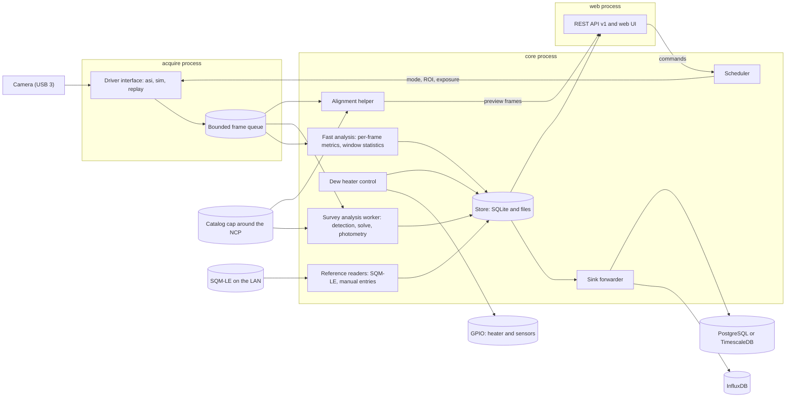

# Seeing monitor: architecture

Status: approved by the owner on October 1, 2026 (phase 1). For a short read, start with Summary, Decisions, Components, Reference hardware, Measurement modes, and Risks and open questions (about 2,500 words). The other sections are reference, and the two appendixes are optional. Sources and calculations are in [research-notes.md](research-notes.md).

## Summary

The seeing monitor is a fixed camera that points at Polaris, plus a Raspberry Pi that runs unattended for months. One camera serves four modes, and a scheduler shares its time:

- **Seeing (fast):** short exposures of a small region of interest (ROI) that follows Polaris, reduced to per-frame metrics and windowed seeing statistics.
- **Sky quality (survey):** long exposures calibrated against a star catalog.
- **Pointing (survey):** the same exposures, plate-solved locally. The solution also tells fast mode where Polaris is.
- **Alignment helper:** a low-latency live view with the solved pointing against the target.

Five rules shape the design. A profile describes the hardware, and everything else is derived. Camera access sits behind a driver interface. Three processes isolate hardware, computation, and the network. The system stores little and summarizes early. Results flow through pluggable sinks that keep their own cursors.

## Decisions and technology choices

| Topic | Decision | Reason | Set by |
|---|---|---|---|
| Language | Python 3.11 or later with NumPy, SciPy, astropy, and `pyerfa`. If the Pi 4 benchmark gate fails, Rust (PyO3) replaces only the per-frame metrics. | One maintainer, the best astronomy ecosystem, and solving is not a bottleneck. | You |
| License | MIT, copyright Lauri Kangas | | You |
| Remote database | A sink interface with InfluxDB first and PostgreSQL with TimescaleDB second. Both can run at once. | Matches your migration plan. | You |
| Hardware | Raspberry Pi 4 (with the owner's power HAT) or Raspberry Pi 5 (with the camera HAT), SD card only. The HAT choice is open. The design targets the Pi 4. | The weakest case sets the budget. | You |
| RAM | Start with 2 GB, and move to 4 GB only if the phase 2 memory gate fails. | Peak memory is about 1.4 GB, and the step to 4 GB nearly doubles the price (April 2026). A bench swap is cheap. | Lead |
| Solver catalog | A 15 degree cap around the north celestial pole (NCP). No all-sky blind solve. | The mount never points far from the pole. | You |
| Fast mode | Bin1 readout and a 2 ms exposure. The brief suggests about 10 ms, which stays selectable. | Bin1 needs no defocus. At 10 ms, Polaris saturates and seeing reads 2 to 27% low. | Lead |
| Local store | SQLite (WAL) for results. FITS, SER, and binary segment files for survey frames, bursts, and per-frame metrics. | No administration and few writes, which suits an SD card. | Lead |
| Camera access | ZWO ASI SDK through `ctypes` in `acquire`. INDI and Alpaca adapters only for other vendors. | Only the SDK offers video mode, ROI streaming, and a drop counter at low latency. | Lead |
| Dew heater | GPIO through `libgpiod` behind an `Io` interface, with one adapter per HAT. The loop holds the heater a small margin above the dew point, logs its duty, and defaults to off. | `libgpiod` works on the Pi 4 and the Pi 5 (`RPi.GPIO` does not work on the Pi 5). Heater plumes can add local turbulence, so the duty goes on every seeing window. | Lead |
| Plate solver | astrometry.net with a custom cap index and SEP star lists. ASTAP as fallback. An in-house tracker between solves. | Packaged for Raspberry Pi OS and safe at the pole. A separate process keeps GPL code out of the MIT project. | Lead |
| Web | FastAPI, static HTML and JavaScript, uPlot, no external assets. | The Pi may have no internet. | Lead |
| Processes | `acquire`, `core`, and `web` under systemd with a watchdog. chrony supplies time. | A closed SDK can hang, and the network-facing process stays read-only. | Lead |
| Configuration and tests | TOML with pydantic. pytest, hypothesis, and GitHub Actions on Windows, Linux x64, and Linux arm64. | The arm64 runner approximates Raspberry Pi OS. | Lead |
| Packaging and lock | `pyproject.toml` with `hatchling` and a `src/` layout. `uv` writes one universal lock (`uv.lock`) with hashes for Windows x64, Linux x64, and Linux arm64, and the install script exports hashed requirements from it. | One lock serves every CI runner and the Pi, and installs verify hashes. | Lead |
| Static checks | `ruff` (lint and format), `mypy` in strict mode, `detect-secrets`, and `tools/check_repo.py`, which fails on absolute paths, IP and MAC addresses, private host names, serial numbers, URL credentials, and co-author trailers. | The repository is public, so the checks catch leaks before review does. An untracked deny list covers private values that no general rule can describe. | Lead |

"You" is the project owner. "Lead" is the design lead's choice, open to your review.

## Components and data flow

| Component | Responsibility | Process |
|---|---|---|
| Drivers | `CameraDriver` backends: `asi` (vendor SDK), `sim` (synthetic stars, turbulence, sky, clouds, injected faults), `replay` (recorded bursts) | `acquire` |
| Acquisition | Capture loop, per-frame timestamps, drop counting, mode changes | `acquire` |
| Scheduler | Grants the camera to one mode at a time, follows daylight and clouds, queues commissioning tasks | `core` |
| Analysis | Fast: per-frame metrics and window statistics. Survey: detection, solving, photometry, pointing, focus, in a low-priority worker. Alignment: live view and quick solve. | `core` |
| Store and sinks | SQLite plus files, quota-based retention, per-sink forwarding with retry | `core` |
| Heater and reference | The dew-heater control loop through GPIO. SQM-LE polling and manual SQM entries. | `core` |
| API and UI | Versioned REST API, static UI, WebSocket live view. Reads the store and sends commands to `core`. | `web` |

The processes isolate three risks. The vendor SDK is a closed binary that can hang on USB faults, so `acquire` restarts alone. `web` faces the network, so it gets read-only store access and no camera access. `core` is the only writer. The processes talk over local connections (`multiprocessing.connection`), and frames travel as length-prefixed bytes with a fixed binary header. No pickle crosses a process boundary.

## Reference hardware

The reference camera is the uncooled, USB-powered ZWO ASI294MM (Sony IMX492, 4/3 inch, rolling shutter). ZWO's page for it shows the same modes and gain charts as the cooled Pro, so the figures below are as published, and commissioning checks them on this camera.

| | Bin1 (native) | Bin2 |
|---|---|---|
| Resolution, pixel | 8288 × 5644, 2.315 µm | 4144 × 2822, 4.63 µm (the sensor sums 2 × 2) |
| ADC | 12 bit (10 in high-speed mode) | 14 bit (12 in high-speed mode) |
| Full well, read noise at gain 0 | 14.4 ke⁻, 2.65 e⁻ | 66.4 ke⁻, 8.0 e⁻ (1.85 e⁻ at gain 120) |
| Plate scale at 250 mm | 1.91 arcsec/pixel | 3.82 arcsec/pixel |
| Row time (fitted from vendor frame rates) | 37.6 µs | 21.3 µs |

The ToupTek GS-250 scope has a 50 mm aperture, a 250 mm focal length (f/5), and a planar apochromatic triplet with a field flattener. The field of view is 4.40 × 2.99 degrees. ToupTek designs for a 1-inch image circle (16 mm, against the sensor's 23.2 mm diagonal), but your test shows good quality to the sensor edges, so the profile uses the full sensor.

- **Sampling picks the readout.** The aperture passes no spatial frequency above D/λ. In bin1 the pixel (1.91 arcsec) is smaller than λ/D (2.5 arcsec at 0.6 µm), so aliasing does not bias the centroid. In bin2 an in-focus star gives a centroid gain of 0.5 to 1.5 for ideal optics (about 0.7 to 1.3 for the vendor's design blur) as Polaris drifts across pixels, so bin2 would need a defocus of about 3 pixels (70 µm of focus offset). Fast mode uses bin1.
- **Frame rate.** Vendor figures imply about 6 ms of overhead per frame in bin1 and 1 ms in bin2 (derived), so small ROIs reach roughly 90 to 150 fps in bin1 and 300 fps or more in bin2. Your 10 ms bin2 recordings run at 97.9 fps, as the model predicts.
- **Rolling shutter.** A 128-row ROI spans 4.8 ms in bin1, so a star's row shifts its timestamp.
- **Polaris is bright.** An estimated 87,000 photoelectrons (±30%) arrive in 10 ms. A sharp-focus bin1 peak pixel then holds about 33,000 against a 14,400 full well, and it reaches 70% of full well after 3 ms. Fast mode defaults to 2 ms.
- **No cooler, no frame buffer, USB power only.** Dark current follows the ambient temperature (about 0.2 e⁻/s per pixel at 20 °C, doubling every 6 °C), so survey frames need a temperature-dependent dark model. The manual lists a DDR3 buffer only for the Pro, so a late read loses frames at once. The camera draws up to 0.37 A, so a Pi 5 on a 3 A supply or a PoE splitter needs the USB current limit lifted (`usb_max_current_enable=1`).

**Larger scopes.** The GS-300 (50 mm, f/6) and GS-350 (58 mm, f/6) share the GS-250's 16 mm design circle. The GS-300 changes no atmospheric number, and the GS-350 changes them by a few percent. Both shrink the field and add wind load. **Keep the GS-250.** The appendix has the comparison.

## Processes, data rates, and storage

| Process | Threads |
|---|---|
| `acquire` | Capture thread at raised priority (blocking SDK calls release the GIL), control thread, and watchdog thread. No analysis. An SDK call that exceeds its timeout makes the process exit, and systemd restarts it. |
| `core` | Scheduler, fast-path consumer, preview encoder, sink forwarder, retention and health, and one low-priority survey worker process |
| `web` | uvicorn event loop with a read-only SQLite connection, read-only image access, and commands to `core` |

**Timing.** Every frame carries `t_utc_ns` (mid-exposure UTC), `t_err_ns` (1-sigma error), `t_quality`, and `dropped_before`. The SDK returns no frame timestamp, so the capture thread stamps each frame with the real-time clock on arrival, and a star's time adds its row times the row time. A sliding linear fit of arrival time against frame number removes arrival jitter. The absolute error is the chrony error bound plus a latency uncertainty that commissioning measures with a light pulse from a GPIO pin.

**Drops.** The system sums three sources (the SDK counter, gaps longer than 1.5 frame periods, and queue overflow) onto the next frame, each window (`n_dropped`, `valid_fraction`), and `health`. A window with more than 5% drops is flagged `degraded`. A full queue drops its oldest frame and counts it. A frame that analysis cannot use is stored with flags and is not a drop.

| Stream | Size | Rate | Notes |
|---|---|---|---|
| Fast frames, bin1, 128 × 128 ROI (4.1 arcmin) | 32 KB | About 90 fps, 2.9 MB/s | Limited by readout, not by the exposure |
| Fast frames, bin2, 64 × 64 ROI | 8 KB | Up to about 360 fps at 2 ms | Needs about 3 pixels of defocus |
| Survey frame, bin2 | 23 MB | 1 per 3 minutes | A bin1 frame is 94 MB, too heavy for a Pi 4 |
| Per-frame metrics | About 40 bytes | 3.5 KB/s at 90 fps | 0.3 GB per 24 hours |
| Results | 0.15 to 0.4 KB | About 4 rows per minute | Under 0.5 GB per year |

The rates are derived estimates, and USB 3 carries every stream with wide margin. The Pi 4 budget is 10% of a core for `acquire`, 25% for the fast path, one core in bursts for the survey worker, and about 1.4 GB of memory at peak (the survey worker takes 550 MB). A 2 GB model fits if the out-of-memory killer takes the survey worker first, calibration frames stay memory-mapped, and native frames are processed off the Pi. More than 1.6 GB at peak in the gate means 4 GB. A NumPy centroid on a 128 × 128 frame takes an estimated 0.2 to 0.4 ms on a Pi 4. The performance gate measures all of this.

| Tier | Content | Retention |
|---|---|---|
| Results | Windows, survey results, pointing, star epochs, health, events (SQLite) | Forever |
| Per-frame metrics | Segment files of 10 minutes each | 7 days or 2 GB, whichever is smaller |
| Star lists | Per survey step: matched stars brighter than G = 11 and all unmatched detections (about 0.3 GB per year) | 1 year |
| Raw bursts | SER with a JSON sidecar, on demand | 2 GB quota. Pinned bursts are exempt. |
| Survey frames | FITS with Rice compression. The newest three stay in RAM. Every tenth frame and every event frame go to disk. | 7 days, then one per night for 60 days |
| Previews | JPEG up to 1 megapixel | 7 days |

A retention task runs hourly, deletes the oldest files first, and defaults to a quota of 25% of the data partition. Under pressure, per-frame metrics shrink first, then previews, survey frames, and unpinned bursts, and each early deletion writes an `event`. Below 1 GB of free space, raw capture stops.

## Data model

Every result is an immutable record keyed by `(station_id, record_type, t_utc_ns, revision)`, and a sink upserts by key.

| Record | Content |
|---|---|
| `frame` (local files; optional sink) | Sequence, UTC time and error, stream ID, centroid, width, peak, flux, background, flags |
| `seeing_window` (each 60 s window) | Frame and drop counts, image-motion RMS, seeing, r0, scintillation, spectrum bins, vibration lines, heater duty, flags |
| `survey_frame`, `sky_quality`, `pointing` (each survey step) | Exposure, gain, mode, temperature. Sky brightness, zero point, transparency, cloud fraction. Attitude, center, roll, scale, residual, offset, focus. |
| `star_list` (each survey step), `star_epoch` (each night) | Matched stars brighter than G = 11 and all unmatched detections. Per star and night: mean position offset, mean magnitude, scatter, frame count. |
| `reference` (each reading) | Instrument, time, value (mag/arcsec²), temperature, pointing, and whether it comes from the fixed SQM-LE or a manual handheld entry |
| `health`, `event`, `run` (every 60 s, on occurrence, on start) | States, temperatures, heater duty, free space, drops, sink backlog, time sync. Events. Versions and effective configuration. |

Each record type is declared once (field, type, unit, definition), and the SQLite schema, sink mappings, API schema, and quantity reference come from that declaration. InfluxDB gets one measurement per type with `station` and `profile` tags. TimescaleDB gets one hypertable per type with a unique index on the key. Tables are append-only, so a sink cursor is the last acknowledged row ID, and a new sink backfills from row zero.

## REST API

The API lives under `/api/v1`. Within `v1`, changes only add fields and endpoints, and a breaking change creates `/api/v2` while `v1` stays for at least one release. FastAPI generates the OpenAPI 3 description and serves the interactive docs from local assets. Times are ISO 8601 UTC strings, field names carry units (`seeing_fwhm_arcsec`), and a missing value is `null` with a `quality` object that says why.

| Endpoint | Method | Purpose |
|---|---|---|
| `/status`, `/health` | GET | State of every component. Health returns 200 (healthy or degraded) or 503. |
| `/seeing`, `/sky`, `/pointing` (each with `/latest`) | GET | Latest record, or history with `from`, `to`, and `step` (1 minute, 10 minutes, 1 hour) |
| `/images/latest`, `/images/{id}`, `/events`, `/profile`, `/config` | GET | Preview and FITS, events, profile with derived values, configuration without secrets or site data |
| `/commands/burst`, `/commands/sweep`, `/commands/replay`, `/mode`, `/alignment/start`, `/alignment/stop` | POST | Commissioning, mode changes, alignment (token required) |
| `/alignment/state`, `/alignment/stream` | GET, WebSocket | Alignment offsets and the live view |

The UI has four pages: **Now**, **History**, **Images**, and **Align**. It uses one column on a phone. The red night mode multiplies the page by pure red, so images show only red light.

## Scheduler

One scheduler owns the camera. It runs a state machine over a priority queue, and all time passes through a `Clock` interface, so tests run a simulated night in seconds.

| State | Entered when | Behavior |
|---|---|---|
| `safe` | Daylight, a sky too bright for any mode, or a persistent fault | Camera idle, with a brightness watch of one 1 ms frame per minute |
| `auto` | The sky is dark enough and the system is healthy | Repeats a fast window (default 120 s), then a survey step: a short exposure for bright stars and a long one for faint stars and the sky. Default cadence: 3 minutes. |
| `align` | You start it from the UI | Preempts everything. Ends when you stop it or after 30 idle minutes. |
| `commission` | A burst, sweep, or replay is queued | Runs at the next cycle boundary. Results are pinned. |
| `paused` | You pause | Nothing runs |

Each reconfiguration increments `stream_id`, so a window never spans one.

- **ROI following.** Before each fast window, the scheduler computes the apparent Polaris position from the latest solution and the ephemeris, and centers the ROI there. If the star nears the ROI edge, the window ends early and the ROI recenters. If the star is missing, a survey frame runs to solve again.
- **Daylight.** The Sun's elevation comes from a low-precision ephemeris and the site location in local configuration, and a measured gate overrides it: a background above 50% of full scale at the shortest exposure forces `safe`. At some latitudes the Sun stays above -18 degrees for weeks, so results carry a twilight flag.
- **Clouds.** Survey frames report the share of expected catalog stars they detect. Below a threshold, the scheduler shortens fast windows and lowers the survey cadence, and windows under cloud carry a `cloud` flag.
- **Faults.** Camera errors trigger backoff and an `acquire` restart. After repeated failures, health turns `degraded`, and `web` and the store stay up.

## Configuration and profiles

| Layer | Source | Tracked | Content |
|---|---|---|---|
| Profile | `profiles/<id>.toml` | Yes | Sensor, optics, readout modes, limits. One file per hardware configuration, and the `id` equals the file name. |
| Defaults | `config/default.toml`, then `config/default.d/*.toml` in file-name order | Yes | `default.toml` holds the keys that belong to no lane (`profile`, `station_id`). Each lane keeps its own defaults (scheduler, windows, retention, thresholds) in its own `default.d` file. |
| Local | `local/config.toml` | No | Station ID, site location, data directory, sink endpoints, token hash |
| Environment | `SEEINGMON_<SECTION>__<KEY>` variables | No | Secrets and overrides |
| Template | `config/local.example.toml` | Yes | Placeholders for the local file |

Later layers override earlier ones. Tables merge key by key, and an array replaces the array in the layer below. A double underscore in a variable name nests one level, so `SEEINGMON_SINKS__INFLUX__URL` sets `url` in `[sinks.influx]`. A value parses as a TOML scalar or array and stays a string otherwise.

`seeingmon.config.load_config` returns a `Config`. Each lane declares a pydantic model for its section and reads it with `config.section("scheduler", SchedulerConfig)`, which validates the merged section and applies the model's defaults. An error names the section and the keys, and it never shows a configured value. `config.profile` loads the profile that the top-level `profile` key names. `config.effective()` returns the merged configuration for the `run` record, with the value of every key whose name contains token, password, secret, credential, or key replaced by a fixed marker.

The `profiles/` and `config/` directories sit at the repository root in a source checkout, and the wheel carries them as package data in `seeingmon/_data/`. `seeingmon.paths` finds them in either layout.

A profile describes the sensor (cooling, temperature sensor), the optics (focal length, aperture, usable image circle, effective wavelength), the readout modes, and the limits (ROI rules, gain, exposure, offset). A readout mode states its resolution, pixel size, ADC bits, full well, read noise and conversion gain at gain 0, a table of rows for higher gains (with an explicit step for the high-conversion-gain switch), row time, and frame overhead. A profile can also hold two photometric priors: the photoelectron rate of a magnitude-0 star, flagged as an estimate, and a dark-current table. The software derives the plate scale and field of view per readout mode, the ROI size in pixels for an angular full width, the Airy size and star sampling, the saturation level per gain (in ADC counts and in 16-bit container counts), and the frame period and data rate. `seeingmon profile show` prints these values, and `profile_summary` returns them as JSON for the API. Fast mode and survey mode each name their readout mode.

## Commissioning support

- **Burst.** `seeingmon burst` or `POST /commands/burst` records frames to a SER file with a JSON sidecar. Pinned bursts are exempt from retention.
- **Sweep.** `seeingmon sweep` runs a short fast window for each cell of a grid (exposure, gain, ROI, readout mode) and prints saturation, signal-to-noise ratio, frame and drop rates, and estimator noise.
- **Dark.** There is no lens cap, so `seeingmon dark` waits while you cover the camera, checks that the frame is dark, and records a set at the current sensor temperature.
- **Replay.** The `replay` driver feeds a recorded burst through `acquire` at the original or the maximum rate, and the production analysis runs unchanged. A replay writes to a separate store.

## Measurement modes
### Seeing (fast)

The camera streams the ROI in bin1. For each frame, `core` subtracts a local background (the median of the ROI border) and computes the intensity-weighted centroid inside a circular aperture, recentered twice. This estimates the angle of arrival (the G-tilt). Centroids use sensor coordinates, so ROI moves do not alias into motion.

Frames group into windows (default 60 s) that never span a reconfiguration. Polaris sits about 0.6 degrees from the pole and drifts 10 arcsec in 60 s (5 pixels in bin1), so each window removes a quadratic trend and corrects the variance for it. The one-axis centroid variance is σ² = 0.170 λ² D⁻¹ᐟ³ r0⁻⁵ᐟ³, and the seeing FWHM is 0.98 λ/r0. At 500 nm, an r0 of 10 cm means 1.0 arcsec seeing and 0.48 arcsec of motion per axis (0.25 pixel in bin1). The estimator corrects for the outer scale (default L0 = 20 m, which lowers a single aperture's variance by 19%) and for exposure averaging (0.3 to 7% in seeing at 2 ms), and it stores both assumptions with the result. The same window yields the scintillation index, the motion spectrum with vibration lines flagged, and a structure-function cross-check that ignores slow drift.

**Validation.** Simulated frozen-flow phase screens through a 50 mm aperture, with exposure integration, pixel sampling, and noise, must return r0 within 10%. Your two recorded 10 ms videos (bin2 mode, 8-bit, 320 × 240, 97.9 fps) check stationarity, spectra, and the agreement of the two estimators, and they test the bin2 centroid effects and the exposure correction at 10 ms. At commissioning, tap tests and gust correlation calibrate the vibration flags. A second star 30 to 60 arcmin away (V of about 6 or brighter) would reject common-mode motion and keep the ground-layer signal. It needs an ROI about 1,000 pixels wide, with the pair's axis within 3 degrees of the sensor rows (rows start 37.6 µs apart), which holds for 20 to 30 minutes at a time, so it stays an experiment.

### Sky quality

Survey frames use bin2 at gain 120 or higher. The pipeline subtracts bias and a temperature-dependent dark model, divides by a flat model, masks stars, and takes a sigma-clipped sky median. The zero point comes from matched Gaia DR3 stars with a fitted BP-RP color term (the camera band is not Gaia G), and Tycho-2 supplies Polaris and other bright stars. Sky brightness is the zero point minus 2.5 log10 of the sky rate per square arcsecond. Transparency is the zero-point offset from the median of the clearest nights, because Polaris sits at a fixed altitude and extinction cannot be fitted. Manual dark sets at several temperatures between 0 and 25 °C fit the dark-rate model and a hot-pixel map, and `health` reports `dark_due` when the library misses the current temperature or is older than 6 months. **Validation:** injected-truth simulation, zero-point scatter of 0.03 mag or less on clear nights, and the reference readings. The fixed SQM-LE points 45 degrees up to the north through a plastic dome, so the dome loss and the altitude difference become fitted terms, and handheld SQM-L readings taken outside the dome calibrate the dome loss.

### Pointing

The pipeline detects stars (SEP), solves inside the catalog cap, and fits a TAN world coordinate system (WCS) to all matched stars. The fit uses catalog positions moved to the observation time with proper motion, precession, nutation, and aberration (`pyerfa`), because annual aberration of up to 20 arcsec would otherwise look like a seasonal pointing drift. The solution and the ephemeris give the Polaris pixel position at any time. Focus is the median FWHM of unsaturated stars, tracked against temperature, and a reference solution fixed at commissioning flags later moves. Sky rotation trails stars up to 0.9 arcsec per second at the far edge of the field (4.3 arcsec in 5 s), so detection and photometry use a trail model. **Validation:** catalog-rendered frames with known pointing and trails must return the pointing within 0.1 pixel, and a second solver checks a sample.

### Alignment helper

In `align`, the camera streams a bin2 view with 0.2 to 1 s exposures. `core` stretches each frame (asinh), encodes a JPEG, and pushes the newest frame over a WebSocket, so latency stays near one exposure plus processing (target: under 1.5 s). A worker solves inside the cap about once per second. The UI overlays the target and shows the offset, the rotation against the target roll, a focus bar, a log histogram, and a saturation warning. **Validation:** a simulated mount-motion script, then known mount steps at commissioning.

## Reported quantities

| Quantity (unit) | Definition and estimator | Uncertainty | Known failure modes |
|---|---|---|---|
| `cx`, `cy` (px) | Centroid inside a circular aperture (15 pixels or more across in bin1), recentered twice | Noise below 0.02 px, subtracted from the variance. Truncation lowers the gain to 0.98 (variance 3 to 5% low). | Saturation, hot pixels, truncation, a star near the ROI edge, bin2 in focus |
| `width_x`, `width_y` (px), `peak` (DN), `flux` (e⁻), `bg` (DN) | Second-moment sigma inside the aperture. Maximum pixel. Aperture sum minus background. Median of the ROI border. | Poisson plus background noise. Truncation lowers the width by a few percent. | Saturation (flag at 98%), clouds, the Polaris halo, defocus |
| `image_motion_rms` (arcsec) | RMS of the detrended centroid per axis, noise subtracted | 2 to 4% (1,000 to 6,000 effective samples per window) | Vibration and wind shake (high), exposure averaging (low), drift, jitter, drops |
| `seeing_fwhm_arcsec`, `r0_cm` | Kolmogorov seeing and r0 at 500 nm and zenith, from the tilt variance with the L0 and exposure corrections and the factor (cos z)^(3/5) | 1 to 2% statistical, 10 to 15% systematic (L0, wind) | As above, plus ground-layer turbulence and bin2 phase effects |
| `scintillation_index` | Normalized flux variance minus the Poisson floor, for exposure T | A few percent. Theory agrees within a factor of about 1.5. | Clouds, saturation, trends. Falls roughly as 1/T above 3 ms. |
| `motion_psd` (arcsec²/Hz), `vibration_lines` (Hz) | Welch spectrum of `cx` and `cy`. Lines above 5 times the local median are flagged. | Chi-squared with twice the segment count in degrees of freedom | The turbulence corner (20 to 200 Hz) can exceed the 45 Hz Nyquist limit at 90 fps. Aliasing, jitter. |
| `sky_mag_arcsec2` (mag/arcsec²) | Zero point minus 2.5 log10 of the sky rate per square arcsecond, camera band. The V-equivalent uses the Gaia G-to-V transform (0.03 mag scatter, BP-RP from -0.5 to 5.0) and an SQM-fitted offset. | 0.1 mag in the camera band, 0.2 to 0.3 mag in V | Moon, twilight, aurora, light domes, clouds, dark-model error, dew. An SQM band differs from V by up to 0.25 mag. |
| `transparency` (0 to 1) | 10^(-0.4 (ZP_ref - ZP)) | About 0.03 | Reference drift, saturated stars, color mismatch |
| `cloud_fraction`, `limiting_mag` (mag) | Share of expected stars missed. Magnitude where half are detected. | About 0.2 mag | Moonlight, bright sky, trailing |
| `center`, `roll` (deg), `plate_scale` (arcsec/px), `offset` (arcmin), `solve_rms` (arcsec), `focus_fwhm` (px) | Least-squares WCS. Roll is the position angle of the direction to the pole. Focus is the median FWHM of unsaturated stars. | Target 0.1 px | Few stars, trailing (inflates the focus value), distortion. Roll is undefined with the center on the pole. |
| `t_utc_ns`, `t_err_ns`, `dropped_before` | Mid-exposure UTC time, 1-sigma error, frames lost immediately before | Clock bound plus latency | Lost synchronization, an uncalibrated latency |

## Camera access and plate solvers
### Camera access

The comparison uses the fast-mode case: a ROI of about 128 × 128 pixels, 90 or more frames per second, per-frame UTC timestamps, and counted drops. Only the ZWO SDK fits. INDI wraps the same SDK but forces the exposure to 95% of the frame period, ignores the drop counter, and stamps frames with one-second protocol resolution (Debian ships INDI 1.9.9 with a 2022 driver). ASCOM Alpaca has no video device and needs three or more HTTP calls per exposure. The SDK files carry an MIT notice, although Debian rates the binaries non-free.

The SDK driver comes first, and INDI and Alpaca adapters wait for a non-ZWO camera. The driver follows four rules. One worker process owns the SDK, and its reader thread stamps frames right after `ASIGetVideoData` returns. Waits are bounded (twice the exposure plus 500 ms), and the reader stops before `ASIStopVideoCapture`, because a blocked read cannot be cancelled. Every mode change runs one function (stop, set ROI and binning, set the start position, read back, discard frames, restart), because the SDK can change geometry silently mid-stream. A recovery ladder escalates from restarting capture through reopening the camera, a sysfs USB reset, restarting `acquire`, and a reboot, to a hard power cycle of the whole Pi through its PoE switch port or a smart plug on its injector (the camera loses its USB power with the Pi). Reports describe ZWO cameras on Pi boards that stall after hours or days until someone power-cycles them. The Pi cannot switch a single USB port, so a camera-only cycle would need a powered hub on its own switchable supply, which stays optional (question 1).

### Plate solvers

The solver runs as a separate process, so GPL code stays outside the MIT code base. The cap catalog holds Gaia DR3 stars to G = 13 within the cap radius (default 15 degrees), plus Tycho-2 for Polaris and other stars brighter than Gaia's limit: about 82,000 stars, roughly 4 MB. A `seeingmon catalog build` tool queries the Gaia archive and writes the catalog and the solver indexes on a larger machine.

| | astrometry.net | ASTAP | cedar-solve |
|---|---|---|---|
| License | GPL-3.0 or later | MPL-2.0 | Apache-2.0 (detector: FSL-1.1-MIT) |
| Cap database | Custom index, 3 to 6 MB | About 28 area files, 25 MB | 4 to 15 MB |
| Pi 4 solve (estimate) | 0.4 to 2 s with a star list | 1.5 to 5 s with detection | 25 to 250 ms |
| Pole behavior | Unit vectors, safe | Pole code fixed December 2023 | RA and roll ill-conditioned |

astrometry.net is primary with SEP star lists (`apt` installs it on arm64), and ASTAP is the fallback adapter. Between solves, a small in-house tracker predicts star positions, matches them, and fits, which suits the alignment helper. cedar-solve stays an option if the helper still misses 1.5 s on a Pi 4 (its version pins clash with Python 3.13). Survey and alignment frames use bin2, because a native frame (94 MB) takes an estimated 5 to 35 s to detect stars on a Pi 4. Attitude is a rotation matrix, roll is the position angle of the direction to the pole, and a hot-pixel mask keeps undersampled bin2 stars from being mistaken for hot pixels.

## Test strategy

| Level | What it checks |
|---|---|
| Unit and simulation (every push) | Estimators against simulated truth (phase-screen turbulence with injected clouds, saturation, vibration, and drops must return r0 within tolerance), scheduler transitions, retention, sink cursors |
| Component and end to end (short on push, long nightly) | `acquire`, `core`, and `web` with the simulator. Kill and restart each process. Simulate a sink outage of days, a full disk, and a clock jump. A simulated night in virtual time matches the injected truth. |
| Replay (local) | Recorded 10 ms video through production code. The repository holds only small synthetic fixtures. Recordings stay outside it, and tests skip when absent. |
| Gate and hardware | A performance gate on a Pi 4 before phase 2 exits. Timing, USB recovery, and a multi-day soak at commissioning. |

GitHub Actions runs Windows, Linux x64, and Linux arm64 on Python 3.11 and 3.13: linter, type checker, tests, a secret scan, and a repository check that fails on absolute paths, IP addresses, and hostnames.

## Deployment
The target is Raspberry Pi OS Lite, 64-bit (Debian 13 with Python 3.13). The Debian 12 image with Python 3.11 also works.

- **Install.** A generic script takes host, user, and paths as parameters, with no defaults. It creates a service user, installs the wheel in a virtual environment and the systemd units, adds the camera udev rule and the USB buffer setting, configures journald and chrony, and copies your local configuration. It is safe to rerun.
- **Recovery.** Services use `Restart=always`, `WatchdogSec`, and a start limit that escalates to `degraded` health. The camera ladder ends in a hard power cycle of the whole Pi through its PoE switch port or a smart plug. An external watchdog on the LAN polls `/api/v1/health` and triggers the cycle when health stays failed for several minutes, and the Pi can request it as a last resort. A command or URL in local configuration defines the cycle, so no address or credential enters the repository.
- **Heater.** Heater outputs default to off at boot and when a service stops. Prefer a HAT with its own failsafe, and add an over-temperature cutoff from the sensors. The pin map and sensor addresses live in local configuration, with an example template.
- **SD card.** Data lives on its own partition. Journald logs stay in RAM, and warnings also go to the `event` table. Temporary files use tmpfs, files are written under a temporary name and renamed, and SQLite runs WAL with `synchronous=NORMAL`. The write budget is under 1 GB per day. Use a high-endurance card. A 32 GB card holds the rolling tiers (about 7 GB) and five years of results.
- **Time and updates.** The Pi 4 has no real-time clock, so records carry `time_invalid` until the first synchronization. Two versioned environments and a symlink flip give a rollback in seconds. The OS updates itself for security, and application and SDK updates are manual.
- **Vendor SDK.** The repository never contains the SDK. The installer takes the archive from a path you give it, checks its checksum, and installs it privately. The INDI third-party repository carries an MIT license text for the SDK, but the terms in ZWO's own archive are unconfirmed, so redistribution waits on that check.

## Security

The device sits on a LAN, and the repository is public.

- **Network.** `web` binds to the LAN interface only, and remote access goes through a VPN. Reads are open on the LAN by default (a deferred decision), and a setting can require the token. Commands need a bearer token (only its hash is stored), are rate-limited, and validate input.
- **Isolation.** Each service runs unprivileged under a systemd sandbox (`NoNewPrivileges`, `ProtectSystem=strict`, `PrivateTmp`). `web` has no camera access and no write access to the data directory. Only `acquire` touches USB.
- **Supply chain and secrets.** Dependencies are pinned with hashes. Secrets and site coordinates live in `local/`, environment variables, or systemd credentials, and never in the repository, the logs, or the API. SSH uses keys only.

## Risks and open questions

| Risk | Effect | Mitigation |
|---|---|---|
| Wind shake and vibration add image motion | Seeing reads high | Line detection and notch filtering, the structure-function cross-check, a stiff mount and wind shield, a two-star experiment, replay validation |
| Exposure averaging | At 10 ms, seeing reads 2 to 27% low | A 2 ms default (0.3 to 7%) and a wind assumption stored with each result. At 90 fps the spectrum cannot give the wind. |
| Polaris saturates, and bin2 biases the centroid | Clipped flux, and a centroid gain of 0.5 to 1.5 | Bin1, 2 ms, a defocus of about 3 pixels if bin2 is used, flags, a commissioning sweep |
| No frame timestamp from the camera | Absolute time depends on the host clock and a latency estimate | Regression over frame number, GPIO light-pulse calibration, `t_err` on every frame |
| The closed SDK hangs or stalls the camera | Lost frames, or no camera for days | Process isolation, watchdog, the recovery ladder ending in a remote power cycle, a soak test, a pinned SDK version |
| Uncooled sensor, dew, and heater plumes | Dark current and transparency drift. The heater can add local turbulence and bias seeing high. | Manual dark sets and a dark-rate model. A GPIO dew heater held a small margin above the dew point, with its duty logged and flagged on seeing windows. A dew flag from star width and transparency. |
| No standard sky scale for an unfiltered sensor | 0.2 to 0.3 mag uncertainty in V | Report the camera band first, and fit against an SQM or TESS-W |
| SD card wear and corruption | Data loss or a failed boot | Write budget, tmpfs, WAL, atomic writes, a high-endurance card, remote sinks as a second copy |

Deferred by you: the InfluxDB version, field names, and history import (the InfluxDB adapter waits for them), and the web access rule (until you decide, the design keeps the default: anyone on the local network can view, a token is needed for actions that change something, and outside access goes through a VPN).

Questions for you:

1. How will the Pi's power be cycled remotely: through its PoE switch port, through a smart plug on the injector, or not at all? A camera-only cycle needs a powered hub on a switchable supply, and ZWO advises a direct connection when troubleshooting, so the soak test must include any hub.
2. Which Pi and HAT will you use? When you decide, send the HAT's pin map, any temperature and humidity sensors, and any failsafe, so the heater adapter can match it.

## Appendix: long-term science plan

A camera that stares at one field for years produces a rare dataset. The table lists what it can show. Each sensitivity is an estimate that assumes the pipeline reaches the astrometry and photometry targets above, and [research-notes.md](research-notes.md) shows the arithmetic. Phase 2 builds only the storage hooks, and the analyses come after commissioning.

| Signal | What the data show | Method | Estimated sensitivity |
|---|---|---|---|
| Aberration, precession, nutation | A 20 arcsec aberration ellipse each year, 20 arcsec per year of precession, and 9 arcsec of nutation over 18.6 years | The pointing series in ICRS, before the apparent-place correction | About 10 pixels (bin1) per year, so weeks. Nutation needs years. The residuals show the mount's stability. |
| Sky clock | The star field rotates at 15 arcsec per second | Field rotation against UTC | Clock steps of tens of milliseconds. One arcsec of mount azimuth looks like 66 ms. |
| Stellar astrometry | Proper motions of the brightest stars (5 to 50 mas per year) | Nightly positions against Gaia | Gaia is more precise, so this checks the astrometric error budget. |
| Variable stars | VSX lists 139 variables brighter than 13 within 2.7 degrees of Polaris, 14 with periods over 30 days (semiregular stars and 2 Miras) | Differential light curves, then period searches | 0.03 mag or more for V brighter than 11 |
| Polaris pulsation | A Cepheid of about 4 days. Its period grows about 4.5 s per year, and its amplitude has changed several times. | Fast-mode flux normalized by the survey transparency | About 0.3% per night. The timing shifts about 6 hours in 10 years. |
| Eclipses, transits, flares, transients | Dimmings of 1% or more, flares, novae | Light curves at 3 minute cadence and the unmatched detections | About 1% in a few hours for V brighter than 10 |
| Moving objects | Satellites and aircraft dominate. SkyBoT lists no known asteroid or comet in the field on seven dates in 2026, because it lies at ecliptic latitude 66 degrees. | Streak and moving-source detection | A rare comet may appear. Satellite counts form a census of polar-orbit constellations. |
| Sky and atmosphere | Light-pollution trend, airglow and the solar cycle, aurora, aerosol and smoke events, clear-sky fraction, seeing against jet-stream wind | Series joined with weather and space-weather data | 0.01 mag per year if the calibration holds |
| Instrument aging | Dark-current drift, hot-pixel growth, cosmic-ray hit rate | Dark-model residuals and hit counts per frame | Percent-level rates |

Three records and a habit keep these options open. `star_epoch` stores each matched star's nightly mean position offset, magnitude, scatter, and frame count (13 MB per year for 1,500 stars). `star_list` stores each survey step's matched stars brighter than G = 11 and all unmatched detections for one year (0.3 GB), so a better algorithm can reprocess the photometry and astrometry, and moving objects can be linked offline. An optional archive sink ships one raw frame per night to remote storage, because difference imaging needs raw pixels. The `pointing` record stores the attitude as a rotation matrix, so analysis can express it in ICRS or in the frame of date. Every record carries its algorithm revision and calibration versions, and the catalog tool can switch to a later Gaia release without invalidating history.

## Appendix: larger scopes (GS-300 and GS-350)

ToupTek's GS-300 is a 50 mm f/6 (USD 229) and its GS-350 a 58 mm f/6 (USD 259), against USD 199 for the GS-250, and all three share the 16 mm design circle. Seeing depends on the aperture, so the GS-300 changes no atmospheric number. The GS-350's 16% larger aperture moves them by a few percent: the motion falls 2.4%, the exposure bias improves by 2 points, and scintillation rises 2 to 5%. The longer scopes mainly change the geometry.

| | GS-250 | GS-300 | GS-350 |
|---|---|---|---|
| Plate scale, bin1 and bin2 (arcsec/pixel) | 1.91, 3.82 | 1.59, 3.18 | 1.36, 2.73 |
| Field (degrees); stars to G = 13 inside the design circle | 4.40 × 2.99; 1,085 | 3.66 × 2.50; 754 | 3.14 × 2.14; 554 |
| In-focus bin2 centroid gain, ideal optics | 0.53 to 1.48 | 0.73 to 1.28 | 0.73 to 1.27 |
| Bin1 time to 70% of full well on Polaris | 3.0 ms | 4.0 ms | 3.0 ms |
| Mass; side profile (a wind-load proxy) | 0.82 kg; 1.0 | 0.94 kg; 1.25 | 1.21 kg; 1.74 |

Both longer scopes improve the bin2 sampling, but bin2 still needs about 2 pixels of defocus at f/6, and bin1 already needs none. They also cut the star count by a third or a half and add mass and wind area to a mount whose shake is the main systematic (a rod-model guess puts the shake variance at 2.4 and 6.8 times higher). **Keep the GS-250.** The verdict changes if a recorded in-focus bin2 histogram is already flat, if the mount is stiff enough to ignore the extra wind load, or if you need stars fainter than G = 13.
